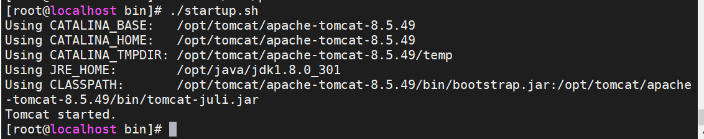
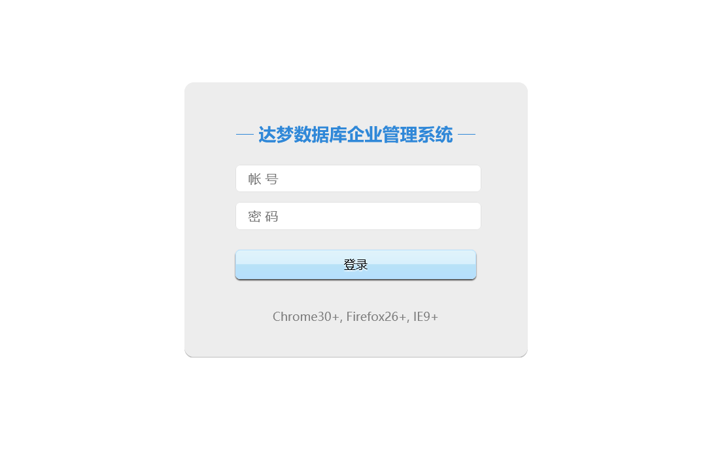

chmod -R 755 /opt/tomcat/apache-tomcat-8.5.49/bin/




自动启动tomcat

在`/opt/tomcat/apache-tomcat-8.5.70/bin/catalina.sh`头部添加

```
. /etc/profile
```

然后注册服务到systemd

```
cd /usr/lib/systemd/system

[root@dbmonitor system]# vi tomcat.service
[Unit]
Description=Tomcat
After=syslog.target network.target remote-fs.target nss-lookup.target

[Service]
Type=oneshot
ExecStart=/opt/tomcat/apache-tomcat-8.5.49/bin/startup.sh
ExecStop=/opt/tomcat/apache-tomcat-8.5.49/bin/shutdown.sh
ExecReload=/bin/kill -s HUP $MAINPID
RemainAfterExit=yes

[Install]

WantedBy=multi-user.target

```


## 部署DEM到Tomcat

复制dem war包到/opt/apache-tomcat-8.5.49/webapps下，并重新启动tomcat

```
cd /opt/tomcat/apache-tomcat-8.5.49/webapps
cp /opt/dm8/web/dem.war ./
cd ../bin
./startup.sh     
```

tomcat启动后会自动解压war包

修改dem包中的db.xml文件，更改为对应的值，然后重新启动tomcat

```
# cd /opt/tomcat/apache-tomcat-8.5.49/webapps/dem/WEB-INF/
# vi db.xml
<?xml version="1.0" encoding="UTF-8"?>
<ConnectPool>
        <Server>192.168.0.94</Server>
        <Port>5250</Port>
        <User>SYSDBA</User>
        <Password>mema123</Password>
        <InitPoolSize>50</InitPoolSize>
        <CorePoolSize>100</CorePoolSize>
        <MaxPoolSize>500</MaxPoolSize>
        <KeepAliveTime>60</KeepAliveTime>
        <DbDriver></DbDriver>
        <DbTestStatement>select 1</DbTestStatement>
        <SSLDir>../sslDir/client_ssl/SYSDBA</SSLDir>
        <SSLPassword></SSLPassword>
        <!-- <Url>jdbc:dm://localhost:5250</Url> -->
</ConnectPool>
```



