# 达梦（DM）数据库安装

- 创建存放安装包的目录：/opt/software

- 创建安装目录：/opt/dmdba


### 1.创建用户和组

**组：dinstall		用户：dmdba**

```shell
#创建组
groupadd -g 12349 dinstall

#创建用户
useradd -u 12345 -g dinstall -m -d /home/dmdba -s /bin/bash dmdba

#修改dmdba的密码
passwd dmdba
```


### 2.修改limit文件

```shell
cd /etc/security
vi limits.conf

#添加以下内容
#soft-软限制 hard-硬限制 nproc-最大进程数 nofile-可以同时打开的文件数量
dmdba         soft nproc   10240
dmdba         hard nproc   10240
dmdba         soft nofile  65536
dmdba         hard nofile  65536

#使配置生效
su - dmdba
ulimit -a
```

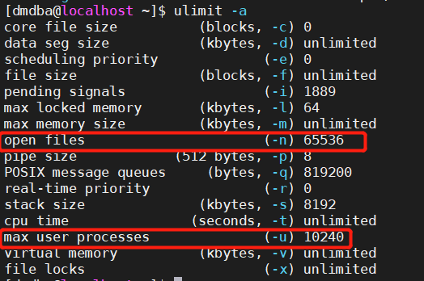


### 3.解压安装包

首先要向安装包上传到虚拟机

```shell
#进入存放压缩包的目录
cd /opt/software
#解压		没有unzip的话，需要安装 yum install unzip
unzip DM8-20210618-x86-rh7-64位.zip
```

解压后：

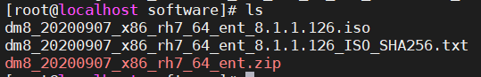


### 4.挂载ISO文件

`mount -o loop dm8_20210618_x86_rh7_64_ent_8.1.2.18_pack3.iso /mnt`


### 5.修改相关文件和目录属性

```shell
cd /opt
chown -R dmdba:dinstall dm8
```

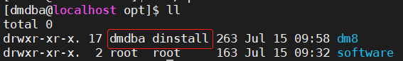


### 6.安装数据库（dmdba用户）

```shell
#切换用户
su - dmdba

#已经进入dmdba用户
cd /mnt
./DMInstall.bin -i
#请选择安装语言(C/c:中文 E/e:英文) [C/c]:c
#解压安装程序......... 
#欢迎使用达梦数据库安装程序

#是否输入Key文件路径? (Y/y:是 N/n:否) [Y/y]:n

#是否设置时区? (Y/y:是 N/n:否) [Y/y]:y
#设置时区:
#[ 1]: GTM-12=日界线西
#[ 2]: GTM-11=萨摩亚群岛
#[ 3]: GTM-10=夏威夷
#[ 4]: GTM-09=阿拉斯加
#[ 5]: GTM-08=太平洋时间（美国和加拿大）
#[ 6]: GTM-07=亚利桑那
#[ 7]: GTM-06=中部时间（美国和加拿大）
#[ 8]: GTM-05=东部部时间（美国和加拿大）
#[ 9]: GTM-04=大西洋时间（美国和加拿大）
#[10]: GTM-03=巴西利亚
#[11]: GTM-02=中大西洋
#[12]: GTM-01=亚速尔群岛
#[13]: GTM=格林威治标准时间
#[14]: GTM+01=萨拉热窝
#[15]: GTM+02=开罗
#[16]: GTM+03=莫斯科
#[17]: GTM+04=阿布扎比
#[18]: GTM+05=伊斯兰堡
#[19]: GTM+06=达卡
#[20]: GTM+07=曼谷，河内
#[21]: GTM+08=中国标准时间
#[22]: GTM+09=汉城
#[23]: GTM+10=关岛
#[24]: GTM+11=所罗门群岛
#[25]: GTM+12=斐济
#[26]: GTM+13=努库阿勒法
#[27]: GTM+14=基里巴斯
#请选择设置时区 [21]:21

#安装类型:
#1 典型安装
#2 服务器
#3 客户端
#4 自定义
#请选择安装类型的数字序号 [1 典型安装]:
#所需空间: 1263M

#请选择安装目录 [/home/dmdba/dmdbms]:/opt/dm8/
#可用空间: 32G
#是否确认安装路径(/opt/dmdbms)? (Y/y:是 N/n:否)  [Y/y]:y

#安装前小结
#安装位置: /opt/dm8
#所需空间: 1263M
#可用空间: 32G
#版本信息: 
#有效日期: 
#安装类型: 典型安装
#是否确认安装? (Y/y:是 N/n:否):y
#2021-07-15 01:51:23
#[INFO] 安装达梦数据库...
#2021-07-15 01:51:23
#[INFO] 安装 基础 模块...
#2021-07-15 01:51:28
#[INFO] 安装 服务器 模块...
#2021-07-15 01:51:31
#[INFO] 安装 客户端 模块...
#2021-07-15 01:51:34
#[INFO] 安装 驱动 模块...
#2021-07-15 01:51:40
#[INFO] 安装 手册 模块...
#2021-07-15 01:51:42
#[INFO] 安装 服务 模块...
#2021-07-15 01:51:43
#[INFO] 移动日志文件。
#2021-07-15 01:51:43
#[INFO] 安装达梦数据库完成。

#请以root系统用户执行命令:
#/opt/dm8/script/root/root_installer.sh

##最后以root方式，执行脚本
su - root
/opt/dm8/script/root/root_installer.sh
```

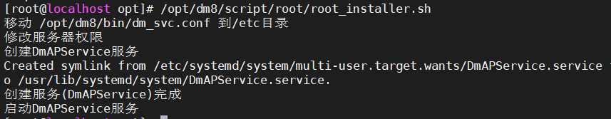


### 7. 修改用户环境

在`.bash_profile`文件中添加路径：`/opt/dm8/bin`

```shell
#root用户
cd
vi .bash_profile
#添加以下内容
export DM_HOME=/opt/dm8
export PATH=$DM_HOME/bin:$PATH

#dmdba用户
cd
vi .bash_profile
#添加以下内容
PATH=$PATH:$HOME/.local/bin:$HOME/bin:/opt/dm8/bin

#更新环境变量
source .bash_profile
```


### 8. 数据库实例化的准备工作（dmdba用户）

```shell
cd /opt/dm8/bin
./dminit PAGE_SIZE=32 EXTENT_SIZE=32 CHARSET=1 CASE_SENSITIVE=0 LENGTH_IN_CHAR=0 BLANK_PAD_MODE=1 DB_NAME=DM PATH=/opt/dm8/data
```

1.  PAGE_SIZE 代表页大小 
2. EXTENT_SIZE 代表簇大小，概念和oracle理论基本一致。 
3. CHARSET 字符集，我们这里设置utf8 
4. CASE_SENSITIVE 大小不敏感 
5. LENGTH_IN_CHAR VARCHAR类型长度以字节为单位 
6. BLANK_PAD_MODE 设置空格填充

DB_NAME为数据库名，PATH为数据库数据的安装路径，里面保存数据文件，在线日志文件，控制文件，参数文件等。

执行后：

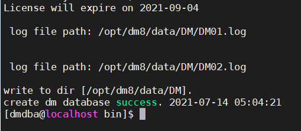


### 9.启动数据库

`./dmserver /opt/dm8/data/DM/dm.ini`


**注意：要出现SYSTEM IS READY**


### 10.配置数据库自动启动（root用户）

```shell
cd /opt/dm8/script/root

./dm_service_installer.sh -t dmserver -p DM -dm_ini /opt/dm8/data/DM/dm.ini
```

注册了一个以DM服务命令的自启动数据库服务

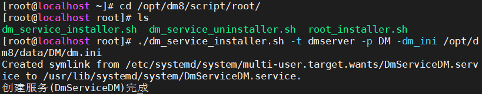

以dmdba用户，进行数据库的启动，如下：

```shell
#以dmdba用户，直接启动单实例

[dmdba@localhost ~]$ cd /opt/dm8/bin

[dmdba@localhost bin]$ ./DmServicememadb start
```

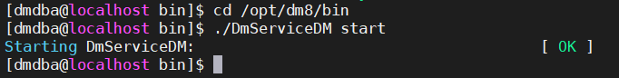

该条命令会创建linux Systemd的Unit

```shell
cd /usr/lib/systemd/system
ls Dm*
```

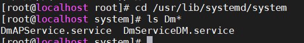

可以用以下方式启停数据库：

```shell
#用root用户
#启动数据库服务
systemctl start DmServicememadb
#停止数据库服务
systemctl stop DmServicememadb
#查看数据库服务状态
systemctl status DmServicememadb
```


### 11.安装完成后查看数据库相关信息

```shell
#查看ip
ip addr

#查看端口
ss -nltp

#查看数据库相关进程
ps -ef|grep dm

#进入DM命令行
cd /opt/dm8/bin
./disql 
```

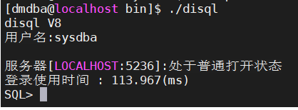


### 12.修改sysdba的密码

密码修改为：Mema_1234

`alter user "用户名" identified by "新密码"; `


修改好密码后登入方式：

`disql sysdba/Mema_1234`


### 13. 连接DM管理工具


点击新建服务器连接

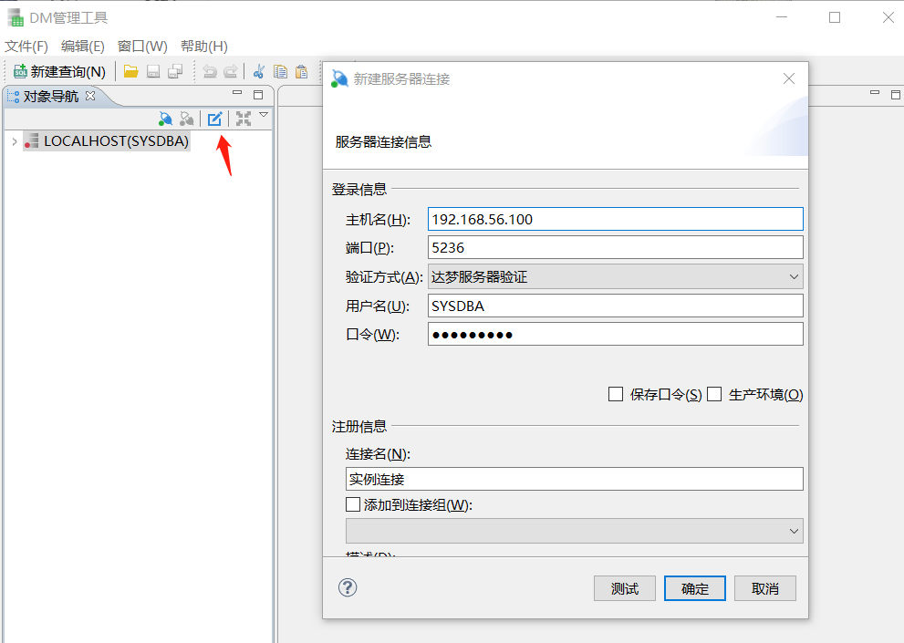

连接成功：

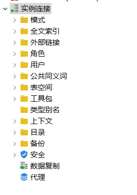

### 14.DM手册

手册位置：` cd  /opt/dm8/bin/doc `

**DM8_SQL程序设计，DM8系统管理员手册一定要看！**

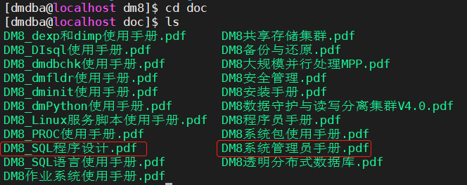

