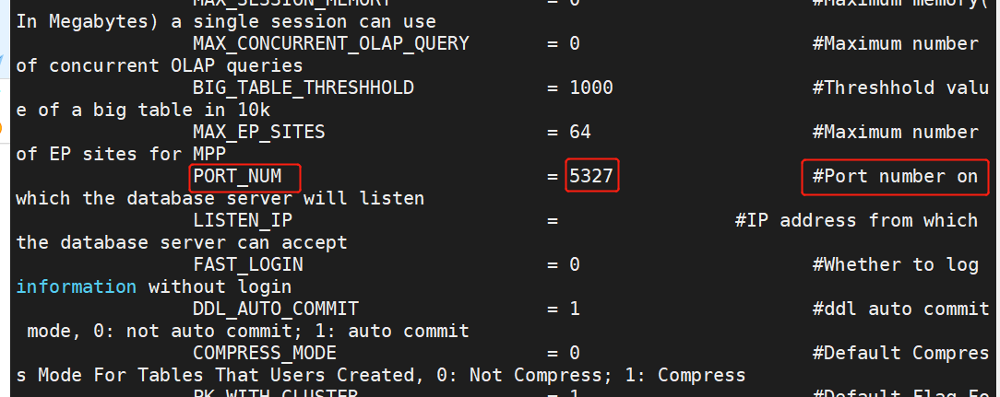
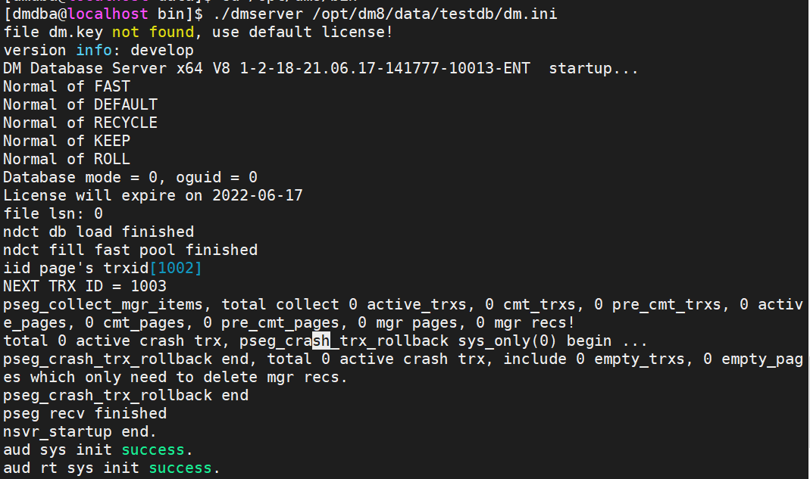
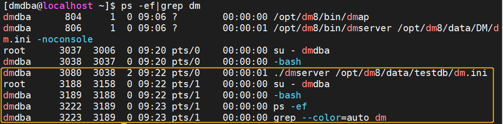
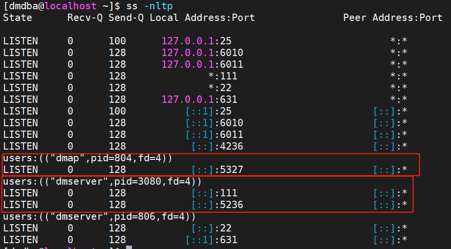
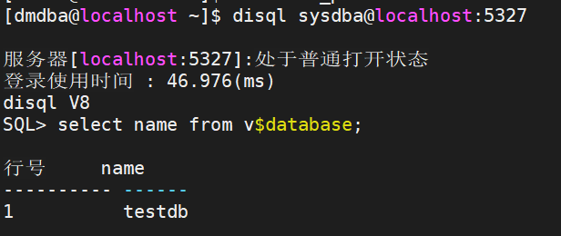
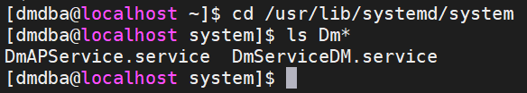
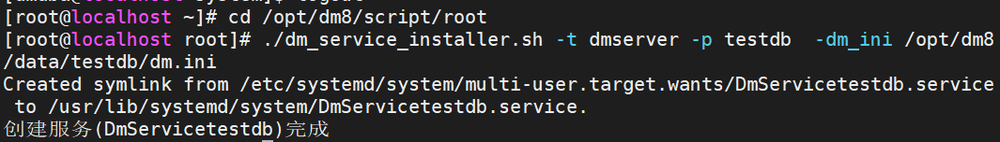
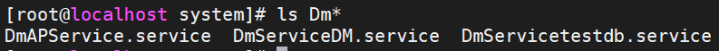
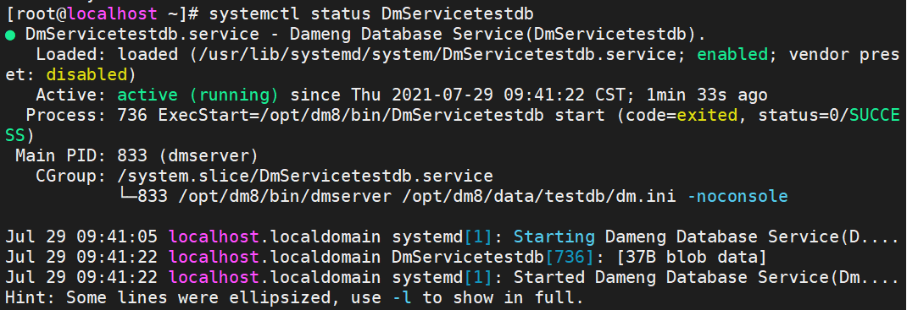
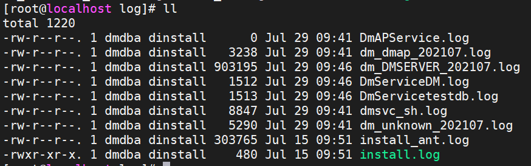

# DM8单机多实例数据库

### 1、创建一个新实例testdb

```sql
cd /opt/dm8/bin

./dminit PAGE_SIZE=32 EXTENT_SIZE=32 CHARSET=1 CASE_SENSITIVE=0 LENGTH_IN_CHAR=0 BLANK_PAD_MODE=1 DB_NAME=testdb PATH=/opt/dm8/data PORT_NUM=5327
```

如果没添加PORT_NUM参数，要对dm.ini里的文件进行修改

进入 /opt/dm8/data/testdb/ 修改 dm.ini 文件




### 2、启动第二个实例和数据库

```
./dmserver /opt/dm8/data/testdb/dm.ini
```




再开一个终端：

进入dmdba用户，查看进程状态：

```shell
ps -ef|grep dm
```



查看端口情况：

```shell
ss -nltp
```




### 3、disql访问

使用disql访问，需要提供端口号

```shell
disql sysdba@localhost:5327
```




### 4、注册实例到系统服务

注册实例实现systemd管理，实现自动启停。

注册前：

`cd /usr/lib/systemd/system`



注册(root用户运行)：

命令：dm_service_installer.sh

关键参数：

- `-t`   服务类型,包括dmimon,dmap,dmserver,dmwatcher,dmmonitor,dmcss,dmcssm,dmasmsvr,dmdcs,dmdrs,dmdras,dmdss
- `-p`   服务名后缀,对于dmimon,dmap服务类型无效

```
cd /opt/dm8/script/root

./dm_service_installer.sh -t dmserver -p testdb  -dm_ini /opt/dm8/data/testdb/dm.ini
```



注册后：

`cd /usr/lib/systemd/system`




### 5、查看实例服务状态

重启后，查看服务状态



实例启停查看

```shell
#用root用户
#启动数据库服务
systemctl start DmServicetestdb
#停止数据库服务
systemctl stop DmServicetestdb
#查看数据库服务状态
systemctl status DmServicetestdb
```


### 6、数据库实例运行日志

数据运行运行日志位于/opt/dm8/log下：



