## DM8数据守护(Data Watch) 实时主备环境搭建与管理


## 一、概述

### 1、架构

DM 数据守护（Data Watch）的实现原理非常简单：将主库（生产库）产生的Redo日志传输到备库，备库接收并重新应用Redo 日志，从而实现备库与主库的数据同步。DM数据守护的核心思想是监控数据库状态，获取主、备库数据同步情况，为Redo 日志传输与重演过程中出现的各种异常情况提供一系列的解决方案。
DM 数据守护系统结构，主要由`主库`、`备库`、`Redo 日志`、`Redo 日志传输`、`Redo 日志重演`、`守护进程（dmwatcher）`、`监视器（dmmonitor）`组成。

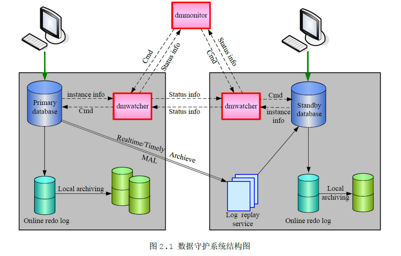

**MAL 系统** 是基于 TCP 协议实现的一种内部通信机制，DM 通过 MAL 系统实现 Redo 日志传输，以及其他一些实例间的消息通讯。

**守护进程(dmwatcher)** 是数据库实例和监视器之间信息流转的桥梁。数据库实例向本地守护进程发送信息，接收本地守护进程的消息和命令；

**监视器(dmmonitor)** 接收守护进程的消息，并向守护进程发送命令；数据库实例与监视器之间没有直接的消息交互；

守护进程解析并执行监视器发起的各种命令（Switchover/Takeover/Open force 等），并在必要时通知数据库实例执行相应的操作。

**MAL_DW_PORT** ： 守护进程监听端口，其他守护进程或监视器使用 MAL_HOST + MAL_DW_PORT 创建 TCP连接。监视器配置文件 dmmonitor.ini 中，MON_DW_IP 就是一组 MAL_HOST: MAL_DW_PORT。

**MAL_INST_DW_PORT** ：实例对守护进程的监听端口，守护进程使用 MAL_HOST + MAL_INST_DW_PORT 创建到实例的 TCP 连接。


**日志应用原理**

采用实时归档来作为主备数据同步的基础。如下实时归档日志应用流程：

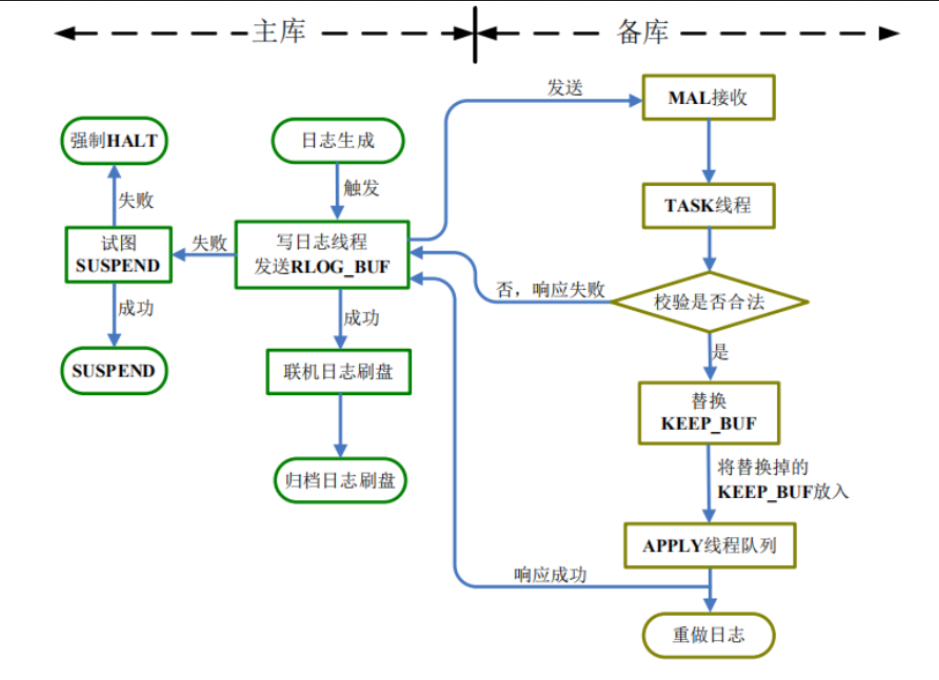

主库生成联机Redo 日志，当触发日志写文件操作后，日志线程先将 RLOG_BUF 发送到备库，备库接收后进行合法性校验（包括日志是否连续、备库状态是否 Open 等），不合法则返回错误信息，合法则作为 KEEP_BUF 保留在内存中，原有 KEEP_BUF 的 Redo 日志加入Apply 任务队列进行Redo 日志重演，并响应主库日志接收成功。如果备库接收日志失败，主库会尝试将状态置为SUSPEND状态，只允许读不允许写，如果SUSPEND状态失败，那么主库会挂起。

### 2、部署

配置实时主备，有以下几种配置方案，可以根据实际情况部署：

只配置主库和最多 8 个**实时备库**。

只配置主库和最多 8 个**异步备库**。

配置主库、最多 8 个实时备库，和最多 8 个异步备库。在实际应用中，如果数据库规模很大，并且对数据的实时性要求不是很严格， 则可以配置多个异步备库用于分担统计报表等任务。

### 3、注意事项

在配置数据守护 V4.0 之前，必须先通过备份还原方式同步各数据库的数据，确保各数据的数据保持完全一致。 主库可以是新初始化的数据库，也可以是正在生产、使用中的数据库。

不能使用分别初始化库或者直接拷贝数据文件的方法，原因如下：

1． 每个库都有一个永久魔数（`permenant_magic`）， 一经生成，永远不会改变， 主 库传送日志时会判断这个值是否一样，确保是来自同一个数据守护环境中的库，否则传送不 了日志。

2． 由于 dminit 初始化数据库时，会生成随机密钥用于加密，每次生成的密钥都不 相同，备库无法解析采用主库密钥加密的数据。

3． 每个库都有一个数据库魔数（`DB_MAGIC`）， 每经过一次还原、恢复操作， DB_MAGIC 就会产生变化，需要通过这种方式来区分同一个数据守护环境中各个不同的库。

需要注意：

对于新初始化的库，首次启动不允许使用 Mount 方式，需要先正常启动并正常 退出，然后才允许 Mount 方式启动。 准备数据时，如果主库是新初始化的库，先正常启动并正常退出，然后再使用 备份还原方式准备备库数据。

如果是初始搭建环境，可以通过对主库脱机备份、对备库脱机还原的方式来准备数据，如果主库已经处于运行状态，则可以对主库进行联机备份、对备库脱机还原的方式来准备数据。

需要注意：
在对数据库进行联机备份的时候需要开启数据库归档模式，才可以对数据库进行联机备份。


## 二、测试环境主机准备

测试环境通过vagrant+virtual Box搭建。

主库host1，备库host2除了nat网卡外，添加一块hostonly网卡，配置静态ip，做为内网，添加一块bridged网卡，配置静态ip，做为外网。（nat网卡主要是vagrant管理使用）

监视器主机monitor，除了nat网卡外，添加一块hostonly网卡，配置静态ip，做为内网

### 1、三台主机

| 角色   | 主机名  | IP地址                                       | 实例名称 | 数据库名称 | 操作系统       |
| ------ | ------- | -------------------------------------------- | -------- | ---------- | -------------- |
| 主库   | host1   | 192.168.56.201 （内网）192.168.0.201（外网） | mema1    | memadb     | Oracle Linux 7 |
| 备库   | host2   | 192.168.56.202 （内网）192.168.0.202（外网） | mema2    | memadb     | Oracle Linux 7 |
| 监视器 | monitor | 192.168.56.203（内网）                       |          |            | Oracle Linux 7 |

tips：配置主库和备库的外网时，需要根据自己电脑的无线局域网适配器 WLAN来进行设置

### 2、端口规划

| 实例名 | PORT_NUM | MAL_INST_DW_PORT | MAL_HOST       | MAL_PORT | MAL_DW_PORT |
| ------ | -------- | ---------------- | -------------- | -------- | ----------- |
| mema1  | 5236     | 5237             | 192.168.56.201 | 5238     | 5239        |
| mema2  | 5236     | 5237             | 192.168.56.202 | 5238     | 5239        |

### 3、主机准备工作

> 利用hostnamectl设置各个主机名称，利用timedatectl设置所有主机的时区到东八区
>
> 为了测试方便，所有密码设置为Mema_1234
>
> sshd提供远程密码登录功能（修改/etc/ssh/sshd.config文件，放开密码验证）
>
> ssh通过mobaXterm连接，可以开多个窗口


## 三、DM软件安装

三台机器都需要安装同一版本的达梦数据库软件

安装包存放目录：/opt/software

软件安装目录：/opt/dm8

### 1、创建用户、组和目录

**在所有节点（以root执行）**

```
[root@all]# groupadd -g 12349 dinstall
[root@all]# useradd -u 12345 -g dinstall -m -d /home/dmdba -s /bin/bash dmdba
[root@all]# passwd dmdba   --密码是Mema_1234

[root@all]# cd /
[root@all]# mkdir -p /opt/software
[root@all]# mkdir -p /opt/dm8
[root@all]# chown -R dmdba:dinstall /opt/dm8
```

### 2、修改资源限制设置

在所有节点（以root执行）

修改`/etc/security/limit.conf`文件

```
[root@all]# cd /etc/security
[root@all]# vi limits.conf
```

添加以下部分：

```
dmdba	soft	nproc	10240
dmdba	hard	nproc	10240
dmdba	soft	nofile	65536
dmdba	hard	nofile	65536
```

使limit生效

```
[root@all]# su - dmdba
[dmdba@all]$ ulimit -a
```

### 3、准备软件包

在所有节点（以root执行）

将安装包` DM8-20210618-x86-rh7-64位.zip`上传至`/opt/software`。

```
[root@all]# cd /opt/software
[root@all]# unzip  DM8-20210618-x86-rh7-64位.zip
# root@如果没有unzip程序，使用：yum install unzip 安装软件
[root@all]# mount -o loop dm8_20210618_x86_rh7_64_ent_8.1.2.18_pack3.iso  /mnt
```

### 4、安装数据库软件

所有节点，进入dmdba用户运行

```
[root@all]# su - dmdba
[dmdba@all]$ cd /mnt
[dmdba@all]$ ./DMInstall.bin -i
# 1 - 选c，中文
# 2 - 选n，无key
# 3 - 选y，设置时区
# 4 - 选21，中国标准时间
# 5 - 选1，典型安装
# 6 - 输入/opt/dm8，安装目的路径
# 7 - 选y，确认路径
# 8 - 选y，安装小结确认

## 接下来进入root用户，运行root_installer.sh脚本，创建DmAPService服务。
[dmdba@all]$ exit
[root@all]# /opt/dm8/script/root/root_installer.sh
```

安装rlwrap软件，支持disql上下箭头查找历史命令

```
[root@all]# yum install rlwrap
```

### 5、修改环境变量

所有节点，以dmdba运行。

在.bash_profile文件中添加路径：`/opt/dm8/bin`

```
[dmdba@all]$ cd
[dmdba@all]$ vi .bash_profile
#添加或修改以下：
# PATH=$PATH:$HOME/.local/bin:$HOME/bin:/opt/dm8/bin
# alias disql="rlwrap disql"
# alias dmrman="rlwrap dmrman"
```

到此，数据库软件安装完毕。

## 四、实例化数据库

### 1、创建主库

在host1上创建主库

```
[dmdba@host1]$ dminit PATH=/opt/dm8/data DB_NAME=memadb INSTANCE_NAME=mema1 PORT_NUM=5236  PAGE_SIZE=32 EXTENT_SIZE=32 CHARSET=1 CASE_SENSITIVE=0 LENGTH_IN_CHAR=0 BLANK_PAD_MODE=1 
```

使用dmserver 启动数据库，在DM 数据库第一次必须正常启动，完成初始化的动作：

```
[host1]$ dmserver /opt/dm8/data/memadb/dm.ini
```

### 2、设置主库为归档方式

克隆一个窗口，设置数据库为归档方式。

```
[dmdba@host1]$ disql sysdba
SQL> alter database mount;
SQL> alter database add archivelog 'DEST=/opt/dm8/data/memadb/arch,TYPE=local,FILE_SIZE=128,space_limit=0';
SQL> alter database archivelog;
SQL> alter database open;
SQL> select arch_mode from v$database;
```

### 3、注册服务并启动实例

```
[root@host1]# /opt/dm8/script/root/dm_service_installer.sh -t dmserver -dm_ini /opt/dm8/data/memadb/dm.ini -p mema1
[root@host1]# systemctl start DmServicemema1
# 查看服务状态
[root@host1]# systemctl status DmServicemema1
[root@host1]# ps -ef|grep dm.ini
```

2、DmService方式启动（需要用dmdba用户启动）

```
cd /opt/dm8/bin
./DmServicemema1 start
```


## 五、初次数据同步

### 1、备份主库

主库运行于归档方式，我们可以使用在线备份方式。

本次测试，我们使用dmrman进行脱机备份

```
[root@host1]# systemctl stop DmServicemema1
[root@host1]# su - dmdba
[dmdba@host1]$ dmrman
RMAN> backup database '/opt/dm8/data/memadb/dm.ini' full backupset '/opt/dm8/data/memadb/bak/memadb_bak01';
```

### 2、初始化备库

```
[dmdba@host2]$ dminit PATH=/opt/dm8/data DB_NAME=memadb INSTANCE_NAME=mema2 PORT_NUM=5236  PAGE_SIZE=32 EXTENT_SIZE=32 CHARSET=1 CASE_SENSITIVE=0 LENGTH_IN_CHAR=0 BLANK_PAD_MODE=1 
```

### 3、将主库的备份复制到备库

```
[dmdba@host1] cd /opt/dm8/data/memadb/bak
[dmdba@host1] scp -r memadb_bak01 192.168.3.202:`pwd`
```

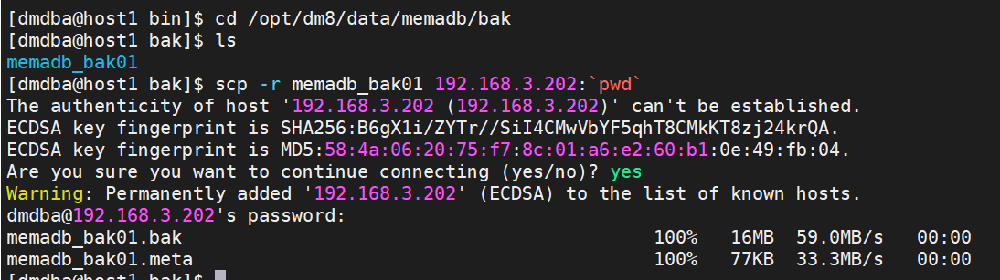

### 4、用主库备份恢复备库

```
[dmdba@host2] dmrman
RMAN> RESTORE DATABASE '/opt/dm8/data/memadb/dm.ini' FROM BACKUPSET '/opt/dm8/data/memadb/bak/memadb_bak01'
RMAN> RECOVER DATABASE '/opt/dm8/data/memadb/dm.ini' FROM BACKUPSET '/opt/dm8/data/memadb/bak/memadb_bak01'
RMAN> RECOVER DATABASE '/opt/dm8/data/memadb/dm.ini' UPDATE DB_MAGIC
```

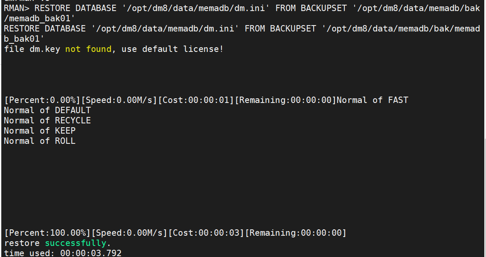

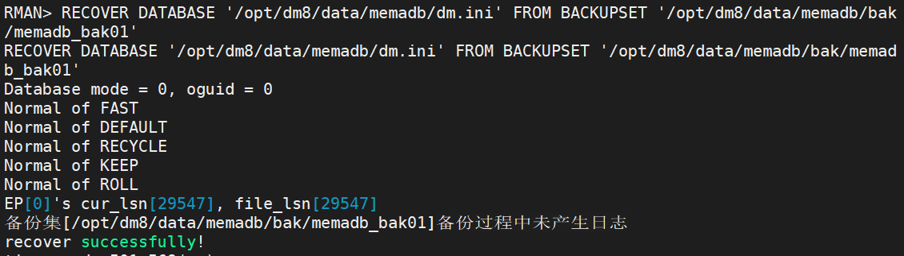

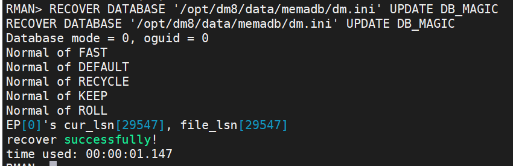

## 六、配置主备库参数

### 1、配置dm.ini

修改主备库参数，注意2个库的instance_name参数不同。

```
[dmdba@host1]vi /opt/dm8/data/memadb/dm.ini
```

```
INSTANCE_NAME = mema1 
#INSTANCE_NAME = mema2
PORT_NUM = 5236  #数据库实例监听端口
ALTER_MODE_STATUS = 0  #不允许手工方式修改实例模式/状态
ENABLE_OFFLINE_TS = 2  #不允许备库 OFFLINE 表空间
MAL_INI = 1  #打开 MAL 系统
ARCH_INI = 1  #打开归档配置
```

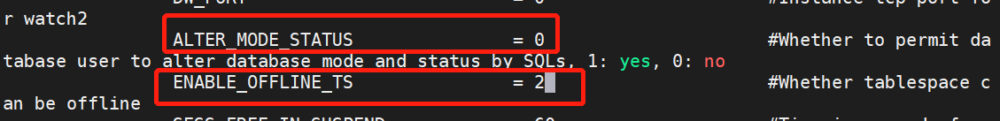


```
[dmdba@host2]vi /opt/dm8/data/memadb/dm.ini
```

```
#INSTANCE_NAME = mema1 
INSTANCE_NAME = mema2
PORT_NUM = 5236  #数据库实例监听端口
ALTER_MODE_STATUS = 0  #不允许手工方式修改实例模式/状态
ENABLE_OFFLINE_TS = 2  #不允许备库 OFFLINE 表空间
MAL_INI = 1  #打开 MAL 系统
ARCH_INI = 1  #打开归档配置
```

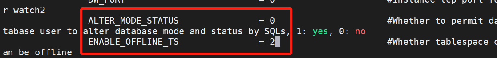

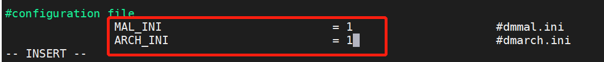

### 2、配置dmmal.ini

2节点配置配置一样。具体如下：

```
MAL_CHECK_INTERVAL = 5          #MAL 链路检测时间间隔
MAL_CONN_FAIL_INTERVAL = 5      #判定 MAL 链路断开的时间

[MAL_INST1]
MAL_INST_NAME = mema1           #实例名，和 dm.ini 中的 INSTANCE_NAME 一致
MAL_HOST = 192.168.56.201       #MAL 系统监听 TCP 连接的 IP 地址
MAL_PORT = 5238                 #MAL 系统监听 TCP 连接的端口
MAL_DW_PORT = 5239              #实例对应的守护进程监听 TCP 连接的端口
MAL_INST_HOST = 192.168.0.201   #实例的对外服务 IP 地址
MAL_INST_PORT = 5236            #实例的对外服务端口，和 dm.ini 中的 PORT_NUM 一致
MAL_INST_DW_PORT = 5237         #实例监听守护进程TCP连接的端口
            

[MAL_INST2]
MAL_INST_NAME = mema2
MAL_HOST = 192.168.56.202
MAL_PORT = 5238
MAL_DW_PORT = 5239
MAL_INST_HOST = 192.168.0.202
MAL_INST_PORT = 5236
MAL_INST_DW_PORT = 5237        
```

### 3、配置dmarch.ini

2节点都配置，ARCH_DEST分写写对方的实例。比如当前实例 mema1 是主库，则ARCH_DEST 配置为 mema2。

```
[dmdba@host1]vi /opt/dm8/data/memadb/dmarch.ini
```

```
[ARCHIVE_REALTIME] 
ARCH_TYPE = REALTIME                       #实时归档类型
ARCH_DEST = mema2                          #实时归档目标实例名

[ARCHIVE_LOCAL1]
ARCH_TYPE = LOCAL                          #本地归档类型
ARCH_DEST = /opt/dm8/data/memadb/arch      #本地归档文件存放路径
ARCH_FILE_SIZE = 128                       #单位 Mb，本地单个归档文件最大值
ARCH_SPACE_LIMIT = 0                       #单位 Mb，0 表示无限制，范围 1024~4294967294M
```

```
[dmdba@host2]vi /opt/dm8/data/memadb/dmarch.ini
```

```
[ARCHIVE_REALTIME] 
ARCH_TYPE = REALTIME                       #实时归档类型
ARCH_DEST = mema1                          #实时归档目标实例名

[ARCHIVE_LOCAL1]
ARCH_TYPE = LOCAL                          #本地归档类型
ARCH_DEST = /opt/dm8/data/memadb/arch      #本地归档文件存放路径
ARCH_FILE_SIZE = 128                       #单位 Mb，本地单个归档文件最大值
ARCH_SPACE_LIMIT = 0                       #单位 Mb，0 表示无限制，范围 1024~4294967294M
```

### 4、配置dmwatcher.ini

2节点都配置。守护进程使用MANUAL，手工切换模式。

```
[GRP1]
DW_TYPE = GLOBAL                            #全局守护类型
DW_MODE = MANUAL                            #自动切换模式
DW_ERROR_TIME = 10                          #远程守护进程故障认定时间
INST_RECOVER_TIME = 60                      #主库守护进程启动恢复的间隔时间
INST_ERROR_TIME = 10                        #本地实例故障认定时间
INST_OGUID = 453331                         #守护系统唯一 OGUID 值
INST_INI = /opt/dm8/data/memadb/dm.ini      #dm.ini 配置文件路径
INST_AUTO_RESTART = 1                       #打开实例的自动启动功能
INST_STARTUP_CMD = /opt/dm8/bin/dmserver    #命令行方式启动
RLOG_SEND_THRESHOLD = 0                     #指定主库发送日志到备库的时间阀值，默认关闭
RLOG_APPLY_THRESHOLD = 0                    #指定备库重演日志的时间阀值，默认关闭
```

注：

> 在DM DW4.0 之后，已经不再需要生成dmwatcher.ctl 控制文件，dmctlcvt 工具也不再支持dmwaterch.ctl 文件的生成。

## 七、以mount方式启动主备库

以 mount 方式启动主库和备库

```
[dmdba@host1] dmserver /opt/dm8/data/memadb/dm.ini mount
```

```
[dmdba@host2] dmserver /opt/dm8/data/memadb/dm.ini mount
```

注意：

> 一定要以 mount 方式启动数据库实例，否则系统启动时会重构回滚表空间，生成 Redo 日志；并且，启动后应用可能连接到数据库实例进行操作，破坏主备库的数据一致性。数据守护配置结束后，守护进程会自动 Open 数据库。

## 八、设置OGUID

在主备库分别执行：

```
[dmdba@host1] disql sysdba
SQL> sp_set_oguid(453331);
```

```
[dmdba@host2] disql sysdba
SQL> sp_set_oguid(453331);
```

## 九、修改主备库模式

主库修改数据库为 primary

```
SQL> alter database primary;
```

备库：

```
SQL> alter database standby;
```


## 十、注册并启动守护进程

在主备库进行注册：

```
[root@host1]# /opt/dm8/script/root/dm_service_installer.sh -t dmwatcher -watcher_ini /opt/dm8/data/memadb/dmwatcher.ini -p mema
[root@host2]# /opt/dm8/script/root/dm_service_installer.sh -t dmwatcher -watcher_ini /opt/dm8/data/memadb/dmwatcher.ini -p mema
```

在主备库启动服务：

```
[root@host1]# systemctl start DmWatcherServicemema
[root@host2]# systemctl start DmWatcherServicemema
```


## 十一、配置监视器

在第三台机器monitor配置监视器

### 1、参数文件

在监控节点的/opt/dm8/data/memadb/目录下创建并修改 dmmonitor.ini 配置确认监视器，其中 MON_DW_IP 中的 IP 和 PORT 和dmmal.ini 中的 MAL_HOST 和 MAL_DW_PORT 配置项保持一致。

```
MON_DW_CONFIRM = 1                   #确认监视器模式
MON_LOG_PATH = /opt/dm8/log          #监视器日志文件存放路径
MON_LOG_INTERVAL = 60                #每隔 60s 定时记录系统信息到日志文件
MON_LOG_FILE_SIZE = 32               #每个日志文件最大 32M
MON_LOG_SPACE_LIMIT = 0              #不限定日志文件总占用空间

[GRP1]
MON_INST_OGUID = 453331              #组 GRP1 的唯一 OGUID 值
MON_DW_IP = 192.168.56.201:5239
MON_DW_IP = 192.168.56.202:5239
```

### 2、启动监视器

```
[dmdba@monitor]$ dmmonitor /opt/dm8/data/memadb/dmmonitor.ini
```


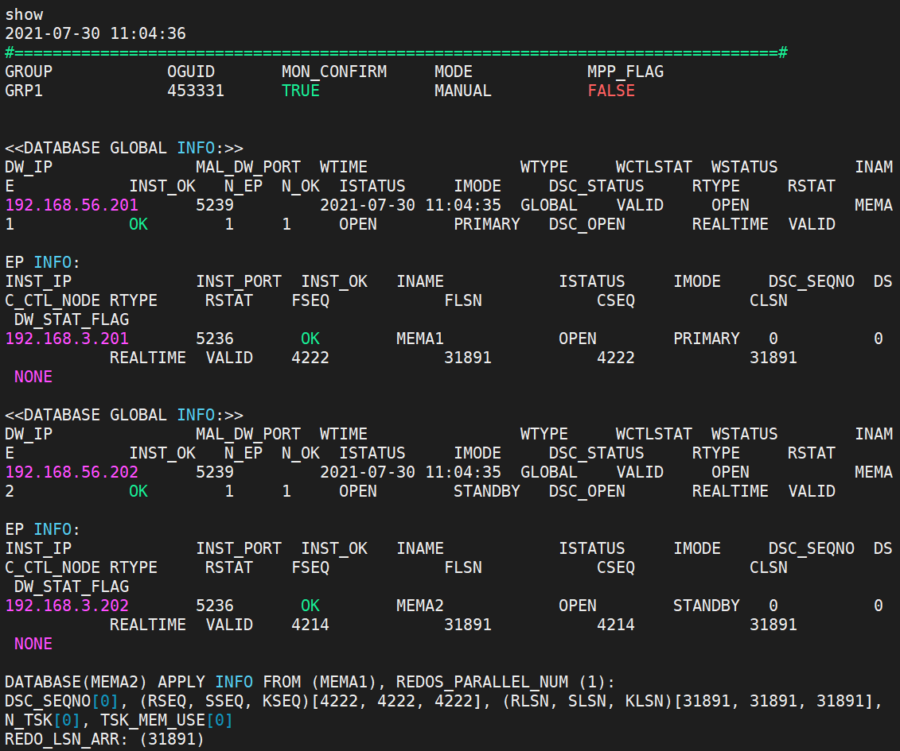

## 十二、测试和管理

### 1、主备库同步测试

主库：

```
[dmdba@host1]disql sysdba@host1:5236
SQL> create table t_objects as select * from sysobjects;
SQL> select count(*) from t_objects;
```

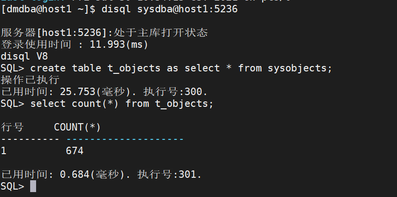

备库：

```
[dmdba@host2]disql sysdba@host2:5236
SQL> select count(*) from t_objects;
```

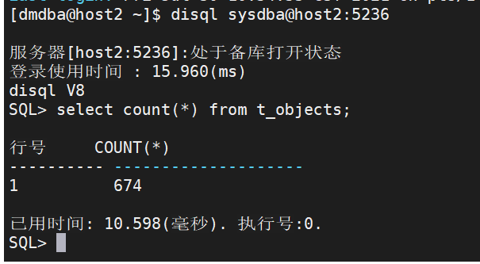


### 2、主备库切换测试

#### 2.1 Switchover切换

操作直接在监控器里面通过指令执行。

`choose switchover` 选择可以switchover的数据库。

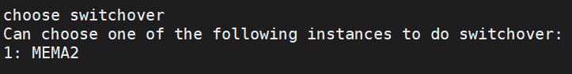


需要进行身份验证，指令`login`

输入数据库的sysdba和对应的密码。验证通过。

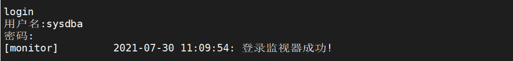

利用指令`switchover mema2`实施switchover

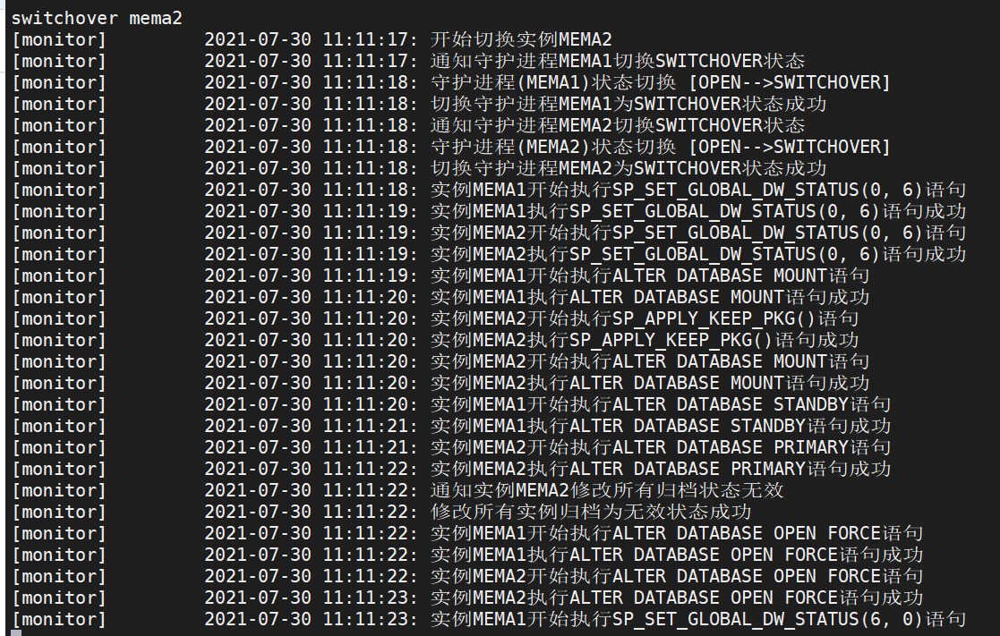

switchover后自动显示DW实时复制的状态。

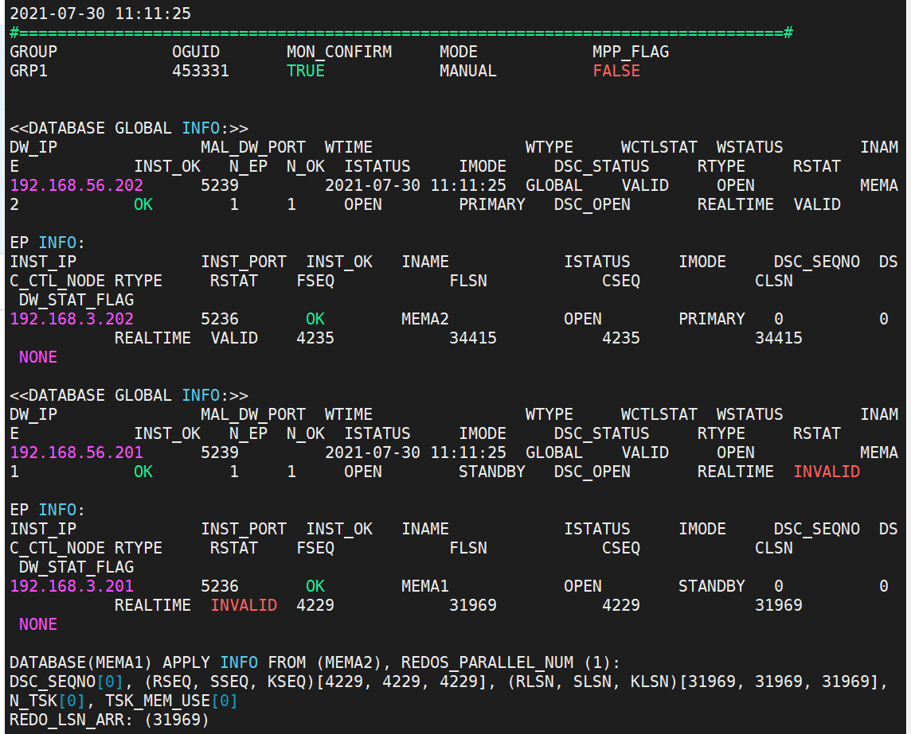

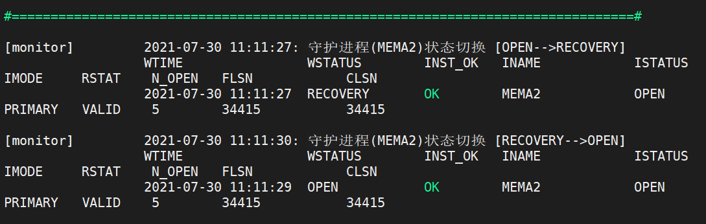

#### 2.2 Takeover接管

等复制组内有故障节点时，可以实施自动或手动takeover接管。

`choose takeover` 选择可以接管的节点，如果所有节点正常，则没有候选节点。


登录到host2，停止网络服务，模拟节点故障。

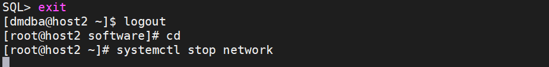

monitor报mema2节点错误。

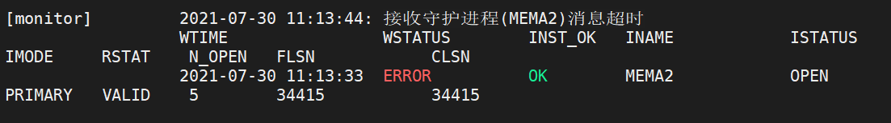

再次输入`choose takeover`，显示mema1可以做为接管候选节点。

输入`takeover mema1` 指定，让mema1接管复制组。


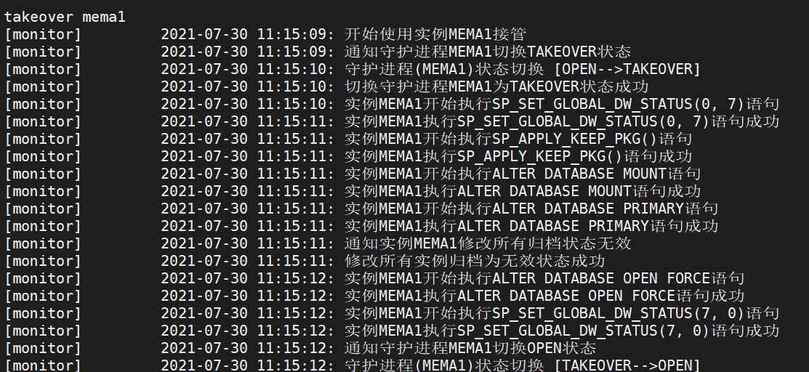

接管后状态汇报。

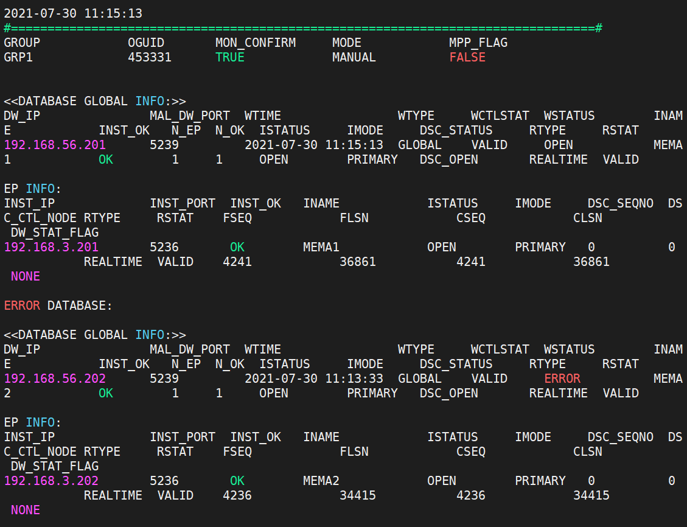

在mema1节点利disql连接到数据库，状态正常。

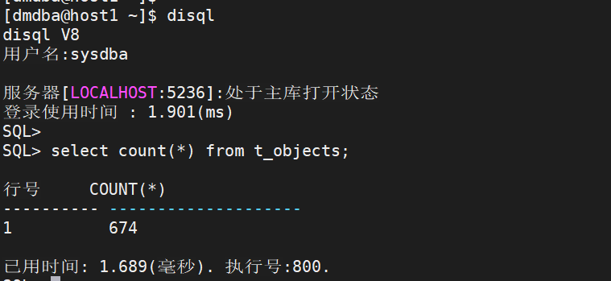

#### 2.3 恢复DW环境

到mema2控制台，恢复网络服务。

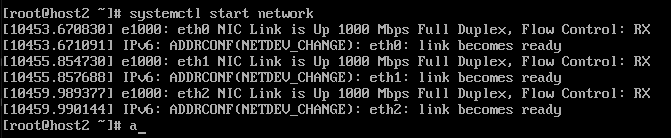

monitor检测到mema2恢复正常。

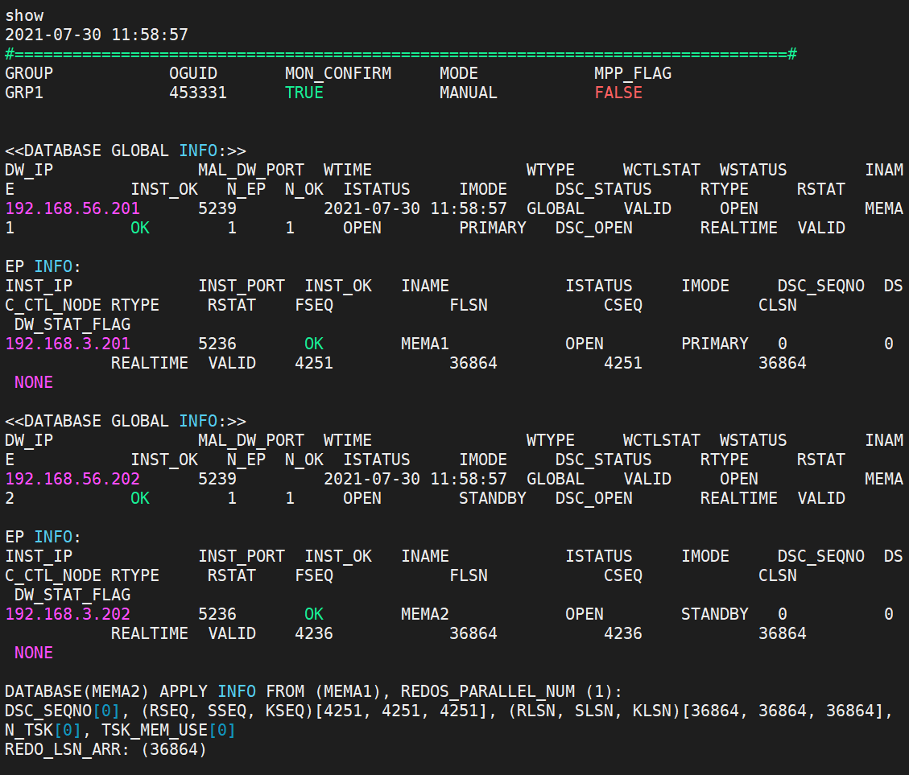

复制组自动恢复。（由于只是断网测试，导致复制组出现脑裂）

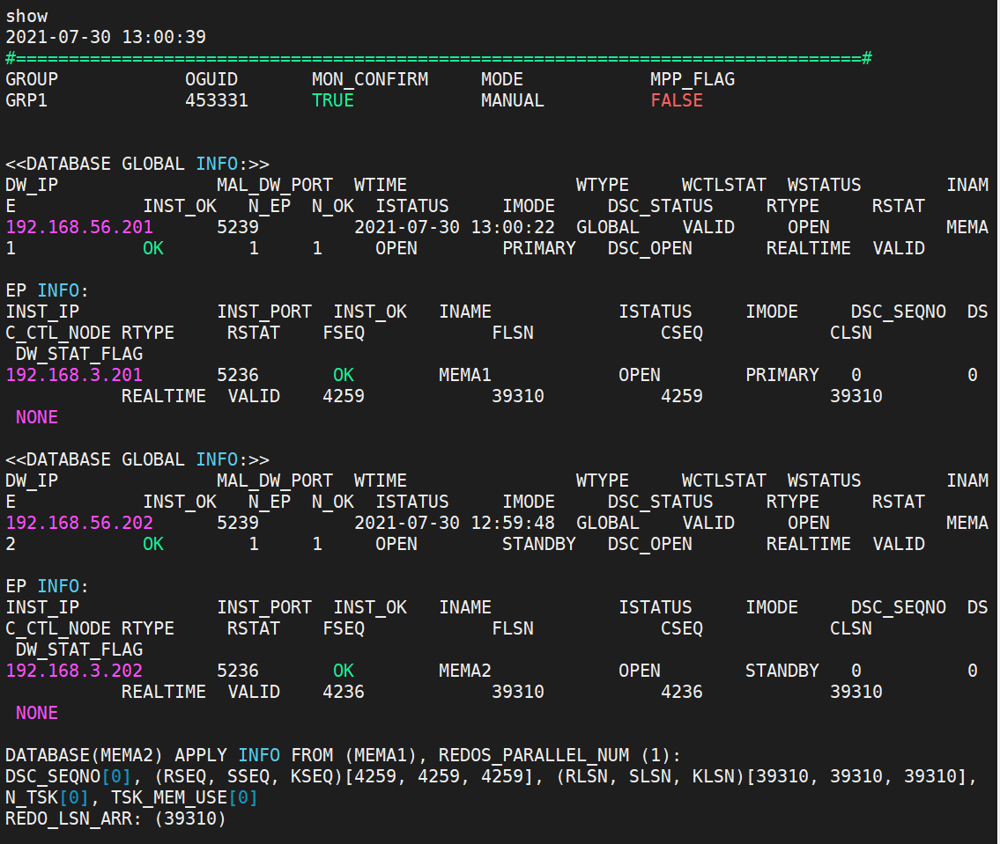

使用指令`tip`了解复制组当前状态。

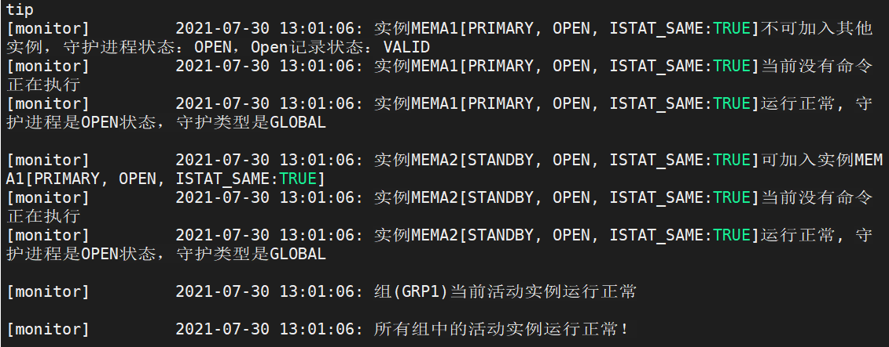

如果出现报错

解决方法：重新创建备库，同步（如果有更好方法，欢迎交流）。

#### 2.4 异常处理

目前状态，mema1在primary模式，正常打开，mema2在primary模式，发生split。

动态重建备库，在不停止主库服务的情况下动态搭建。

1）在monitor主机，关闭dmmonito进程，使用`exit`指令即可。


2） 在host2主机，关闭守护进程和数据库进程

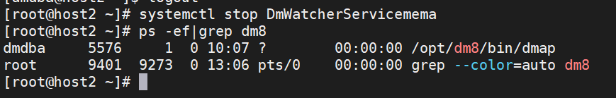

3） 清理脑裂产生的文件。

（如果没有dmwatcher.ini之外的dmwatch开头的文件就不用删除）

删除命令：`rm dmwatcher*`

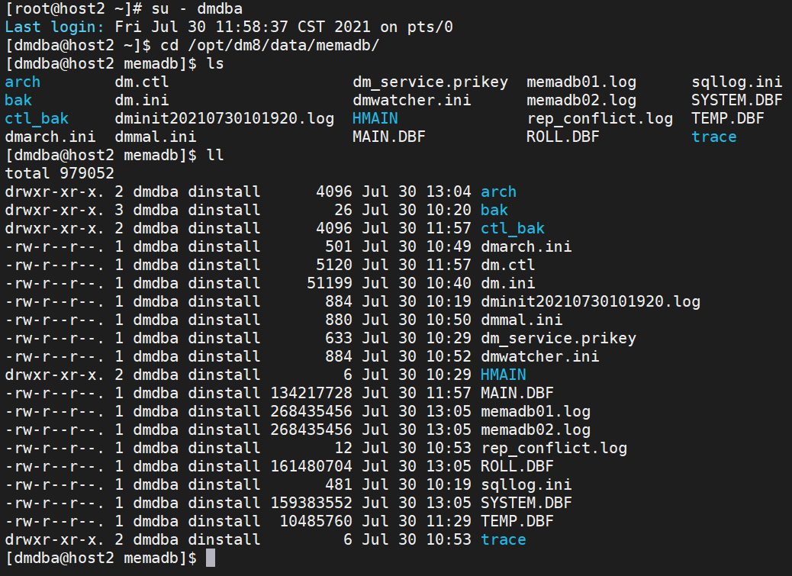

注：这一步误删除了一个配置文件dmwatcher.ini。后面从host1 rcp回来即可。

4）在host1主机上，在线备份memadb数据库

```sql 
backup database full backupset;
```


拷贝备份到host2节点相应位置：

```shell
cd /opt/dm8/data/memadb/bak 

scp -r DB_memadb_FULL_20210730_130844_212306/ 192.168.3.202:'pwd'
```

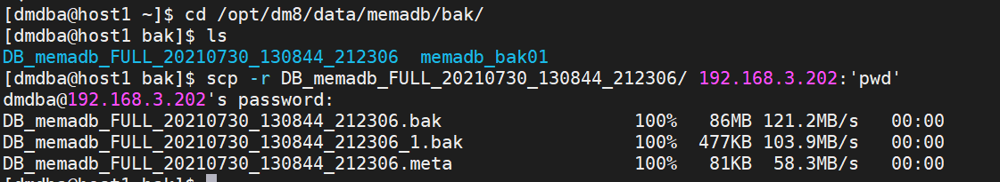

5） 在host2恢复数据库：

```
[dmdba@host2] dmrman
RMAN> RESTORE DATABASE '/opt/dm8/data/memadb/dm.ini' FROM BACKUPSET '/opt/dm8/data/memadb/bak/DB_memadb_FULL_20210730_130844_212306'
RMAN> RECOVER DATABASE '/opt/dm8/data/memadb/dm.ini' FROM BACKUPSET '/opt/dm8/data/memadb/bak/DB_memadb_FULL_20210730_130844_212306'
RMAN> RECOVER DATABASE '/opt/dm8/data/memadb/dm.ini' UPDATE DB_MAGIC
```

6） 将host1上的dmwatcher.ini scp到host2（如果误删）

```shell
cd /opt/dm8/data/memadb

scp dmwatcher.ini 192.168.3.202:'pwd'
```

7） 启动host2上监控进程

```shell 
systemctl start DmWatcherServicemema

ps -ef|grep dm8
```

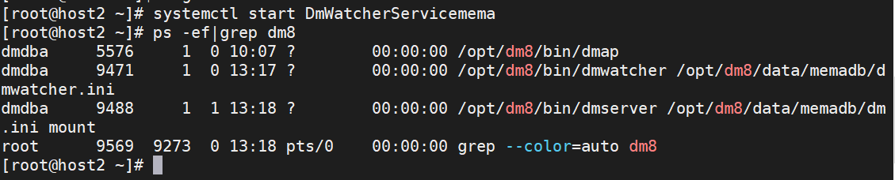

8） 启动monitor上dmmonitor

```shell
dmmonitor /opt/dm8/data/memadb/dmmonitor.ini
```

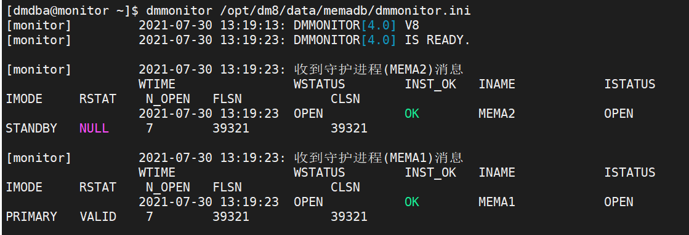

9） 查看集群状态	`show`

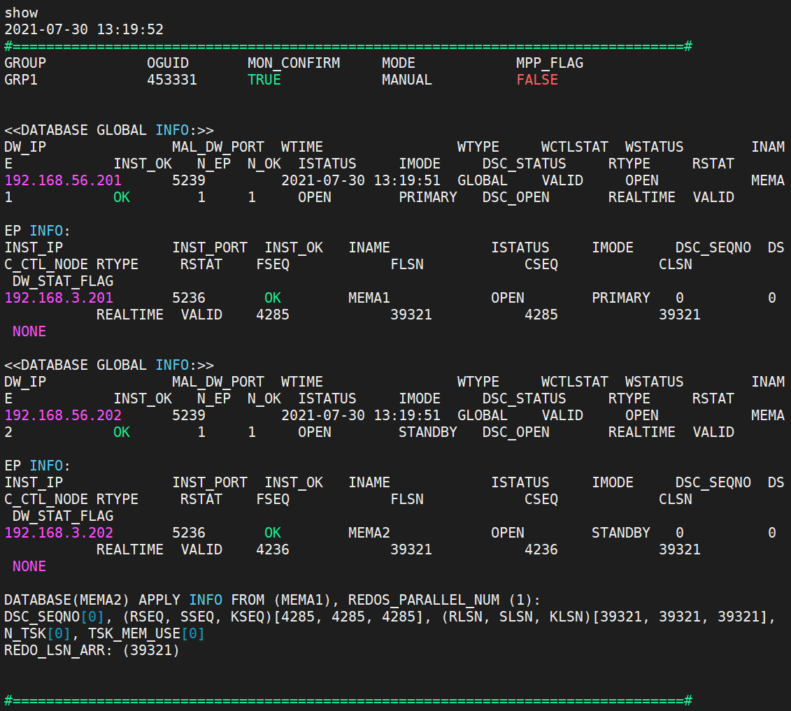

### 3、启动和关闭测试

因为Global 守护类型的守护进程，会自动将数据库实例切换到 Open 状态，并将守护进程状态也切换为 Open。因此在关闭DW系统时，必须按照一定的顺序来关闭守护进程和实例。

可以在监视器中执行 Stop Instance 命令关闭数据守护系统，命令执行成功后，数据库实例正常关闭。但守护进程并没有真正退出，而是将状态切换为Shutdown 状态。

如果使用手动方式关闭数据守护系统，请严格按照以下顺序：

> 如果启动了确认监视器，先关闭确	认监视器（防止自动接管）
>
> 关闭主库守护进程（防止重启实例）
>
> 关闭备库守护进程（防止重启实例）

*在关闭守护进程时会自动关闭对应的DM实例。 所以我们这里只需要关闭对应的守护进程即可。*

#### 3.1 关闭DW环境

关闭守护系统时，**必须按照一定的顺序**来**关闭**进程和数据库实例。特别是自动切换模式，如果退出守护进程或主备库的顺序不正确可能会引起切换甚至造成守护进程组分裂。

通过监视器执行`Stop Group `命令 关闭数据守护系统，是最简单、安全的方式。命令执行成功后，数据库实例正常关闭。但守护进程没有真正退出，而是将状态切换为Shutdown状态。

`Stop Group`命令内部流程如下：

1. 通知守护进程切换为Shutdown状态
2. 通知主库退出
3. 通知其他备库退出


我们这里使用手工方式关闭DW.

```shell
# 1.关闭监视器进程
[root@monitor]# 
# 直接ctrl + c 结束命令即可。


# 2.关闭主库守护进程
[root@host1]# systemctl stop DmWatcherServicemema
[root@host1]# ps -ef|grep dm.ini
root     18324 16166  0 05:45 pts/6    00:00:00 grep --color=auto dm.ini


# 3.关闭备库守护进程
[root@host2]#  systemctl stop DmWatcherServicemema
[root@host2]# ps -ef|grep dm.ini
root     16460 14503  0 05:46 pts/4    00:00:00 grep --color=auto dm.ini

```

#### 3.2 启动DW环境

```shell
# 启动主库
[root@host1]# systemctl start DmWatcherServicemema

# 启动备库
[root@host2]# systemctl start DmWatcherServicemema

# 启动监视器
[dmdba@monitor]$ dmmonitor /opt/dm8/data/memadb/dmmonitor.ini
```


## 十三、客户端连接配置

配置 DM 数据守护，一般要求配置连接服务名，以实现故障自动重连。连接服务名可以在 DM 提供的 JDBC、 DPI 等接口中使用，连接数据库时指定连接服务名，接口会随机选择一个 IP 进行连接，如果连接不成功或者服务器状态不正确，则顺序获取下一个 IP 进行连接，直至连接成功或者遍历了所有 IP。

可以通过编辑 dm_svc.conf 文件配置连接服务名。 dm_svc.conf 配置文件在 DM 安装时生成。

Windows 平台下位于%SystemRoot%\system32 目录， Linux 平台下位于/etc 目录。

连接服务名格式：
`SERVERNAME=(IP[:PORT],IP[:PORT],......)`

dm_svc.conf 文件中常用配置项目说明：

- SERVERNAME
  连接服务名，用户通过连接服务名访问数据库。
-  IP
  数据库所在的 IP 地址，如果是 IPv6 地址，为了区分端口，需要用[]封闭 IP 地址。
- PORT
  数据库使用的 TCP 连接端口，可选配置，不配置则使用连接上指定的端口。 
- LOGIN_MODE
  指定优先登录的服务器模式。 0： 优先连接 Primary 模式的库， Normal 模式次之，
  最后选择 Stantby 模式； 1：只连接主库； 2：只连接备库； 3：优先连接 Standby 模式
  的库， Primary 模式次之，最后选择Normal模式； 4：优先连接Normal模式的库， Primary
  模式次之，最后选择 Standby 模式。 默认值为 0。
- SWITCH_TIME
  检测到数据库实例故障时，接口在服务器之间切换的次数；超过设置次数没有连接到有
  效数据库时，断开连接并报错。有效值范围 1~9223372036854775807，默认值为 3。
- SWITCH_INTERVAL
  表 示 在 服 务 器 之 间 切 换 的 时 间 间 隔 ， 单 位 为 毫 秒 ， 有 效 值 范 围
  1~9223372036854775807，默认值为 200。
- RW_SEPARATE
  指定是否启用读写分离。 0 表示不启用读写分离； 1 表示启用读写分离，默认值为 0。
- RW_PERCENT
  启用读写分离时， 读写分离的分发比例，有效值范围 0~100，默认值为 25。
  例如，配置一个名为 dw_svc 的连接服务名，使用 dw_svc 连接数据守护中的数据库，
  即可实现故障自动重连。

```
memadb=(192.168.3.201:5236,192.168.3.202:5236)
LOGIN_MODE=(1)
SWITCH_TIME=(3)
SWITCH_INTERVAL=(1000)
```


## 附录：其他测试

在host1以sysdba进入disql

为业务用户建立表空间

```sql
CREATE TABLESPACE TS_MEMA
DATAFILE 'tsmema01.dbf' SIZE 128, 'tsmema02.dbf' SIZE 128;
```

建一个业务用户

```sql
CREATE USER MEMA
IDENTIFIED BY Mema_1234
DEFAULT TABLESPACE TS_MEMA;

grant resource to mema;
```

在host2上查看:	

```sql
select name from v$tablespace;
select username from all_users;
host ls /opt/dm8/data/memadb
```

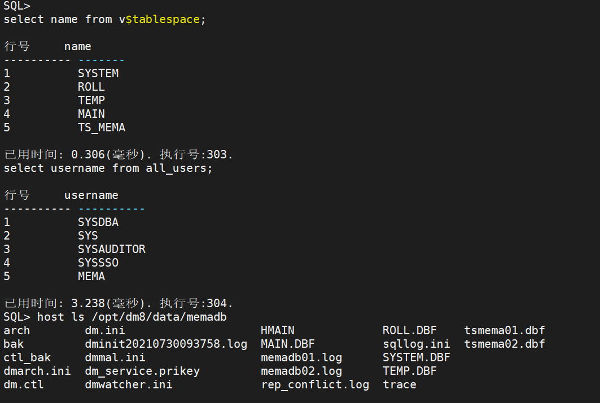

在host1上用mema用户登录，建表，生成批量随即数据。

```sql
conn mema/Mema_1234@host1:5236

CREATE TABLE student (
id int, name varchar(20), math int, english int,
science int
);

insert into student select rownum as id,
dbms_random.string('1',trunc(dbms_random.value(3,8))),
trunc(dbms_random.value(0,100)),
trunc(dbms_random.value(0,100)),
trunc(dbms_random.value(0,100))
from dual connect by level <=10000000;
-- 估计执行时间5分钟

commit;
```

登录host2上mema2例程查看数据库：

```sql
select count(*) from student
```

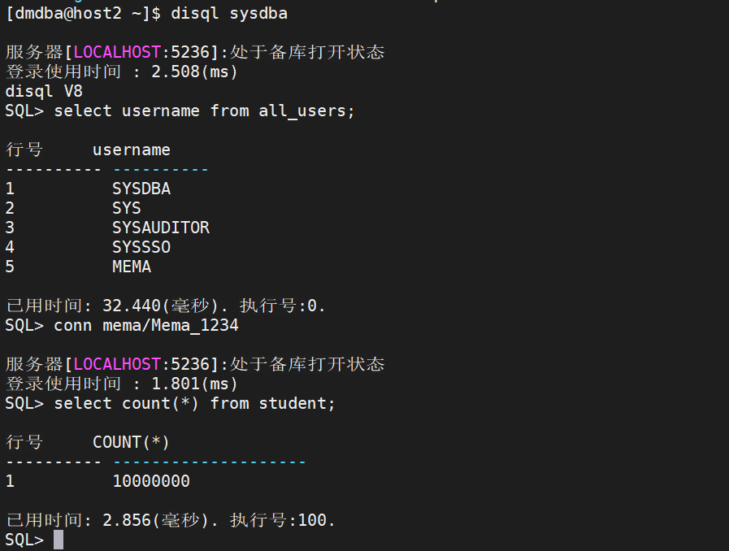

host1和host2上产生的归档日志：

```
#分别在两个节点上查看
cd /opt/dm8/data/memadb/arch/
ls
ll
```

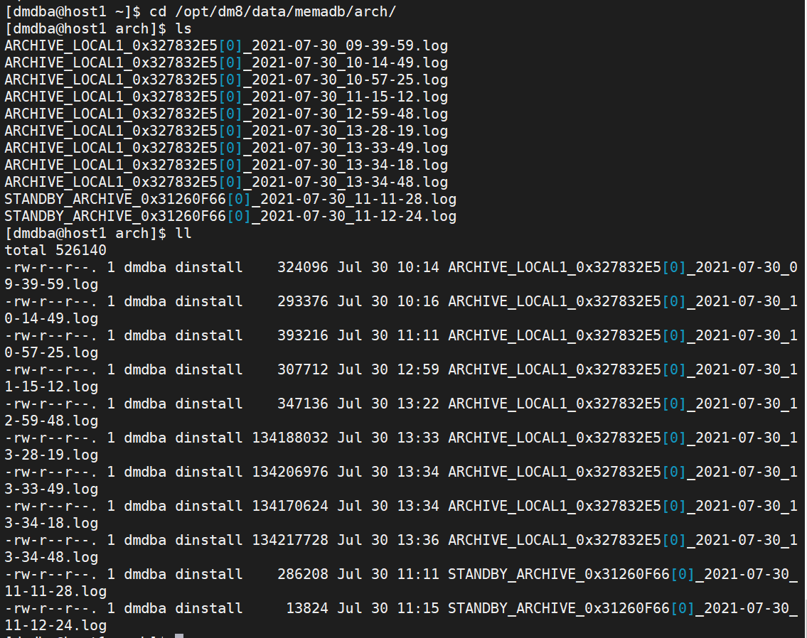

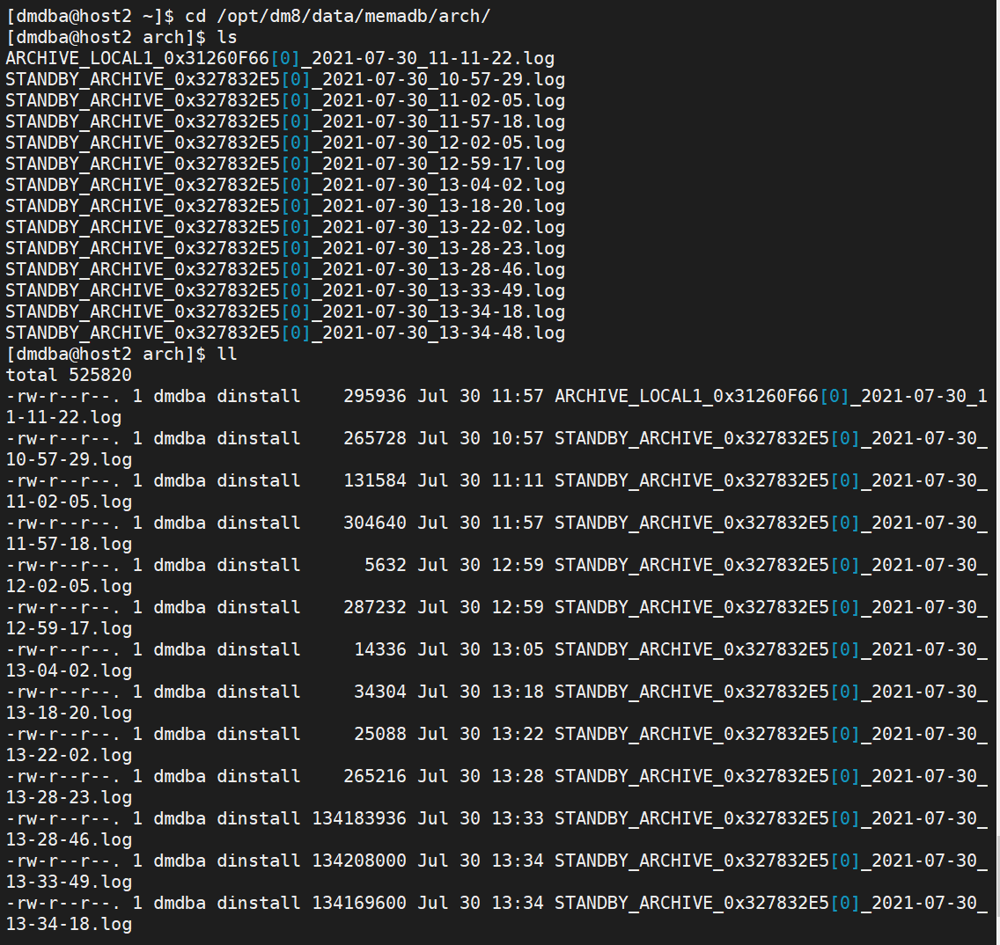
