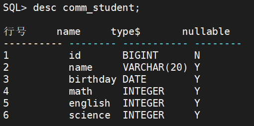
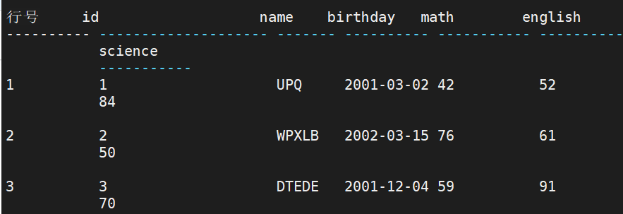
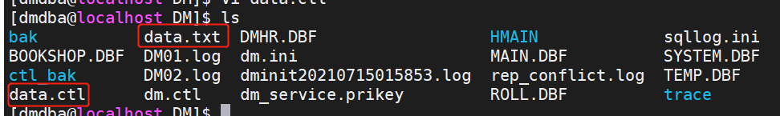
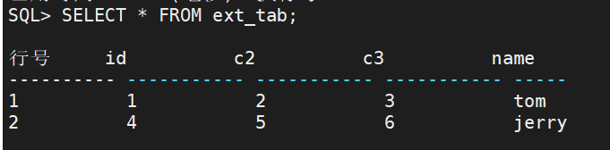
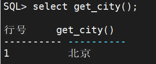
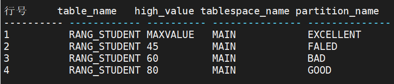
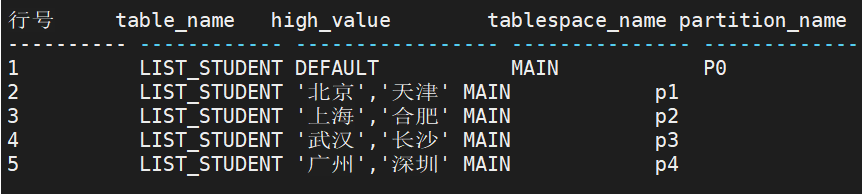
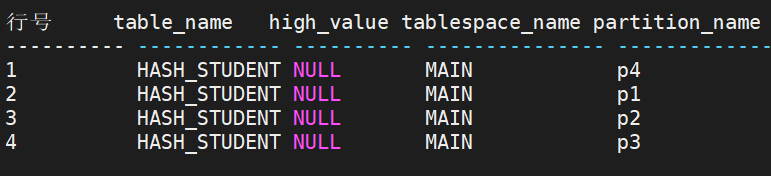
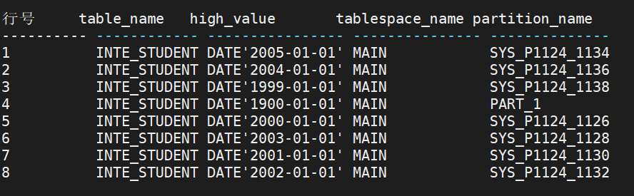

# DM中的各种表

达梦数据库有：普通表、分区表、临时表、堆表(rowid)、列存表（HUGE）、外部表等 默认的普通表是索引组织部表（索引组织表，无主键利用 rowid，并发不好）。

### 1、 普通表（索引组织表）

创建普通表，id使用自增列

```SQL
CREATE TABLE comm_student (
id bigint identity,
name varchar(20),
birthday date,
math int,
english int,
science int
);

insert into comm_student 
select
dbms_random.string('1',trunc(dbms_random.value(3,8))),
current_date()-365*20+dbms_random.value(-365,365),
trunc(dbms_random.value(40,100)),
trunc(dbms_random.value(40,100)),
trunc(dbms_random.value(40,100))
from dual
connect by level <=100;

commit;

-- 或：
-- 通过存储过程添加随机生成数据
CREATE OR REPLACE PROCEDURE GEN_DATA(num int) AS
DECLARE
 id int;
BEGIN
 id:=1;
 while id <= num loop
  insert into comm_student values(
  		dbms_random.string('1',trunc(dbms_random.value(3,8))),
		current_date()-365*20+dbms_random.value(-365,365),
		trunc(dbms_random.value(40,100)),
		trunc(dbms_random.value(40,100)),
		trunc(dbms_random.value(40,100)));
  id:=id+1;
 end loop;
END;

call GEN_DATA(100000);
```





反向生成DDL语句为：

```SQL
CREATE TABLE "USER_MEMA"."student1"
(
"id" BIGINT IDENTITY(1, 1) NOT NULL,
"name" VARCHAR(20),
"birthday" DATE,
"math" INT,
"english" INT,
"science" INT) STORAGE(ON "TS_MEMA", CLUSTERBTR) ;
```

### 2、堆表

```
CREATE TABLE heap_student (
id bigint identity,
name varchar(20),
birthday date,
math int,
english int,
science int
)
STORAGE ( BRANCH(4,2));

insert into heap_student 
select
dbms_random.string('1',trunc(dbms_random.value(3,8))),
current_date()-365*28+dbms_random.value(-366,366),
trunc(dbms_random.value(0,100)),
trunc(dbms_random.value(0,100)),
trunc(dbms_random.value(0,100))
from dual
connect by level <=10000;

commit;
```

**堆表的维护**　

　堆表在进行数据扫描过程中，有着其先天的优势。如果知道了数据记录的 ROWID，则直接可以对 ROWID 进行解码，得到该记录的文件号、页号和页内偏移，也就得到了该记录。 　所以建议在经常查询的列上建立二级索引，这样在进行操作中，先通过二级索引找到记录ROWID，就可以直接找到数据，效率有较大提高。 　堆表虽然支持表的 ALTER 操作，但是建议轻易不要进行此类操作。对表进行 ALTER操作，数据记录的 ROWID 有可能发生改变，这样每次进行 ALTER 操作，都可能进行索引的重建，需要花费较多的时间。 　达梦数据库支持对堆表的备份与还原操作。还原数据时，Ｂ树数据和二级索引可以同时被还原。

### 3、HUGE表/列存储表

1、HUGE FILE SYSTEM：是达梦数据自有的，针对海量数据进行分析一种高效的表，列存储表是建立在HFS（分层文件管理系统）上的。 

2、HUGE 表建立在自己特有的表空间上HUGE表空间，默认在HMAIN表空间上 。 

3、相关信息存在V$huge_tablespace中。最多可以创建32767个huge表空间。 

4、创建HUGE表时，根据with和without 来确定表是非事务还是事务型的HUGE表。

 5、HUGE表与普通行表一样，可以进行增删改操作。 

6、但HUGE表的删除与更新操作的效率会比行表低一些，并发操作性能会比行差一些。

HUGE表的一些**限制**： 

1、支持定义 NULL , NOT NULL, UNIQUE ,PRIMARY KEY 

2、 HUGE表不建立聚族索引，允许建立二级索引，不支持位图索引， 其中unique不检查唯一性。 

3、不支持表空间限制 

4、不支持大字段列 

5、不支持全文索引 

6、不支持建立触发器 

7、不允许建触发器

达梦数据库初始化后，已经建立了一个HMAIN表空间，用来存放列存储表(HUGE Table)

```
CREATE HUGE TABLE huge_student (
id bigint,
name varchar(20),
birthday date,
math int,
english int,
science int
);

insert into huge_student 
select ROWNUM AS id,
dbms_random.string('1',trunc(dbms_random.value(3,8))),
current_date()-365*28+dbms_random.value(-366,366),
trunc(dbms_random.value(0,100)),
trunc(dbms_random.value(0,100)),
trunc(dbms_random.value(0,100))
from dual
connect by level <=1000000;

commit;
```

### 4、外部表

外部表是表的数据不会放在数据库里面，会放在操作系统的文件里面。通过数据库外部表可以查看外部文件的数据。 1、建立外部表时，不会产生页、簇、段等存储结构。 2、只能与表相关的定义放在数据库字典中，不能对外部表的内容进行修改（update 、instert、 delete） 3、不能对外部表创建索引。 4、外部表可以通过SQL语句解码器来完成。而不需要将外部表装载到数据库中。

用途：要访问其他数据并不在数据库当中，要查数据。

1、准备外部数据

创建一个文本文件`data.txt`

```
1,2,3,tom
4,5,6,jerry
```

2、配置控制文件`data.ctl`

```
LOAD DATA
INFILE '/opt/dm8/data/DM/data.txt'
INTO TABLE TEST
FIELDS ','
```



3、创建外部表

```
CREATE EXTERNAL TABLE ext_tab(id int,c2 int,c3 int,name varchar(30))
FROM '/opt/dm8/data/DM/data.ctl';
```

4、查询

```
SELECT * FROM ext_tab;
```



### 5、分区表

#### 分区测试

**准备工作**：

创建测试用户，添加一个随机生成城市名称的存储函数。

```
CREATE USER u_part IDENTIFIED BY Mema_1234;
GRANT resource TO u_part;

CONNECT u_part/Mema_1234

CREATE OR REPLACE FUNCTION GET_CITY() RETURN VARCHAR AS
    TYPE   cityArray IS VARRAY(10) OF VARCHAR(100);
    citys cityArray;
BEGIN
   citys:=cityArray();
   citys.extend();
   citys(1):='上海';
   citys.extend();
   citys(2):='北京';
   citys.extend();
   citys(3):='广州';
   citys.extend();
   citys(4):='重庆';
   citys.extend();
   citys(5):='深圳';
   citys.extend();
   citys(6):='青岛';
   citys.extend();
   citys(7):='成都';
   citys.extend();
   citys(8):='香港';
   citys.extend();
   citys(9):='合肥';
   citys.extend();
   citys(10):='武汉';
   RETURN citys(trunc(dbms_random.VALUE(1,11)));
END;
/

select get_city();
```



#### 1）范围分区

范围分区是按照某个列或几个列的值的范围来创建分区，当用户向表中写入数据时，数据库服务器将按照这些列上的值进行判断，将数据写入相应的分区中。在创建范围分区时，首先要指定分区列，即按照哪些列进行分区。 例如，创建一个表RANG_STUDENT，并进行分区：

```
CREATE TABLE RANG_STUDENT(
id bigint,
name varchar(20),
city varchar(10),
birthday date,
tel varchar(20),
email varchar(50),
math int,
english int,
science int
)
PARTITION BY RANGE (math)(
PARTITION FALED VALUES LESS THAN ('45'),
PARTITION BAD VALUES LESS THAN ('60'),
PARTITION GOOD VALUES LESS THAN ('80'),
PARTITION EXCELLENT VALUES EQU OR LESS THAN (MAXVALUE)
);
```

插入数据：

```
insert into RANG_STUDENT 
select
  level,
  dbms_random.string('1',trunc(dbms_random.value(3,8))),
  get_city(),
  current_date()-365*20+dbms_random.value(-365*3,365*3),
  to_char(10000000000+floor(dbms_random.value(3111111111,3999999999))),
  dbms_random.string('L',8)||'@'||dbms_random.string('L',5)||'.com',
  trunc(dbms_random.value(40,100)),
  trunc(dbms_random.value(40,100)),
  trunc(dbms_random.value(40,100))
  from dual
connect by level <=10000;
```

查询数据：

```
select * from RANG_STUDENT;

select * from RANG_STUDENT PARTITION(BAD);
select * from RANG_STUDENT PARTITION(FALED);
select * from RANG_STUDENT PARTITION(GOOD);
select * from RANG_STUDENT PARTITION(EXCELLENT);
```

查询字典信息：

```
select table_name , high_value, tablespace_name,partition_name from user_tab_partitions where  table_name='RANG_STUDENT';
```



注意：

> 分区表建议取消主键，建唯一性本地索引防止数据重复。如果表中一定要主键，则分区范围一定要包含主键列。
>
> 普通表存在自增列也无法分区。

#### 2）列表分区

建表：

```
CREATE TABLE LIST_STUDENT(
id bigint,
name varchar(20),
city varchar(10),
birthday date,
tel varchar(20),
email varchar(50),
math int,
english int,
science int
)
PARTITION BY LIST(city)(                         
PARTITION p1 VALUES ('北京', '天津'),                        
PARTITION p2 VALUES ('上海', '合肥'),                        
PARTITION p3 VALUES ('武汉', '长沙'),                        
PARTITION p4 VALUES ('广州', '深圳'),
PARTITION P0 VALUES (DEFAULT)                        
);
```

插入数据：

```
insert into LIST_STUDENT 
select
  level,
  dbms_random.string('1',trunc(dbms_random.value(3,8))),
  get_city(),
  current_date()-365*20+dbms_random.value(-365*3,365*3),
  to_char(10000000000+floor(dbms_random.value(3111111111,3999999999))),
  dbms_random.string('L',8)||'@'||dbms_random.string('L',5)||'.com',
  trunc(dbms_random.value(40,100)),
  trunc(dbms_random.value(40,100)),
  trunc(dbms_random.value(40,100))
  from dual
connect by level <=10000;
```

查询数据：

```
SELECT * FROM LIST_STUDENT;
SELECT * FROM LIST_STUDENT PARTITION(P0);
SELECT * FROM LIST_STUDENT PARTITION(P1);
SELECT * FROM LIST_STUDENT PARTITION(P2);
SELECT * FROM LIST_STUDENT PARTITION(P3);
SELECT * FROM LIST_STUDENT PARTITION(P4);
```

查询字典信息：

```
select table_name, high_value,tablespace_name,partition_name from user_tab_partitions
where TABLE_NAME='LIST_STUDENT';
```



#### 3）哈希分区

建表：

```
CREATE TABLE HASH_STUDENT(
id bigint,
name varchar(20),
city varchar(10),
birthday date,
tel varchar(20),
email varchar(50),
math int,
english int,
science int
)
PARTITION BY HASH(name)(             
PARTITION p1,            
PARTITION p2,            
PARTITION p3,            
PARTITION p4            
); 
```

插入数据：

```
insert into HASH_STUDENT 
select
  level,
  dbms_random.string('1',trunc(dbms_random.value(3,8))),
  get_city(),
  current_date()-365*20+dbms_random.value(-365*3,365*3),
  to_char(10000000000+floor(dbms_random.value(3111111111,3999999999))),
  dbms_random.string('L',8)||'@'||dbms_random.string('L',5)||'.com',
  trunc(dbms_random.value(40,100)),
  trunc(dbms_random.value(40,100)),
  trunc(dbms_random.value(40,100))
  from dual
connect by level <=10000;
```

查询数据：

```
SELECT * FROM HASH_STUDENT;

SELECT * FROM HASH_STUDENT PARTITION(P1);
SELECT * FROM HASH_STUDENT PARTITION(P2);
SELECT * FROM HASH_STUDENT PARTITION(P3);
SELECT * FROM HASH_STUDENT PARTITION(P4);
```

查询数据字典：

```
select table_name, high_value, tablespace_name,partition_name from user_tab_partitions where  table_name='HASH_STUDENT';
```



#### 4）间隔分区

间隔分区怎么用？ 首先我们需要了解两个函数： NUMTOYMINTERVAL、NUMTODSINTERVAL 。 根据单词的组合，我们看到最后一个词是 INTERVAL (internal), 间隔，间隙的意思。 我们可以知道这是两个间隔函数。然后继续往前看， YM 、DS 这两个缩写，又是什么呢。 YM： YEAR MONTH 年、月。 DS: DAY SECOND 天、秒 很显然，这两个是表示时间间隔的间隔函数。

（1）NUMTOYMINTERVAL 间隔单位是年–>月（最小） 

（2）NUMTODSINTERVAL 间隔单位是天–>秒（最小）

建表：

```
CREATE TABLE INTE_STUDENT(
id bigint,
name varchar(20),
city varchar(10),
birthday date,
tel varchar(20),
email varchar(50),
math int,
english int,
science int
)
PARTITION BY RANGE (birthday)  INTERVAL(NUMTOYMINTERVAL(1,'YEAR'))
(
PARTITION "PART_1" VALUES LESS THAN (TO_DATE('1900-01-01 00:00:0','YYYY-MM-DD HH24:MI:SS'))
);
```

插入数据：

```
insert into INTE_STUDENT 
select
  level,
  dbms_random.string('1',trunc(dbms_random.value(3,8))),
  get_city(),
  current_date()-365*20+dbms_random.value(-365*3,365*3),
  to_char(10000000000+floor(dbms_random.value(3111111111,3999999999))),
  dbms_random.string('L',8)||'@'||dbms_random.string('L',5)||'.com',
  trunc(dbms_random.value(40,100)),
  trunc(dbms_random.value(40,100)),
  trunc(dbms_random.value(40,100))
  from dual
connect by level <=10000;
```

查询数据：

```
select * from inte_student;
select * from inte_student partition(SYS_P1386_1388)
```

查询数据字典：

```
select table_name, high_value, tablespace_name,partition_name from user_tab_partitions where  table_name='INTE_STUDENT';
```



### 6、临时表

1、在达梦里面不可以创建临时表空间，用户不能手动创建临时表空间； 2、可以创建临时表； 3、用户可以通过系统函数 sf_rest_temp_ts 释放表空间； 4、通过 select * from v$dm_ini where para_name link ‘%TEMP%’； 5、通过sp_set_para_value(2,‘temp_size’,200) 设置临时表空间大小； 6、临时表空间文件在磁盘占用大小不会缩减，用户可以通过sf_rest_temp_ts来进行磁盘空间清理； 7、TEMP表空间完全由达梦数据库自动维护

```
-- 临时表分为两种级别：（事务级，会话级）：
-- 1、on commit delete rows：临时表是事务级的，每次事务提交或回滚之后，表中的所有数据被删除。
-- 2、on commit paresrve rows：指定临时表是会话级，会话结束的时候清空表。

CREATE GLOBAL  TEMPORARY TABLE TEMP_SESSION_TAB (ID INT,NAME VARCHAR(20))
ON COMMIT PRESERVE ROWS; --创建基于会话级的临时表。

CREATE GLOBAL TEMPORARY TABLE TEMP_TRX_TAB (ID INT , NAME VARCHAR(20)) 
ON COMMIT DELETE ROWS;  --创建基于事务级临时表。


SELECT * FROM SYS.DBA_TABLES WHERE DBA_TABLES.TABLE_NAME  LIKE 'TEMP_%';
```

### 7、其他

#### 1、随机数生成方式

```
-- 其他随机数生成方式

-- 随机生成某个范围的整数
select trunc(dbms_random.value(40,100));

-- 随机生成字符串
select dbms_random.string('1',trunc(dbms_random.value(3,8)));

-- 随机生成手机号
select to_char(10000000000+floor(dbms_random.value(3111111111,3999999999)));

-- 随机生成电子邮箱
select dbms_random.string('L',8)||'@'||dbms_random.string('L',5)||'.com';

-- 随机生成某段日期范围
select current_date()-365*20+dbms_random.value(-365,365);

-- 随机生成城市函数
CREATE OR REPLACE FUNCTION GET_CITY() RETURN VARCHAR AS
    TYPE   cityArray IS VARRAY(10) OF VARCHAR(100);
    citys cityArray;
BEGIN
   citys:=cityArray();
   citys.extend();
   citys(1):='上海';
   citys.extend();
   citys(2):='北京';
   citys.extend();
   citys(3):='广州';
   citys.extend();
   citys(4):='重庆';
   citys.extend();
   citys(5):='深圳';
   citys.extend();
   citys(6):='青岛';
   citys.extend();
   citys(7):='成都';
   citys.extend();
   citys(8):='香港';
   citys.extend();
   citys(9):='合肥';
   citys.extend();
   citys(10):='武汉';
   RETURN citys(trunc(dbms_random.VALUE(1,10)));
END;
/

select get_city();
```

#### 2、批量删除模式下所有表

```
DECLARE
    VAR1     VARCHAR(20) := 'TEST';
    TAB_NAME VARCHAR(100);
    SQL1     VARCHAR(500);
    SQL2     VARCHAR(500);
    C1 CURSOR;
BEGIN
    SQL1 = 'SELECT TABLE_NAME FROM DBA_TABLES WHERE OWNER = '''||VAR1||''';';
    OPEN C1 FOR SQL1;
    LOOP
        FETCH C1 INTO TAB_NAME;
        EXIT WHEN C1%NOTFOUND;
        SQL2 = 'DROP TABLE "' || VAR1 || '"."' ||TAB_NAME || '";' ;
        EXECUTE IMMEDIATE SQL2;
    END LOOP;
    CLOSE C1;                   
END;
/
```

