## 达梦数据可能共享存储集群（DSC）

| 主机         | dmnode1        | dmnode2        | dbmonitor      |
| ------------ | -------------- | -------------- | -------------- |
| IP           | 192.168.56.101 | 192.168.56.102 | 192.168.56.103 |
| 功能         | 节点1          | 节点2          | 监控           |
| 软件安装目录 | /opt/dm8       | /opt/dm8       | /opt/dm8       |

**共享存储：**

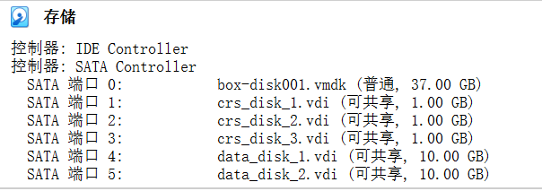


### 环境准备

在dbnode1和dbnode2及dbmonitor上修改主机名称，时区，修改密码

```
# 设置基本信息
# 不同主机主机名称不同 dbnode1,dbnode2,dbmonitor
#####################################################
hostnamectl set-hostname dbnode1
timedatectl set-timezone Asia/Shanghai
echo "Mema_1234" | passwd root --stdin 
yum install -y unzip

# 设置主机名hosts表
#####################################################
cat >> /etc/hosts <<EOF
192.168.56.101 dbnode1 dbnode1.dmtest.com
192.168.56.102 dbnode2 dbnode1.dmtest.com
192.168.56.103 dbmonitor monitor.dmtest.com
192.168.1.101 dbnode1_priv dbnode1_priv.dmtest.com
192.168.1.102 dbnode2_priv dbnode1_priv.dmtest.com
192.168.1.103 dbmonitor_priv dbmonitor_priv.dmtest.com
EOF
```

在host1和host2上准备共享存储：/dev/dm/*

```
# 本地盘分区.
######################################################
echo -e "n\np\n1\n\n\nw" | fdisk /dev/sdb

# 格式化.
######################################################
mkfs.xfs -f /dev/sdb1

# Mount .
######################################################
UUID=`blkid -o value /dev/sdb1 | grep -v xfs`

cat >> /etc/fstab <<EOF
UUID=${UUID}  /opt    xfs    defaults 1 2
EOF

mount /opt
```

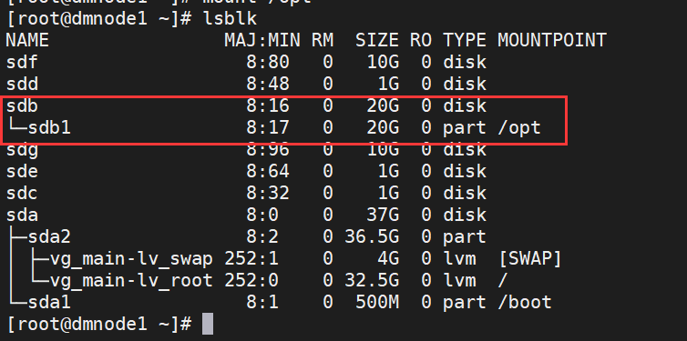

```
# 添加DM安装用户和目录
######################################################
groupadd -g 10001 dinstall
useradd -u 10000 -g dinstall -m -d /home/dmdba -s /bin/bash dmdba
echo "Mema_1234" | passwd dmdba --stdin > /dev/null 2>&1

cd /
mkdir -p /opt/software
mkdir -p /opt/dm8
chown -R dmdba:dinstall /opt/dm8

# 分区共享磁盘（一个节点执行即可）
######################################################
if [ ! -e /dev/sdc1 ]; then
  echo -e "n\np\n1\n\n\nw" | fdisk /dev/sdc
fi
if [ ! -e /dev/sdd1 ]; then
  echo -e "n\np\n1\n\n\nw" | fdisk /dev/sdd
fi
if [ ! -e /dev/sde1 ]; then
  echo -e "n\np\n1\n\n\nw" | fdisk /dev/sde
fi
if [ ! -e /dev/sdf1 ]; then
  echo -e "n\np\n1\n\n\nw" | fdisk /dev/sdf
fi
if [ ! -e /dev/sdg1 ]; then
  echo -e "n\np\n1\n\n\nw" | fdisk /dev/sdg
fi

ls /dev/sd*
```

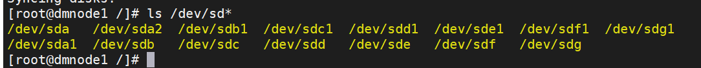

**绑定共享磁盘两个节点都要**

```
# 绑定共享磁盘
######################################################
cat > /etc/scsi_id.config <<EOF
options=-g
EOF

ASM_DISK1=`/usr/lib/udev/scsi_id -g -u -d /dev/sdc`
ASM_DISK2=`/usr/lib/udev/scsi_id -g -u -d /dev/sdd`
ASM_DISK3=`/usr/lib/udev/scsi_id -g -u -d /dev/sde`
ASM_DISK4=`/usr/lib/udev/scsi_id -g -u -d /dev/sdf`
ASM_DISK5=`/usr/lib/udev/scsi_id -g -u -d /dev/sdg`

cat > /etc/udev/rules.d/99-oracle-asmdevices.rules <<EOF
KERNEL=="sd?1", SUBSYSTEM=="block", PROGRAM=="/usr/lib/udev/scsi_id -g -u -d /dev/\$parent", RESULT=="${ASM_DISK1}", SYMLINK+="dm/vote", OWNER="dmdba", GROUP="dinstall", MODE="0660"
KERNEL=="sd?1", SUBSYSTEM=="block", PROGRAM=="/usr/lib/udev/scsi_id -g -u -d /dev/\$parent", RESULT=="${ASM_DISK2}", SYMLINK+="dm/dcr", OWNER="dmdba", GROUP="dinstall", MODE="0660"
KERNEL=="sd?1", SUBSYSTEM=="block", PROGRAM=="/usr/lib/udev/scsi_id -g -u -d /dev/\$parent", RESULT=="${ASM_DISK3}", SYMLINK+="dm/dcr1", OWNER="dmdba", GROUP="dinstall", MODE="0660"
KERNEL=="sd?1", SUBSYSTEM=="block", PROGRAM=="/usr/lib/udev/scsi_id -g -u -d /dev/\$parent", RESULT=="${ASM_DISK4}", SYMLINK+="dm/data01", OWNER="dmdba", GROUP="dinstall", MODE="0660"
KERNEL=="sd?1", SUBSYSTEM=="block", PROGRAM=="/usr/lib/udev/scsi_id -g -u -d /dev/\$parent", RESULT=="${ASM_DISK5}", SYMLINK+="dm/data02", OWNER="dmdba", GROUP="dinstall", MODE="0660"
EOF

# Do partprobe and reload twice.
# Sometimes links don't all appear on first run.
######################################################
/sbin/partprobe /dev/sdc1
/sbin/partprobe /dev/sdd1
/sbin/partprobe /dev/sde1
/sbin/partprobe /dev/sdf1
/sbin/partprobe /dev/sdg1

sleep 10
/sbin/udevadm control --reload-rules
sleep 10
/sbin/partprobe /dev/sdc1
/sbin/partprobe /dev/sdd1
/sbin/partprobe /dev/sde1
/sbin/partprobe /dev/sdf1
/sbin/partprobe /dev/sdg1

sleep 10
/sbin/udevadm control --reload-rules
sleep 10
ls -al /dev/dm/*

#验证两台机器的磁盘号要一致！！！
more /etc/udev/rules.d/99-oracle-asmdevices.rules
```

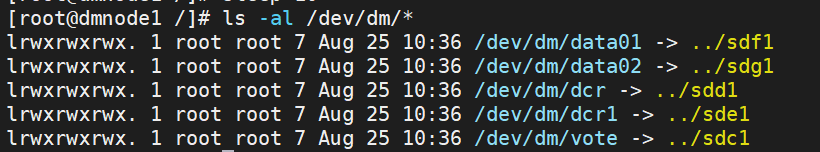

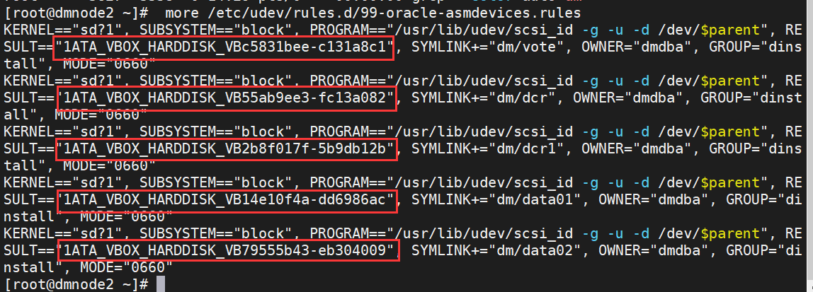

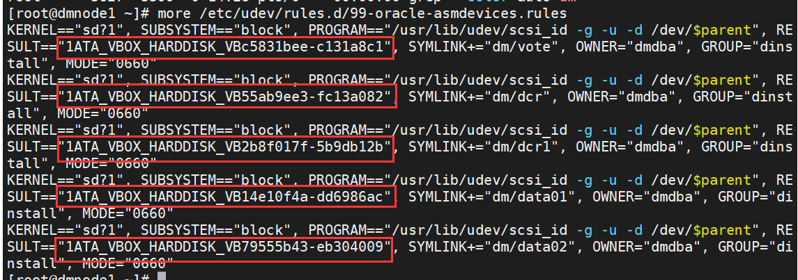

==(安装DM)==

### 配置集群初始化

#### 1、配置dmdcr_cfg.ini

==（host1,host2相同配置）==

准备dmdcr_cfg.ini 配置文件，为了使用 dmasmcmd 工具格式化 DCR 和 Voting Disk。

```
cd /opt/dm8/dsc_config
vi dmdcr_cfg.ini

DCR_N_GRP = 3                              #集群环境包括多少个 group，取值范围 1~16
DCR_VTD_PATH = /dev/dm/vote                #Voting Disk 路径
DCR_OGUID = 63635                          #消息标识，dmcssm 登录 dmcss 消息校验用

[GRP]
DCR_GRP_TYPE = CSS                         #组类型
DCR_GRP_NAME = GRP_CSS                     #组名
DCR_GRP_N_EP = 2                           #组内节点个数 N
DCR_GRP_DSKCHK_CNT = 60                    #磁盘心跳机制，容错时间，单位秒，缺省 60S，取值范围 5~600
[GRP_CSS]
DCR_EP_NAME = CSS0
DCR_EP_HOST = 192.168.56.101                   #节点 IP(CSS/ASM 有效)对DB来说，是绑定 VIP 的网卡对应的物理 IP 地址
DCR_EP_PORT = 9341
[GRP_CSS]
DCR_EP_NAME = CSS1
DCR_EP_HOST = 192.168.56.102 
DCR_EP_PORT = 9343

[GRP]
DCR_GRP_TYPE = ASM
DCR_GRP_NAME = GRP_ASM
DCR_GRP_N_EP = 2
DCR_GRP_DSKCHK_CNT = 60
[GRP_ASM]
DCR_EP_NAME = ASM0                          #ASM 的节点名必须和dmasvrmal.ini里的 MAL_INST_NAME 一致
DCR_EP_SHM_KEY = 93360
DCR_EP_SHM_SIZE = 10
DCR_EP_HOST = 192.168.56.101
DCR_EP_PORT = 9349
DCR_EP_ASM_LOAD_PATH = /dev/dm
[GRP_ASM]
DCR_EP_NAME = ASM1
DCR_EP_SHM_KEY = 93361
DCR_EP_SHM_SIZE = 10
DCR_EP_HOST = 192.168.56.102
DCR_EP_PORT = 9351
DCR_EP_ASM_LOAD_PATH = /dev/dm

[GRP]
DCR_GRP_TYPE = DB
DCR_GRP_NAME = GRP_DSC
DCR_GRP_N_EP = 2
DCR_GRP_DSKCHK_CNT = 60
[GRP_DSC]
DCR_EP_NAME = DSC0
DCR_EP_SEQNO = 0
DCR_EP_PORT = 5236
DCR_CHECK_PORT = 9741
[GRP_DSC]
DCR_EP_NAME = DSC1
DCR_EP_SEQNO = 1
DCR_EP_PORT = 5236
DCR_CHECK_PORT = 9742
```

host1写好后可通过scp传送过去

```
scp dmdcr_cfg.ini dmdba@192.168.56.102:/opt/dm8/dsc_config
```

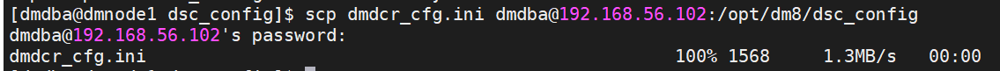

#### 2、初始化数据DCR 和 Voting Disk

运行dmasmcmd，并执行初始化 在dmnode1机上启动：（只需在一台机器执行即可）

```
dmasmcmd

ASM>create dcrdisk '/dev/dm/dcr' 'dcr'
[Trace]The ASM initialize dcrdisk /dev/dm/dcr to name DMASMdcr

ASM>create votedisk '/dev/dm/vote' 'vote'
[Trace]The ASM initialize votedisk /dev/dm/vote to name DMASMvote

ASM>create asmdisk '/dev/dm/data02' 'LOG01'
[Trace]The ASM initialize asmdisk /dev/dm/data02 to name DMASMLOG01

ASM>create asmdisk '/dev/dm/data01' 'DATA01'
[Trace]The ASM initialize asmdisk /dev/dm/data01 to name DMASMDATA01

ASM>init dcrdisk '/dev/dm/dcr' from '/opt/dm8/dsc_config/dmdcr_cfg.ini'identified by 'Mema_1234'
[Trace]DG 126 allocate 4 extents for file 0xfe000002.

ASM>init votedisk '/dev/dm/vote' from '/opt/dm8/dsc_config/dmdcr_cfg.ini'
[Trace]DG 125 allocate 4 extents for file 0xfd000002.

```

检查是否初始化成功

```
dmasmcmd

ASM> check dcrdisk '/dev/dm/dcr'
```

dmnode1：

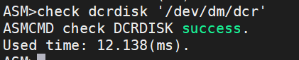

dmnode2：

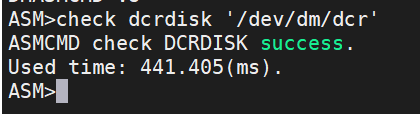

#### 3、配置dmasvrmal.ini

==(两个节点相同)==

host1

```
cd /opt/dm8
mkdir config
vi dmasvrmal.ini

[MAL_INST1]
 MAL_INST_NAME  = ASM0
 MAL_HOST = 192.168.56.101
 MAL_PORT = 7236

[MAL_INST2]
 MAL_INST_NAME = ASM1
 MAL_HOST = 192.168.56.102
 MAL_PORT = 7237
```

写完通过scp传输过去

#### 4、配置dmdcr.ini

host1：文件：/opt/dm8/config/dmdcr.ini

```
DMDCR_PATH = /dev/dm/dcr #记录 DCR 磁盘路径
DMDCR_MAL_PATH =/opt/dm8/config/dmasvrmal.ini #dmasmsvr 使用的 MAL 配置文件路径
DMDCR_SEQNO = 0

#ASM 重启参数，命令行方式启动
DMDCR_ASM_RESTART_INTERVAL = 30
DMDCR_ASM_STARTUP_CMD =/opt/dm8/bin/dmasmsvr dcr_ini=/opt/dm8/config/dmdcr.ini

#DB 重启参数，命令行方式启动
DMDCR_DB_RESTART_INTERVAL = 60
DMDCR_DB_STARTUP_CMD =/opt/dm8/bin/dmserver path=/opt/dm8/config/dsc0_config/dm.ini dcr_ini=/opt/dm8/config/dmdcr.ini
```

host2：文件：/opt/dm8/config/dmdcr.ini

```
DMDCR_PATH = /dev/dm/dcr #记录 DCR 磁盘路径
DMDCR_MAL_PATH =/opt/dm8/config/dmasvrmal.ini #dmasmsvr 使用的 MAL 配置文件路径
DMDCR_SEQNO = 1

#ASM 重启参数，命令行方式启动
DMDCR_ASM_RESTART_INTERVAL = 30
DMDCR_ASM_STARTUP_CMD =/opt/dm8/bin/dmasmsvr dcr_ini=/opt/dm8/config/dmdcr.ini

#DB 重启参数，命令行方式启动
DMDCR_DB_RESTART_INTERVAL = 60
DMDCR_DB_STARTUP_CMD =/opt/dm8/bin/dmserver path=/opt/dm8/config/dsc1_config/dm.ini dcr_ini=/opt/dm8/config/dmdcr.ini
```

#### 5、启动 DMCSS、DMASM 服务程序

在host1，host2节点以前台挂载方式先后分别启动 dmcss、dmasmsvr 程序，结束进程Ctrl+c。

1）手动启动 dmcss ，dmasmsvr 命令：

```
dmcss dcr_ini=/opt/dm8/config/dmdcr.ini
dmasmsvr dcr_ini=/opt/dm8/config/dmdcr.ini
```

其中在运行`dmcss dcr_ini=/opt/dm8/config/dmdcr.ini`命令时，可能会报如下错误：

**dmcss: error while loading shared libraries: libdmcalc.so: cannot open shared object file: No such file or directory **

解决方法如下,分别在两台服务器上都执行此命令：

```
ln -s /opt/dm8/bin/*.so  /lib64
```

或者：进入`/opt/dm8/bin`执行指令。

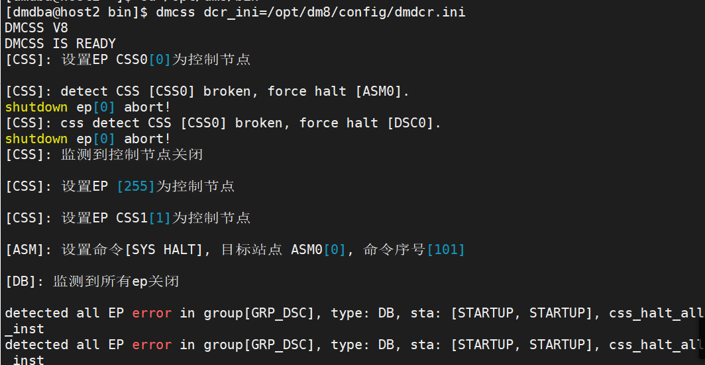

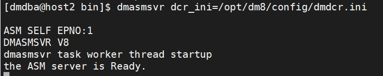

==（要出现ASM server is Ready）==

(出现以下报错可以忽略)

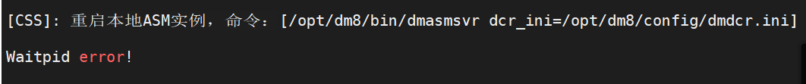

#### 6、创建DMASM磁盘组

在host1机器上启动dmasmtool工具（一台机器上执行即可），创建DMASM磁盘组： 开一个新的终端窗口，进入dmasmtool交互模式：

```
dmasmtool DCR_INI=/opt/dm8/config/dmdcr.ini


create diskgroup 'DMDATA' asmdisk '/dev/dm/data01'
create diskgroup 'DMLOG' asmdisk '/dev/dm/data02'
```

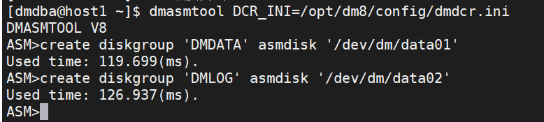

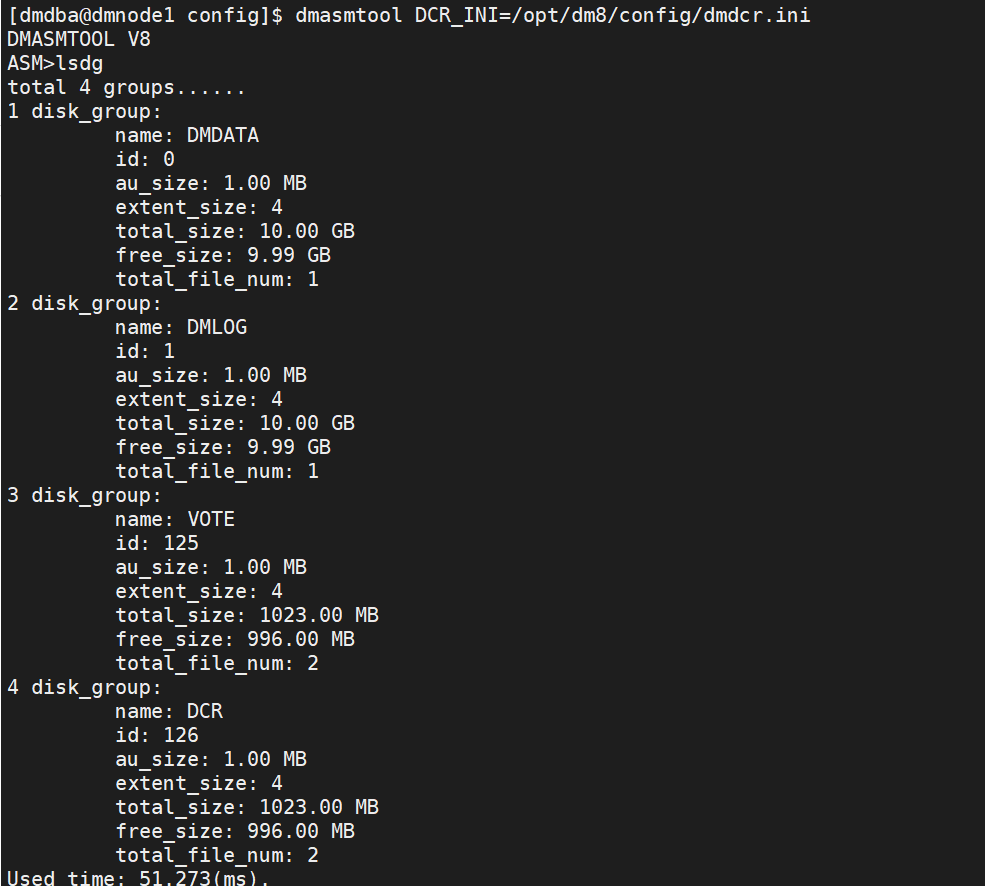

（出现以下报错，等待dmcss,dmasmsvr的服务启动即可）

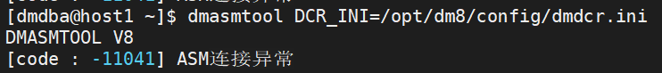

#### 7、配置dminit.ini

两机相同，位于/opt/dm8/config/dminit.ini

```
db_name = GRP_DSC                                              #初始化数据库名称
system_path = +DMDATA/data                                     #初始化数据库存放的路径
system = +DMDATA/data/dsc/system.dbf
system_size = 128
roll = +DMDATA/data/dsc/roll.dbf
roll_size = 128
main = +DMDATA/data/dsc/main.dbf
main_size = 128
ctl_path = +DMDATA/data/dsc/dm.ctl
ctl_size = 8
log_size = 256
dcr_path = /dev/dm/dcr                                       #dcr 磁盘路径，目前不支持 asm，只能是裸设备
dcr_seqno = 0
auto_overwrite = 1

[DSC0]                                   #inst_name 跟 dmdcr_cfg.ini 中 DB 类型 group 中 DCR_EP_NAME 对应
config_path = /opt/dm8/config/dsc0_config
port_num = 5236
mal_host = 192.168.56.101
mal_port = 9340
log_path = +DMLOG/log/dsc0_log01.log
log_path = +DMLOG/log/dsc0_log02.log

[DSC1]                                      #inst_name 跟 dmdcr_cfg.ini 中 DB 类型 group 中 DCR_EP_NAME 对应
config_path = /opt/dm8/config/dsc1_config
port_num = 5236
mal_host = 192.168.56.102
mal_port = 9341
log_path = +DMLOG/log/dsc1_log01.log
log_path = +DMLOG/log/dsc1_log02.log
```

#### 8、初始化集群DB 环境

使用 dminit 初始化DB 环境

选择host1节点，启动 dminit 工具初始化数据库。 dminit 执行完成后，会在 config_path 目录（/dm8/config/dsc0_config 和/dm8/config/dsc1_config）下生成配置文件 dm.ini 和 dmmal.ini，将/dm8/config/dsc1_config拷贝到host2机器对应目录下。

```
dminit control=/opt/dm8/config/dminit.ini
```

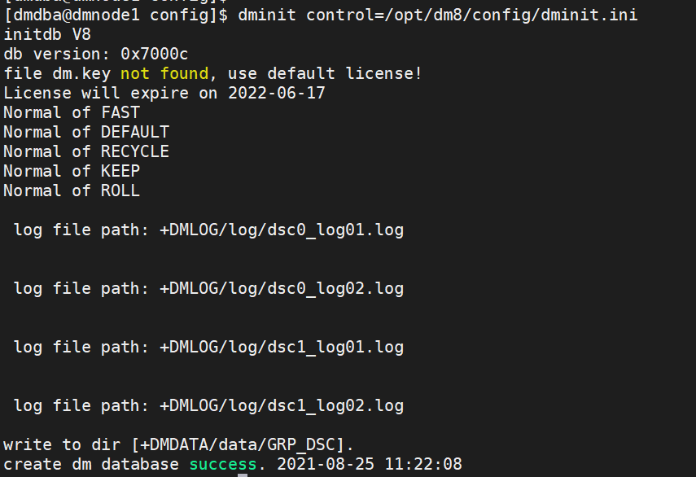


将生成的配置文件（dsc1_config）发送到dmnode2：

```
scp -r dsc1_config/ dmdba@192.168.56.102:/opt/dm8/config
```

#### 9、配置 dmarch.ini

先将两台机器上dm.ini中的ARCH_INI设置为1，然后配置dmarch.ini文件

```
cd /opt/dm8/config/dsc0_config
vi dm.ini
```

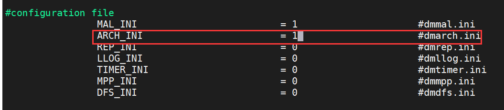

两台机器添加目录：/opt/dm8/arch

```
mkdir -p /opt/dm8/arch
```

在host1机器的/opt/dm8/config/dsc0_config下新建dmarch.ini文件

```
[ARCHIVE_LOCAL1]
  ARCH_TYPE            = LOCAL
  ARCH_DEST            = /opt/dm8/arch/arch_0
  ARCH_FILE_SIZE       = 2048
  ARCH_SPACE_LIMIT     = 51200
[ARCH_REMOTE1]
  ARCH_TYPE            = REMOTE
  ARCH_DEST            = DSC1
  ARCH_INCOMING_PATH   = /opt/dm8/arch/arch_0_remote 
  #设置为本地存储路径，用于保存 ARCH_DEST实例发送的REDO 日志
  ARCH_FILE_SIZE       = 2048
  ARCH_SPACE_LIMIT     = 51200
```

在host2机器的/opt/dm8/config/dsc1_config下新建dmarch.ini文件

```
[ARCHIVE_LOCAL1]
  ARCH_TYPE            = LOCAL
  ARCH_DEST            = /opt/dm8/arch/arch_1 
  ARCH_FILE_SIZE       = 2048
  ARCH_SPACE_LIMIT     = 51200
[ARCH_REMOTE1]
  ARCH_TYPE            = REMOTE
  ARCH_DEST            = DSC0
  ARCH_INCOMING_PATH   = /opt/dm8/arch/arch_1_remote
  ARCH_FILE_SIZE       = 2048
```

### 启动数据库

#### 1、启动数据库

两机机分别启动 dmserver 即可完成 DMDSC 集群搭建。 如果 DMCSS 配置有自动拉起 dmserver 的功能，可以等待 DMCSS 自动拉起实例，不需要手动启动。

host1:

```
dmserver /opt/dm8/config/dsc0_config/dm.ini dcr_ini=/opt/dm8/config/dmdcr.ini
```

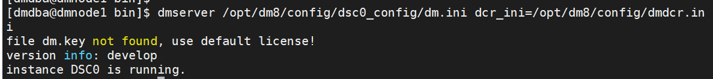

host2:

```
dmserver /opt/dm8/config/dsc1_config/dm.ini dcr_ini=/opt/dm8/config/dmdcr.ini
```

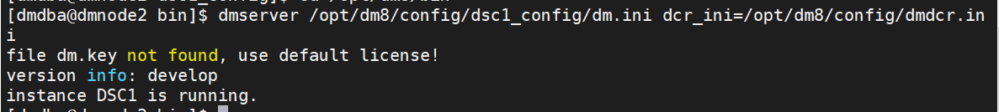

#### 2、查看数据库运行情况

```
ps -ef | grep dmdba
```

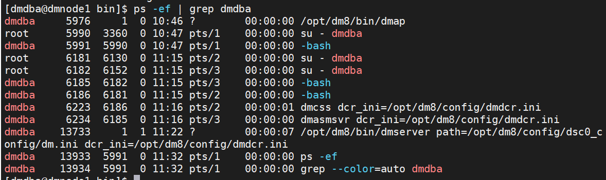

```
disql

SQL> select * from v$instance;
```

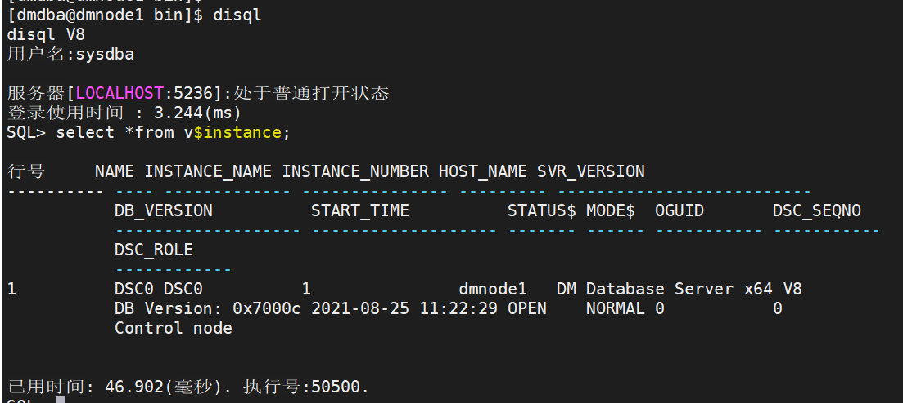

#### 3、启动监视器

将dmcssm.ini放在/opt/dm8/monitor/目录下

编辑dmcssm.ini

```
CSSM_OGUID = 63635
#和 dmdcr_cfg.ini 中的 DCR_OGUID 保持一致
#配置所有 CSS 的连接信息，和 dmdcr_cfg.ini 中 CSS 配置项的DCR_EP_HOST 和 DCR_EP_PORT 保持一致
CSSM_CSS_IP = 192.168.56.101:9341
CSSM_CSS_IP = 192.168.56.102:9343
CSSM_LOG_PATH = /opt/dm8/log
CSSM_LOG_FILE_SIZE = 256
CSSM_LOG_SPACE_LIMIT = 1024
```

启动监视器：

```
dmcssm INI_PATH=/opt/dm8/monitor/dmcssm.ini
```

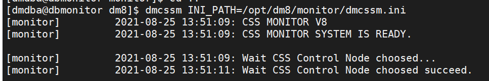

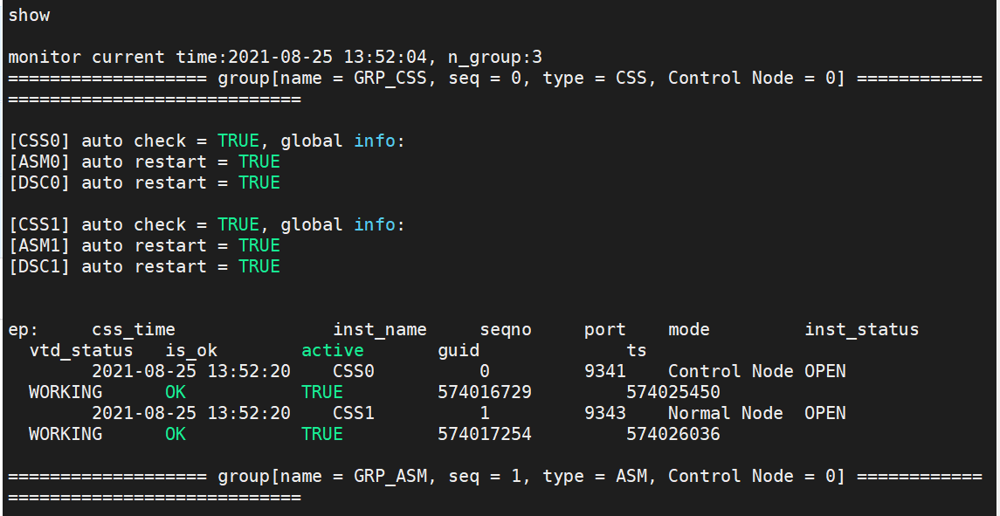

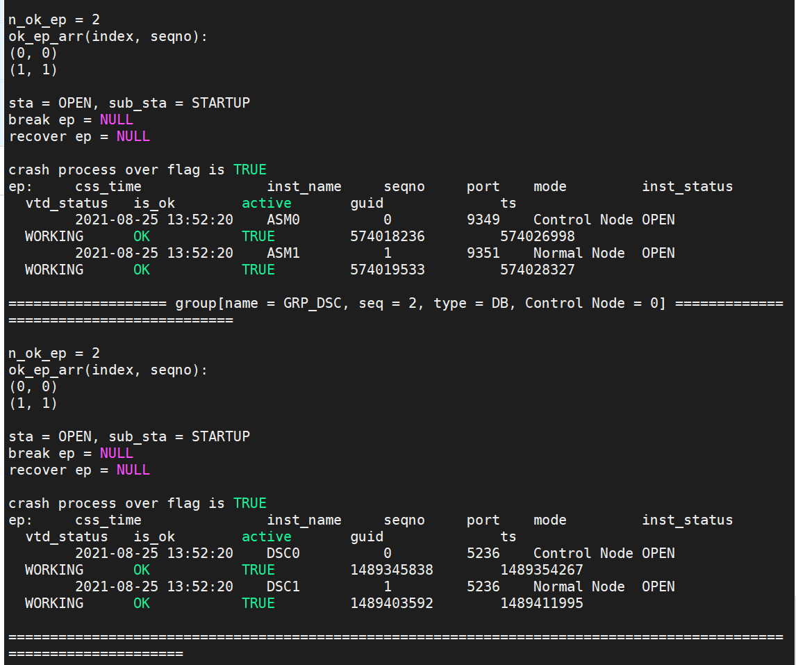

### 注册服务

（注册服务要在root用户下）

注册服务实现开机自启。

分别在两台机器上注册CSS，（DMCSS 配置有自动拉起 dmasmsvr和dmserver的功能）

注册ASM，dmasmsvr(RAC)服务需设置依赖服务(dmcss)

注册dmserver，需设置依赖服务(dmcss)

dmnode1:

```
cd /opt/dm8/script/root
./dm_service_installer.sh -t dmcss -dcr_ini /opt/dm8/config/dmdcr.ini -p CSS0
./dm_service_installer.sh -t dmasmsvr -dcr_ini /opt/dm8/config/dmdcr.ini -p ASM0 -y DmCSSServiceCSS0.service 
./dm_service_installer.sh -t dmserver -dm_ini /opt/dm8/config/dsc0_config/dm.ini -dcr_ini /opt/dm8/config/dmdcr.ini -p DSC0 -y DmCSSServiceCSS0.service
```

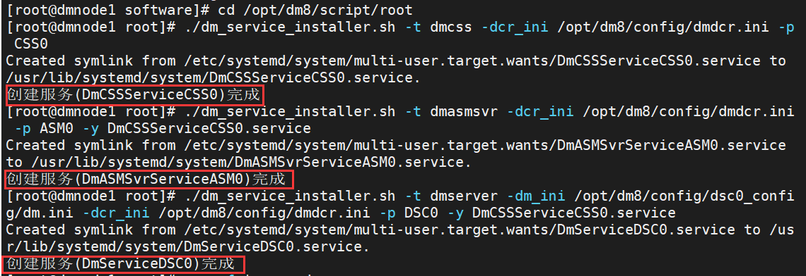

host2：

```
cd /opt/dm8/script/root
./dm_service_installer.sh -t dmcss -dcr_ini /opt/dm8/config/dmdcr.ini -p CSS1
./dm_service_installer.sh -t dmasmsvr -dcr_ini /opt/dm8/config/dmdcr.ini -p ASM1 -y DmCSSServiceCSS1.service
./dm_service_installer.sh -t dmserver -dm_ini /opt/dm8/config/dsc1_config/dm.ini -dcr_ini /opt/dm8/config/dmdcr.ini -p DSC1 -y DmCSSServiceCSS1.service
```

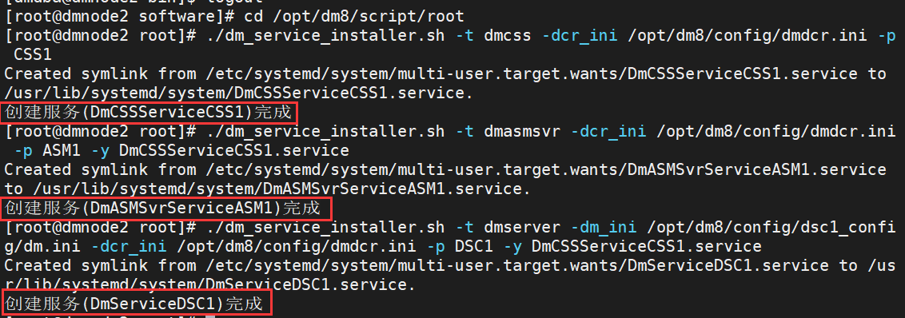

查看服务：

```
#查看 css
ps -ef | grep dmcss
#查看asm
ps -ef | grep dmasm 
#查看数据库服务
ps -ef | grep dmserver

ps -ef|grep dmdba
ss -nltp
```

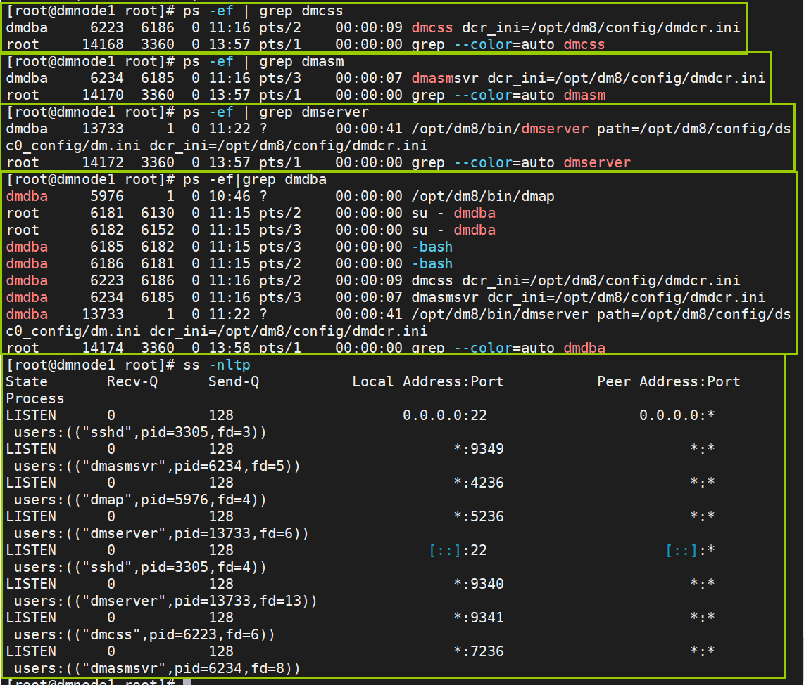

通过监视器：show config

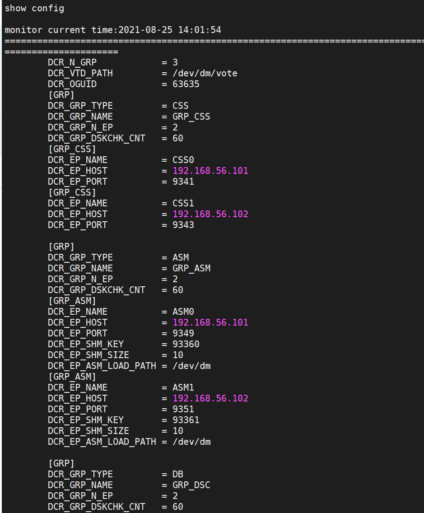

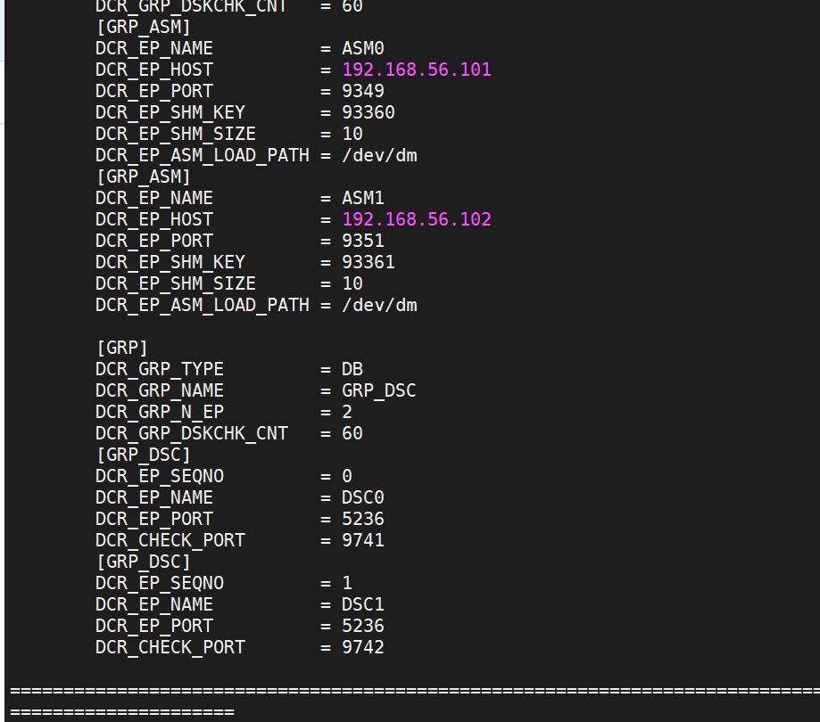

通过disql查看：

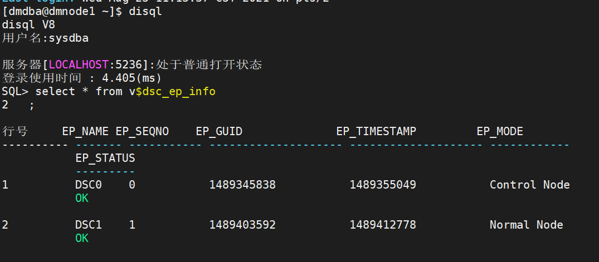

```
/opt/dm8/bin/dmserver path=/opt/dm8/config/dsc1_config/dm.ini dcr_ini=/opt/dm8/config/dmdcr.ini
```

### 启动与关闭

启动顺序：

- host1机器：`systemctl start DmServiceCSS0`
- host2机器：`systemctl start DmServiceCSS1 `

说明：

> 必须同时启动两台机器服务，如果 DMCSS 配置有自动拉起dmasmsvr和 dmserver 的功能，CSS启动后30秒自动拉起DmServiceASM，ASM启动后1分钟自动拉起DmServiceDSC，可以通过进程查看，3个服务都启动后DSC可以正常访问。

停止顺序：

- host1机器：`systemctl stop DmServiceDSC0 `
- host2机器：`systemctl stop DmServiceDSC1 `
- host1机器：`systemctl stop DmServiceASM0 `
- host2机器：`systemctl stop DmServiceASM1 `
- host1机器：`systemctl stop DmServiceCSS0 `
- host2机器：`systemctl stop DmServiceCSS1 `

### 服务名与客户端连接

配置服务名配置dm_svc.conf服务名文件

文件位于：`/etc/dm_svc.conf`

```
dsc=(192.168.56.101:5236,192.168.56.102:5236)
SWITCH_TIME=(10000)
SWITCH_INTERVAL=(100)
TIME_ZONE=(480)
```

使用服务名连接

```
disql sysdba@dsc
```

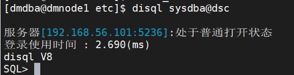


### 验证故障自动重连

```
select * from v$dsc_ep_info;
```

登录dmnode1的实例，进行查看

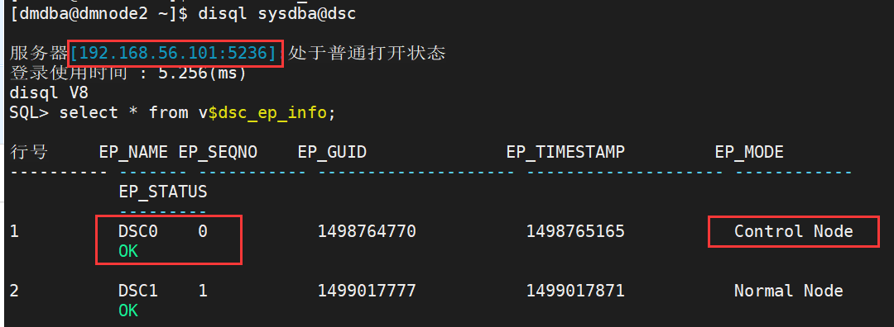

关闭节点 1 服务器，再次查询

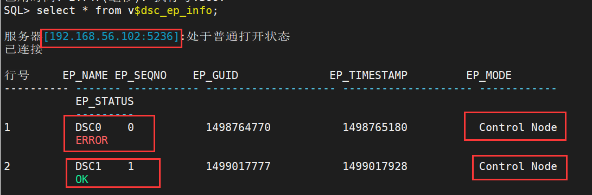

启动节点 1 服务器后，再次查询（故障节点重新加入）

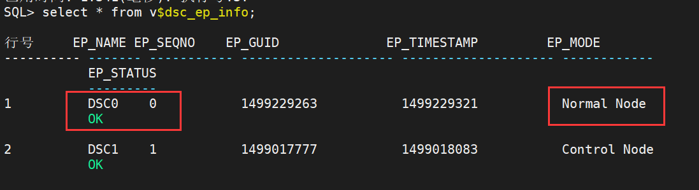
