## 使用客服端进行定时任务

将数据库开启归档模式：

```
alter DATABASE MOUNT;
alter DATABASE ARCHIVELOG;
alter database add archivelog 'type=local,dest=/opt/dm8/data/DB803/arch,file_size=256,space_limit=0';
alter DATABASE open;
```

通过管理工具进行连接：

（右键创建作业环境）


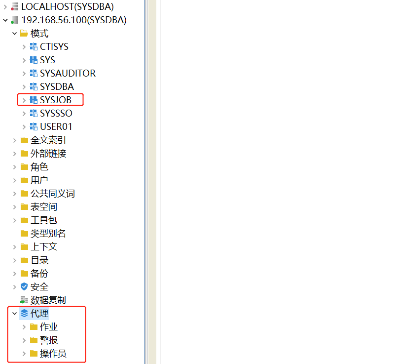

创建定时任务：

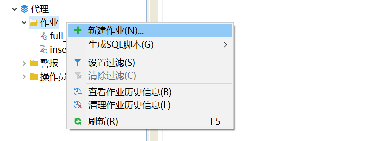

设置作业名：


设置备份路径、备份方式：

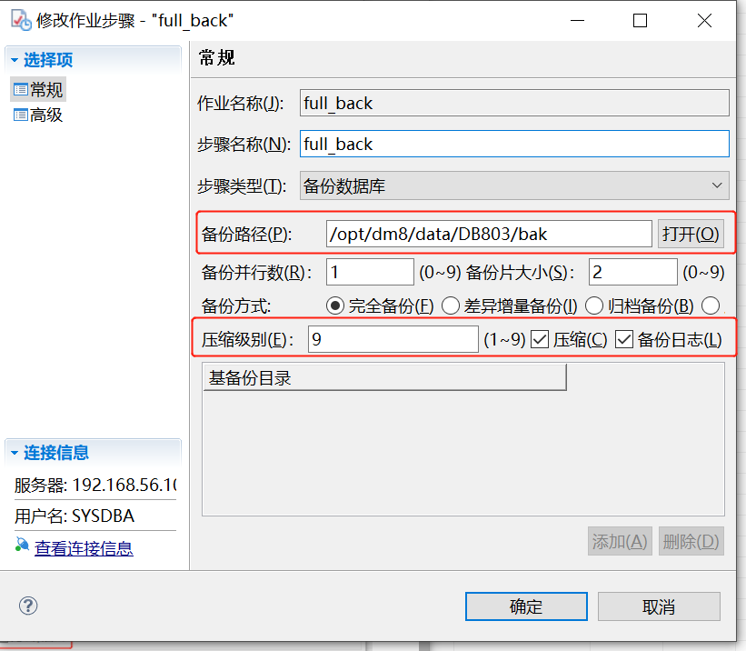

设置执行时间：

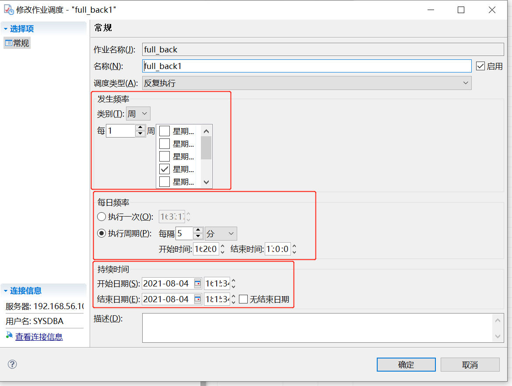

DDL：

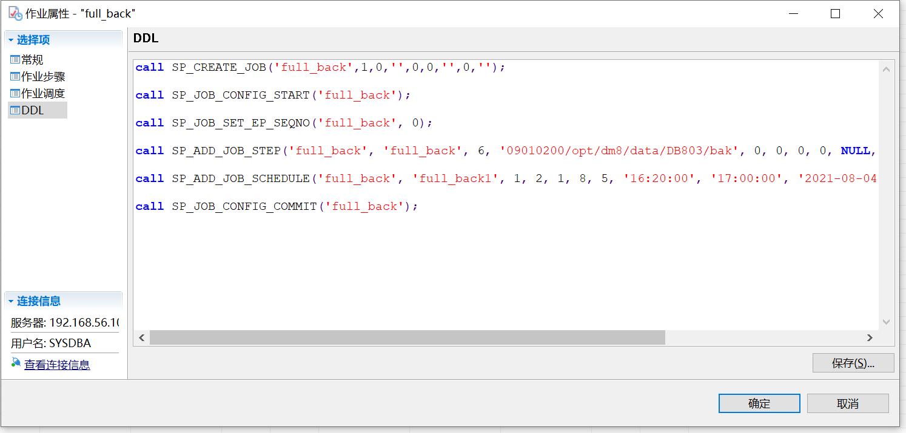

```sql
call SP_CREATE_JOB('full_back',1,0,'',0,0,'',0,'');

call SP_JOB_CONFIG_START('full_back');

call SP_JOB_SET_EP_SEQNO('full_back', 0);

call SP_ADD_JOB_STEP('full_back', 'full_back', 6, '09010200/opt/dm8/data/DB803/bak', 0, 0, 0, 0, NULL, 0);

call SP_ADD_JOB_SCHEDULE('full_back', 'full_back1', 1, 2, 1, 8, 5, '16:20:00', '17:00:00', '2021-08-04 16:15:34', '2021-08-04 18:15:34', '');

call SP_JOB_CONFIG_COMMIT('full_back');
```

到后台进行查看

```
cd /opt/dm8/data/DB803/bak
ls -lt
```

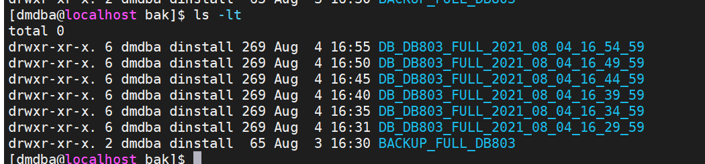


创建定时插入数据：

```sql
call SP_CREATE_JOB('insert_data',1,0,'',0,0,'',0,'');

call SP_JOB_CONFIG_START('insert_data');

call SP_ADD_JOB_STEP('insert_data', 'insert_data', 0, 'insert into student select rownum as id,
dbms_random.string(''1'',trunc(dbms_random.value(3,8))),
current_date()-365*28+dbms_random.value(-366,366),
trunc(dbms_random.value(0,100)),
trunc(dbms_random.value(0,100)),
trunc(dbms_random.value(0,100))
from dual
connect by level <=100;
commit;', 0, 0, 0, 0, NULL, 0);

call SP_ADD_JOB_SCHEDULE('insert_data', 'insert_data1', 1, 2, 1, 8, 2, '00:00:00', '17:59:59', '2021-08-04 16:32:57', '2021-08-04 16:52:57', '');

call SP_JOB_CONFIG_COMMIT('insert_data');
```

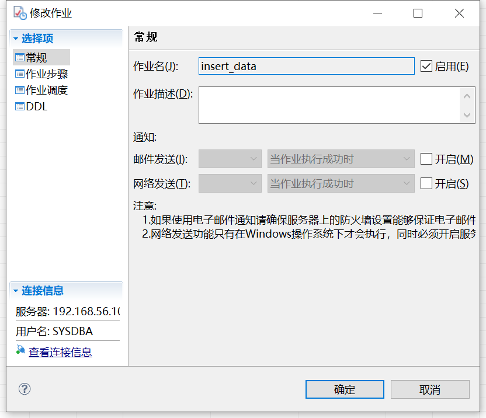

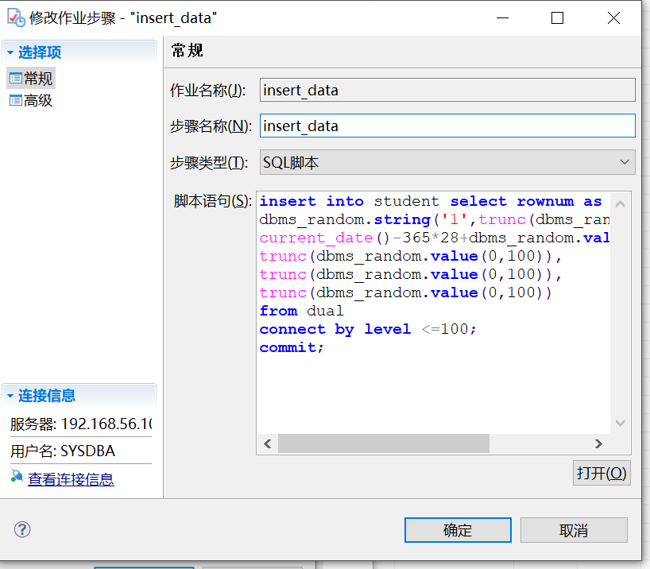

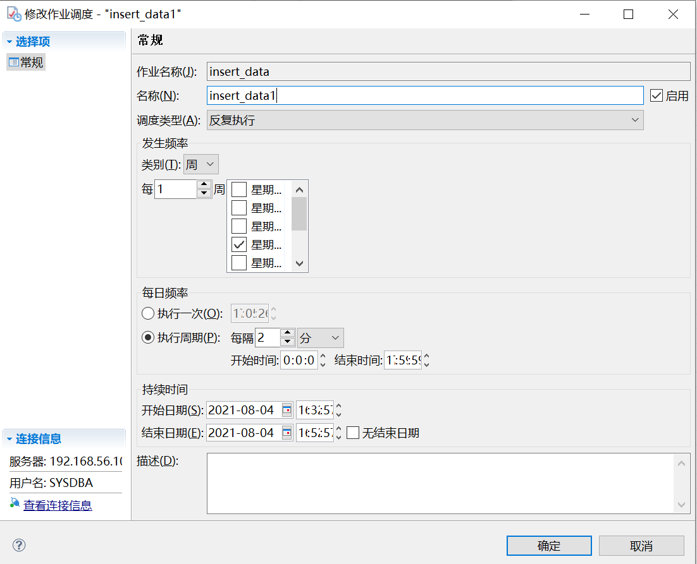

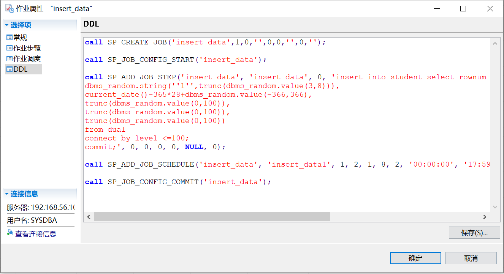


## 使用crontab进行定时任务

在/opt/dm8/script下创建test.sh （dmdba用户）

```shell
#!/bin/bash

. /etc/profile
. ~/.bash_profile

HOSTNAME="localhost"
PORT="5327"
USERNAME="sysdba"
PASSWORD="Mema_1234"

disql ${USERNAME}/${PASSWORD}@${HOSTNAME}:${PORT} -e "backup database;"
```

修改crontab环境变量 /etc/crontab（root用户）

```shell
#修改crontab环境变量，添加/opt/dm8/bin在PATH后
vi /etc/crontab

SHELL=/bin/bash
PATH=/sbin:/bin:/usr/sbin:/usr/bin:/opt/dm8/bin
MAILTO=root

#更新环境
source /etc/crontab
```

添加crontab任务（dmdba用户）

```shell
#编辑crontab任务
crontab -e

*/5 16-17 6 8 5 . /etc/profile;/bin/sh /opt/dm8/script/test.sh

#查看crontab任务
crontab -l
```

查看crontab是否成功执行 

```shell
cd /opt/dm8/data/testdb/bak
ls -lt
```

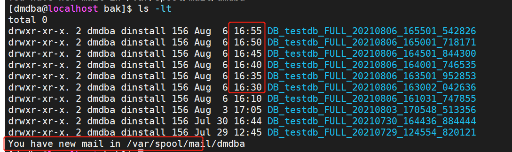
