## DM数据库备份与恢复

### 数据库冷备份和异库恢复练习

准备测试用户和数据

```SQL
connect sysdba@localhost:5327

CREATE TABLESPACE TS_user
DATAFILE '/opt/dm8/data/testdb/user01.dbf' SIZE 128, '/opt/dm8/data/testdb/user02.dbf' SIZE 128;


CREATE USER user01
IDENTIFIED BY Mema_1234
DEFAULT TABLESPACE TS_user;

GRANT resource TO user01;
GRANT ALL ON dbms_random TO user01;

connect user01/Mema_1234@localhost:5327

CREATE TABLE student (
id int,
name varchar(20),
math int,
english int,
science int
);

insert into student select rownum as id,
dbms_random.string('1',trunc(dbms_random.value(3,8))),
trunc(dbms_random.value(0,100)),
trunc(dbms_random.value(0,100)),
trunc(dbms_random.value(0,100))
from dual
connect by level <=1000000;
```

#### 1、停止要备份的数据库

进入操作系统**root**用户，停止数据库服务：

```
systemctl stop DmServicetestdb.service 
# 切换到dmdba用户
su - dmdba 

# 进入bin目录
cd /opt/dm8/bin 

# 进入脱机备份工具
./dmrman
```

#### 2、备份数据库

备份数据库，生成备份集

```
RMAN>BACKUP DATABASE '/opt/dm8/data/testdb/dm.ini' FULL BACKUPSET '/opt/dm8/data/dm_back/testdb_full_bak_01';
```


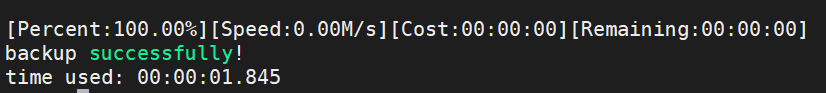

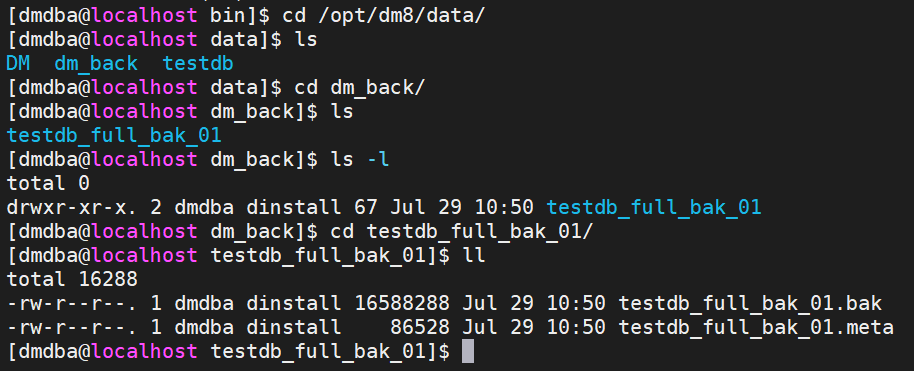

**备份完毕，可以启动源数据库 !**

#### 3、创建目标数据库

```shell
cd /opt/dm8/bin
./dminit path=/opt/dm8/data db_name=DB4RESTORE auto_overwrite=1

# AUTO_OVERWRITE             是否覆盖所有同名文件(0) 0:不覆盖 1:部分覆盖 2:完全覆盖
```

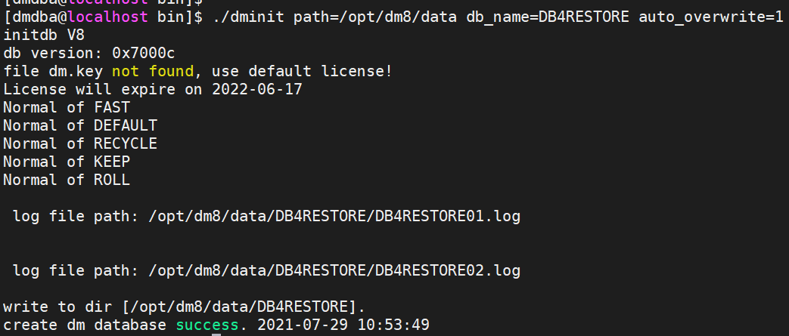

#### 4、还原目标数据库

```
RMAN>RESTORE DATABASE '/opt/dm8/data/DB4RESTORE/dm.ini' FROM BACKUPSET '/opt/dm8/data/dm_back/testdb_full_bak_01';
```

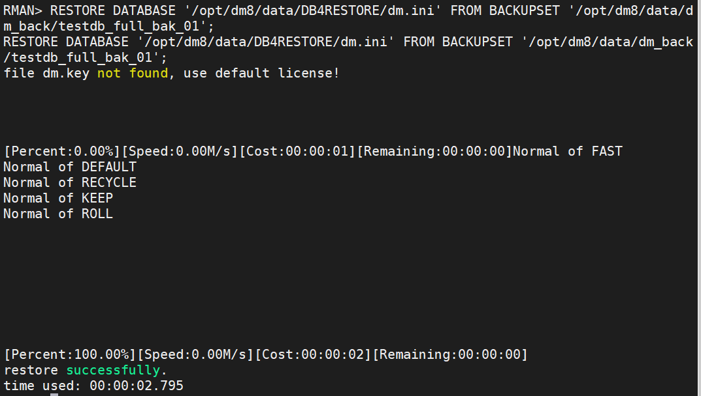

#### 5、恢复目标数据库

```
RMAN>RECOVER DATABASE '/opt/dm8/data/DB4RESTORE/dm.ini' FROM BACKUPSET '/opt/dm8/data/dm_back/testdb_full_bak_01';
```

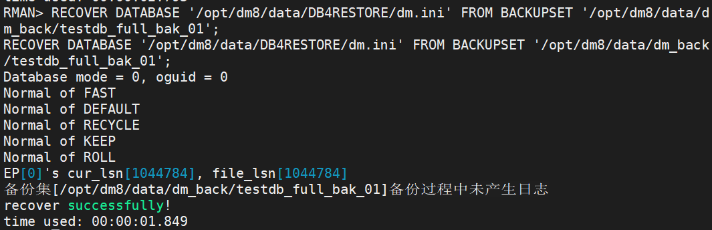

#### 6、更新目标数据库的魔数

```
RMAN>RECOVER DATABASE '/opt/dm8/data/DB4RESTORE/dm.ini' UPDATE DB_MAGIC;
```

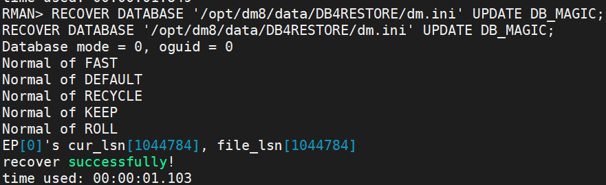

恢复后启动，需要修改端口号

修改端口后（源数据库5327，新数据库5555），再启动

```shell
cd /opt/dm8/data/DB4RESTORE
vi dm.ini

#启动
dmserver dm.ini -noconsole
```

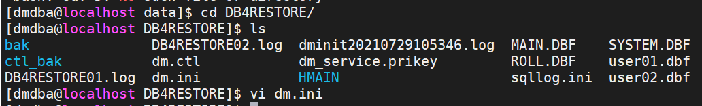

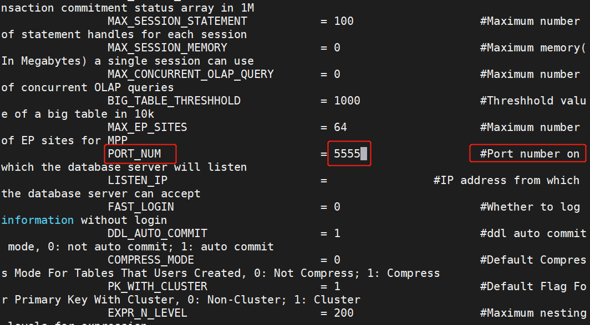

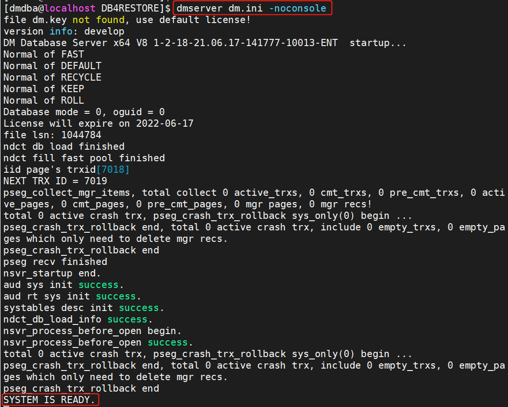

连接新恢复的数据库，查看确认：

```sql
connect user01/Mema_1234@localhost:5555

select count(*) from dtudent;
```

观察新老数据库魔数的变化

```sql
connect sysdba@localhost:5327

select permanent_magic;
select db_magic;

connect sysdba@localhost:5555

select permanent_magic;
select db_magic;
```

新老数据库实例名称和数据库名称的比较：

```sql
connect sysdba@localhost:5327

select name from v$instance;
select name from v$database;

connect sysdba@localhost:5555

select name from v$instance;
select name from v$database;
```

后续工作：注册新数据库的服务，实现自动启停。

练习：

```
$ cd /opt/dmdbms/bin
$ ./dminit PAGE_SIZE=32 EXTENT_SIZE=32 CHARSET=1 CASE_SENSITIVE=0 LENGTH_IN_CHAR=0 BLANK_PAD_MODE=1  PATH=/opt/dmdbms/data DB_NAME=RECDB INSTANCE_NAME=REC PORT_NUM=5432 auto_overwrite=1

$ dmrman
RMAN>RESTORE DATABASE '/opt/dmdbms/data/RECDB/dm.ini' FROM BACKUPSET '/opt/dmdbms/data/dm_back/testdb_full_bak_01';

RMAN>RECOVER DATABASE '/opt/dmdbms/data/RECDB/dm.ini' FROM BACKUPSET '/opt/dmdbms/data/dm_back/testdb_full_bak_01';

RMAN>RECOVER DATABASE '/opt/dmdbms/data/RECDB/dm.ini' UPDATE DB_MAGIC;
RMAN>exit

$ cd /opt/dmdbms/data/RECDB
$ dmserver dm.ini
```

注：

> 新恢复的数据库例程名称为REC，数据库名称还是testdb
>
> 达梦的库级还原与恢复不更新db_magic，则无法启动实例
>
> 还可以用归档日志恢复 RMAN> recover database '/opt/dmdbms/data/RECDB/dm.ini' with archivedir 'opt/dmdbms/data/testdb/arch';


### 数据库在线备份和异库基于时间点的恢复

#### 1、源库说明

测试源库：

| 项目     | 值       |
| -------- | -------- |
| 数据库名 | testdb   |
| 实例名   | DMSERVER |
| 端口     | 5327     |

缺省表空间和缺省用户：

```sql 
select name from v$tablespace;
select username from all_users;
```

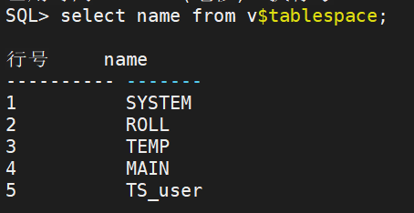


#### 2、测试数据准备

```sql 
connect sysdba/Mema_1234@localhost:5327

CREATE TABLESPACE TS_MEMA
DATAFILE '/opt/dm8/data/testdb/ts_mema_01.dbf' SIZE 128, '/opt/dm8/data/testdb/ts_mema_02.dbf' SIZE 128;


CREATE USER user_mema
IDENTIFIED BY Mema_1234
DEFAULT TABLESPACE TS_MEMA;

GRANT resource TO user_mema;
GRANT ALL ON dbms_random TO user_mema;

connect user_mema/Mema_1234@localhost:5327

CREATE TABLE student (
id int,
name varchar(20),
birthday date,
math int,
english int,
science int
);

insert into student select rownum as id,
dbms_random.string('1',trunc(dbms_random.value(3,8))),
current_date()-365*28+dbms_random.value(-366,366),
trunc(dbms_random.value(0,100)),
trunc(dbms_random.value(0,100)),
trunc(dbms_random.value(0,100))
from dual
connect by level <=100;

commit;
```

#### 3、配置数据库到归档方式

首先，将数据库配置为归档模式

```sql
SQL> alter database mount;

SQL> alter database archivelog;
```

其次，根据实际情况配置相应的归档类型（以下实例均在 mount 模式下配置）。

本地归档配置，归档目录为 /opt/dm8/data/testdb/arch ，文件大小为 256MB ，空间不限制。

```sql
SQL> alter database add archivelog 'type=local,dest=/opt/dm8/data/testdb/arch,file_size=256,space_limit=0';
```

配置完成后打开数据库。

```sql
SQL> alter database open;
```

#### 4、在线备份数据库memadb

进入disql，数据库运行时，在线备份。

```sql 
backup database
```

#### 5、备份完成添加新数据

添200000条数据。

```sql
connect user_mema/Mema_1234@localhost:5327

insert into student select rownum+200 as id,
dbms_random.string('1',trunc(dbms_random.value(3,8))),
current_date()-365*28+dbms_random.value(-366,366),
trunc(dbms_random.value(0,100)),
trunc(dbms_random.value(0,100)),
trunc(dbms_random.value(0,100))
from dual
connect by level <=100000;
commit；


insert into student select rownum+1100000 as id,
dbms_random.string('1',trunc(dbms_random.value(3,8))),
current_date()-365*28+dbms_random.value(-366,366),
trunc(dbms_random.value(0,100)),
trunc(dbms_random.value(0,100)),
trunc(dbms_random.value(0,100))
from dual
connect by level <=100000;

commit；
```

#### 6、删除表记录，提交

```sql 
delete from student;
commit
```

#### 7、创建新的数据库实例

```shell 
$ cd /opt/dm8/bin
$ ./dminit PAGE_SIZE=32 EXTENT_SIZE=32 CHARSET=1 CASE_SENSITIVE=0 LENGTH_IN_CHAR=0 BLANK_PAD_MODE=1  PATH=/opt/dm8/data DB_NAME=AUX INSTANCE_NAME=AUX PORT_NUM=6666 auto_overwrite=1
```

#### 8、基于时间恢复

恢复到时间点：Tue Jul 29 12:45:54 CST 2021

备份集：DB_testdb_FULL_20210729_124554_820121

```
restore database '/opt/dm8/data/AUX/dm.ini' from backupset '/opt/dm8/data/testdb/bak/DB_testdb_FULL_20210729_124554_820121';
```

```
recover database '/opt/dm8/data/AUX/dm.ini' with archivedir '/opt/dm8/data/testdb/arch' until time '2021-07-29 12:45:54';
```

```
recover database '/opt/dm8/data/AUX/dm.ini' update db_magic;
```

#### 9、恢复后验证

启动实例

```shell 
cd /opt/dm8/data/AUX

dmserver dm.ini
```

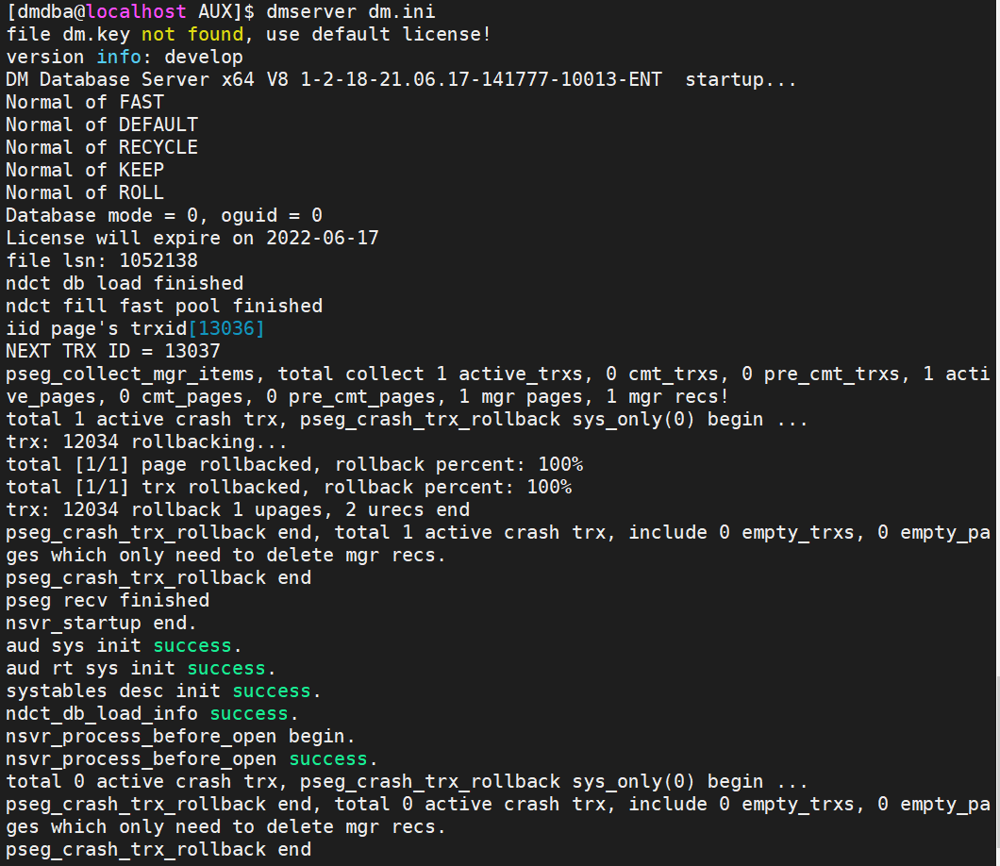

登录验证：

```sql 
conn user_mema/Mema_1234@localhost:6666

select count(*) from student;
```

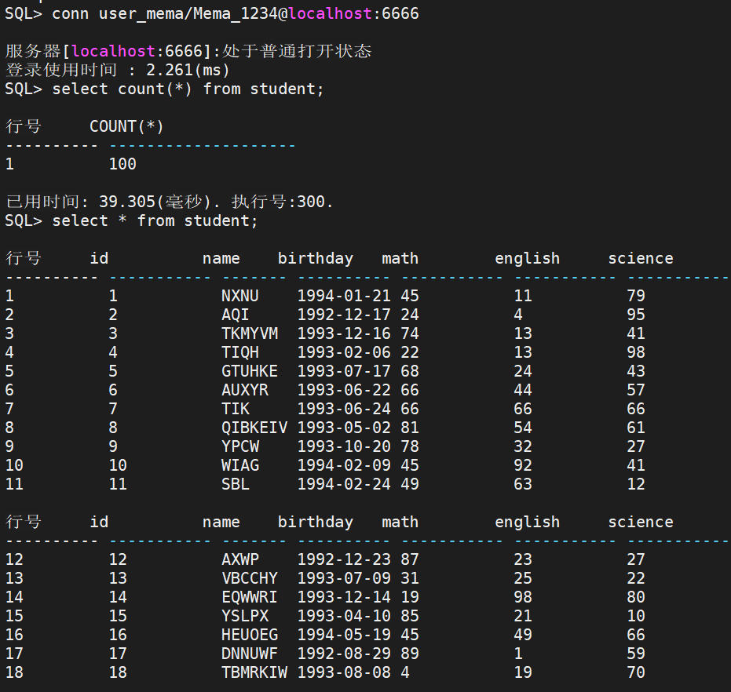