# DM数据库运行参数优化说明

### 1、内存有关参数

#### 1.1 内存池

```shell
cd /opt/dm8/data/memadb
cat dm.ini|grep MEMORY
```


需要关注的是 **MEMORY_POOL** 和 **MEMORY_TARGET** 

**MEMORY_POOL** ：**共享内存池初始大小**，以M为单位。共享内存池是由DM管理的内存。有效值范围：64~67108864。 

**MEMORY_TARGET**： **共享内存池在扩充最大值**，以M为单位，有效值范围：0~67108864，0表示不限制。

在物理内存较大的情况下，比如大于64G，可以将MEMORY_POOL设置为2048，即2G。 同时也建议设置 MEMORY_TARGET参数，该参数默认为0，不受限制。

#### 1.2 缓冲区

##### 1.2.1 数据缓冲区

**1）Normal 缓冲区（buffer）**

NORMAL 缓冲区主要是提供给系统处理的一些数据页，没有特定指定缓冲区的情况下， 默认缓冲区为 NORMAL。

```shell
cat dm.ini|grep BUFFER
```

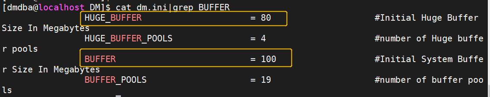

关注 **buffer** 和 **huge_buffer**

**BUFFER：系统缓冲区大小**，以 M 为单位。**推荐值：系统缓冲区大小为可用物理内存的 60%～80%。有效值范围（8~1048576）** BUFFER_POOLS ： BUFFER 系统分区数，每个 BUFFER 分区的大小为 BUFFER/BUFFER_POOLS。**默认值是19，在内存不大的情况下，建议调小该值。**

**2) Keep 缓冲区**

```
cat dm.ini |grep KEEP
```

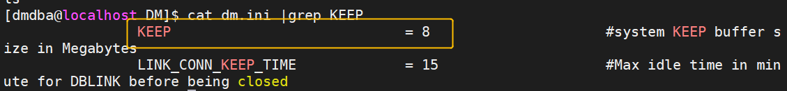

KEEP: KEEP 缓冲区大小，以 M 为单位。默认8M，有效值范围（8~1048576）。**达梦的KEEP缓冲区只能在表空间级别进行设置**


**3) RECYCLE 和FAST缓冲区**

```
cat dm.ini |grep FAST
cat dm.ini |grep RECYCLE
```

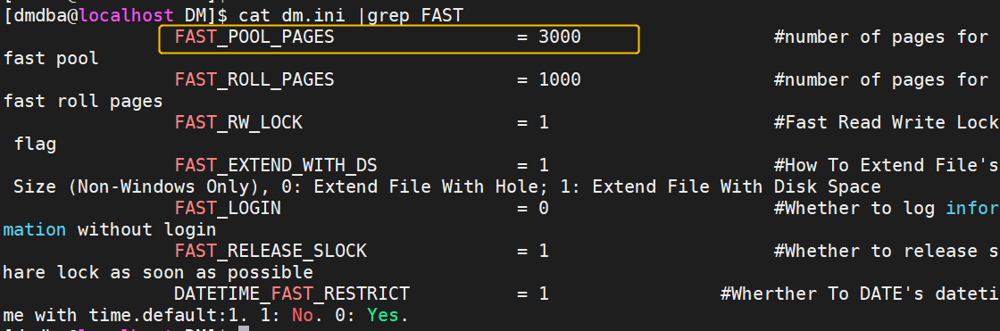

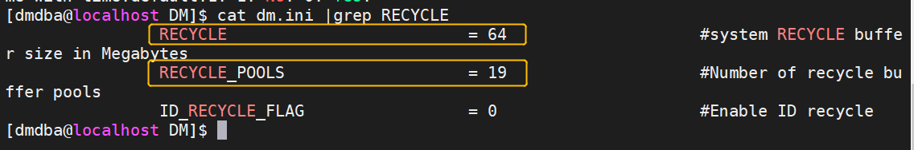

**RECYCLE ：RECYCLE 缓冲区大小**，以 M 为单位。有效值范围（8~1048576），**建议设置为500M以上。** 

**RECYCLE_POOLS：RECYCLE 缓冲区分区数**，每个 RECYCLE 分区的大小为RECYCLE/RECYCLE_POOLS。有效值范围（1~512） 

**FAST_POOL_PAGES : 快速缓冲区页数**。有效值范围（0~99999）。 **FAST_POOL_PAGES 的值最多不能超过BUFFER 总页数的一半**，如果超过，系统会自动调整为 BUFFER 总页数的一半。

##### 1.2.2 日志缓冲区

那么为何不在数据缓冲区中缓存重做日志而要单独设立日志缓冲区呢？其主要基于以下原因。

- 重做日志的格式同数据页完全不一样，无法进行统一管理；
- 重做日志具备连续写的特点；
- 在逻辑上，写重做日志比数据页IO优先级更高。

```
cat dm.ini |grep RLOG_POOL_SIZE
```

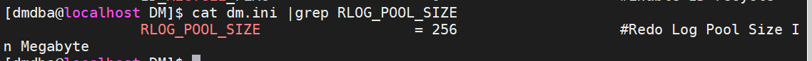

RLOG_BUF_SIZE ----- 日志缓冲区的大小 单位：page 设置成2的幂。 RLOG_POOL_SIZE ----最大日志缓冲区的大小 单位：M

RLOG_POOL_SIZE:该参数默认值为256M。

##### 1.2.3 字典缓冲区

字典缓冲区主要存储一些数据字典信息，如模式信息、表信息、列信息、触发器信息等。每次对数据库的操作都会涉及数据字典信息，访问数据字典信息的效率直接影响到相应的操作效率，如进行查询语句，就需要相应的表信息、列信息等，这些字典信息如果都在缓冲区里，则直接从缓冲区中获取即可，否则需要I/O才能读取到这些信息

```
cat dm.ini |grep DICT_BUF_SIZE
```

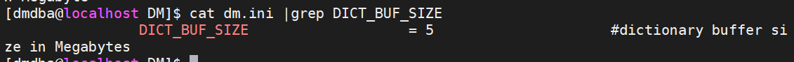

DICT_BUF_SIZE：该参数默认值为5M，有效值范围（1~2048）。**建议改成50M以上。**

##### 1.2.4 SQL缓冲区

SQL缓冲区提供在执行SQL语句过程中所需要的内存，包括计划、SQL语句和结果集缓存。很多应用当中都存在反复执行相同SQL语句的情况，此时可以使用缓冲区保存这些语句和它们的执行计划，这就是计划重用。这样带来的好处是加快了SQL语句执行效率，但同时给内存增加了压力。

```
cat dm.ini |grep CACHE_POOL_SIZE
```

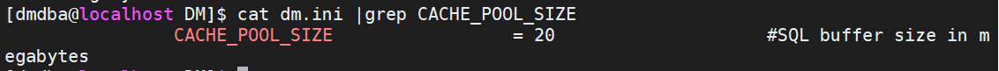

CACHE_POOL_SIZE默认值20M，一般在**内存小于16G的情况下，建议设置为200M，内存大于16G，小于64G，建议设置为1024M，当内存大于64G时，建议设置为2048M。**


#### 1.3 排序区

对数据进行排序，如果内存排序无法完成，把部分排序转到磁盘（temp)

排序区提供数据排序所需要的内存缓冲空间。当用户执行SQL语句时，常常需要进行排序，所使用的内存就是排序缓冲区提供的。在每次排序过程中，都先申请内存，排序结束后再释放内存。

```
cat dm.ini |grep SORT_
```

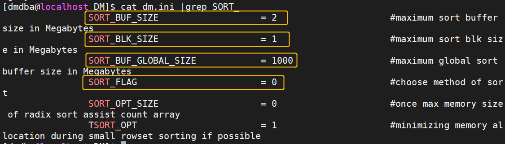

**SORT_FLAG**：默认为0，参数含义：0：原排序机制；1：新排序机制。 **在内存大于64G时建议使用新排序机制，其他情况使用原排序机制。**

**SORT_BUF_SIZE**：默认为2。**在内存小于64G时建议设置为10M，大于64G时建议设置为512M。**

**SORT_BUF_GLOBAL_SIZE**，默认为1000M。**当内存小于16G时，建议设置为500M，大于16G小于64G时建议设置为2000，当内存大于64G时，建议设置为5120M。**

**SORT_BLK_SIZE**：默认为 1M，新排序机制下，每个排序分片空间的大小，必须小于 SORT_BUF_GLOBAL_SIZE。


#### 1.4 哈希区

DM 7提供了为哈希连接而设定的缓冲区，不过该缓冲区是虚拟缓冲区。之所以说是虚拟缓冲，是因为系统没有真正创建特定属于哈希缓冲区的内存，而在进行哈希连接时，对排序的数据量进行了计算。如果计算出的数据量大小超过了哈希缓冲区的大小，则使用DM 7创新外存哈希方式；如果没有超过哈希缓冲区的大小，实际上使用的还是VPOOL内存池进行的哈希操作。

```
cat dm.ini |grep HJ_BUF
cat dm.ini |grep HAGR_BUF
```

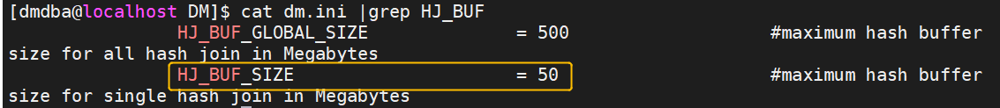


**HJ_BUF_SIZE** : **单个 HASH 连接操作符的数据总缓存大小，默认值50M**。 HJ_BUF_GLOBAL_SIZE ：HASH 连接操作符的数据总缓存大小（>=HJ_BUF_SIZE），默认为500 M。

**HAGR_BUF_GLOBAL_SIZE**: **HAGR、DIST、集合操作、SPL2、NTTS2 以及HTAB 操作符的数据总缓存大小（>= HAGR_BUF_SIZE），默认为500 M**。 HAGR_BUF_SIZE: 单个 HAGR、DIST、集合操作、SPL2、NTTS2以及 HTAB 操作符的数据总缓存大小，默认值50M。

**在服务器物理内存小于16GB的情况下，建议使用默认值。**

**当物理内存大于16GB，小于64GB时，建议将HJ_BUF_SIZE 和 HAGR_BUF_SIZE 设置为500M。 HAGR_BUF_GLOBAL_SIZE 和 HJ_BUF_GLOBAL_SIZE 设置为10000M以上。**

**当物理内存大于64GB时，建议将HJ_BUF_SIZE 和HAGR_BUF_SIZE 设置为1000M。 HAGR_BUF_GLOBAL_SIZE 和 HJ_BUF_GLOBAL_SIZE 设置为15000M以上。**


### 2、线程有关

```
cat dm.ini |grep WORKER_THREADS
cat dm.ini |grep TASK_THREADS
```

工作线程（WORKER_THREADS）这里默认值是2，建议改成逻辑CPU数量。 任务线程（TASK_THREADS）这里的默认值是4。 建议设置规则如下：

**1)逻辑CPU数量少于8时设置为4.** **2)逻辑CPU数量大于等于64时，设置为16.**

修改SQL如下：

```
SP_SET_PARA_VALUE(2,’WORKER_THREADS’,v_cpus);
SP_SET_PARA_VALUE(2,’TASK_THREADS’,4|16)；
```


### 3、其他参数

#### 1. 重用执行计划（USE_PLN_POOL）

```
cat dm.ini |grep USE_PLN_POOL
```

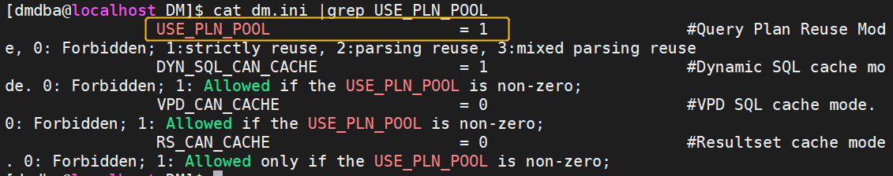

控制是否重用执行计划, **建议设置为1**。

0：禁止执行计划的重用； 

1：启用执行计划的重用功能 ； 

2：对不包含显式参数的语句进行常量参数化优化； 

3：即使包含显式参数的语句，也进行常量参数化优化

#### 2. 禁用OLAP(OLAP_FLAG)

```
cat dm.ini |grep OLAP_FLAG
```

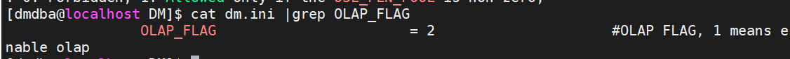

该参数控制是否启用联机分析处理，**建议设置为2**。 

取值参数：0：不启用； 1：启用； 2：不启用，同时倾向于使用索引范围扫描

#### 3. 打开系统监控（ENABLE_MONITOR）

```
cat dm.ini |grep ENABLE_MONITOR
```

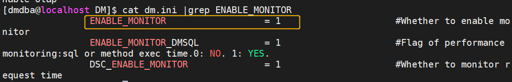

**建议启用系统监控**，该参数默认也为1，即启用监控，如果设置为0表示关闭。

#### 4. 关闭SQL 日志功能（SVR_LOG）

```
cat dm.ini |grep SVR_LOG
```

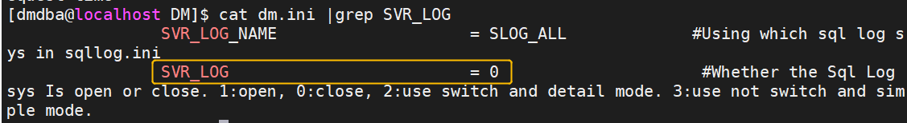

该参数可设置值如下：

0：表示关闭； 

1：表示打开； 

2：按文件中记录数量切换日志文件， 日志记录为详细模式； 

3：不切换日志文件，日志记录为简单模式，只记录时间和原始语句

#### 5. 设置临时表空间大小

```
cat dm.ini |grep TEMP
```

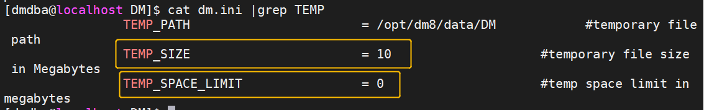

**TEMP_SIZE：默认创建的临时表空间大小，默认10M。** 

**TEMP_SPACE_LIMIT ：临时表空间大小上限，默认为0，表示不限制临时表空间大小。**

这里需要根据具体的业务，适当修改临时表空间大小，但**建议改到1024M以上**，同时指定最大限制。

#### 6. 会话数设置

```
cat dm.ini |grep MAX_SESSION
```

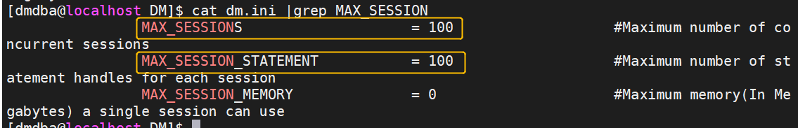

达梦的会话主要受限如上2个参数。

**MAX_SESSIONS** ：系统允许同时连接的最大数，同时还受到LICENSE 的限制，取二者中较小的值。

**MAX_SESSION_STATEMENT** ：系统级单个会话上允许同时打开的语句句柄最大数。

**生产环境建议将MAX_SESSIONS 设置到1500，	MAX_SESSION_STATEMENT 设置到20000。**

#### 7. 兼容性设置

```
cat dm.ini |grep COMPATIBLE_MODE
```

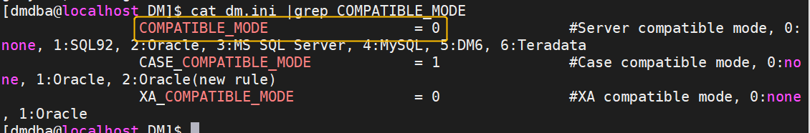

达梦通过COMPATIBLE_MODE参数来设置对其他数据库的兼容性，**建议设置为2**:

0：不兼容， 

1：兼容 SQL92 标准， 

2：部分兼容 ORACLE， 

3：部分兼容 MS SQL SERVER，

4：部分兼容 MYSQL，

5：兼容 DM6， 

6：部分兼容 TERADATA