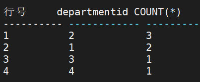
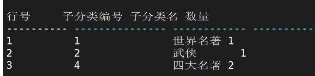
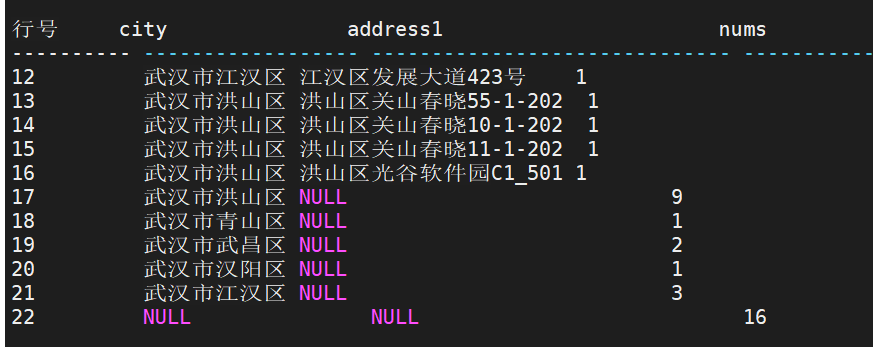
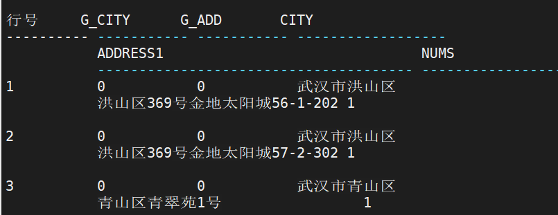
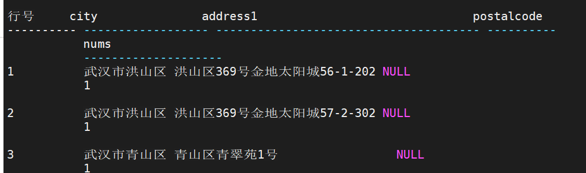
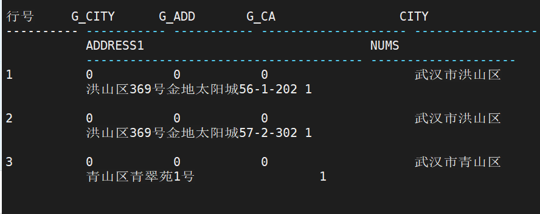
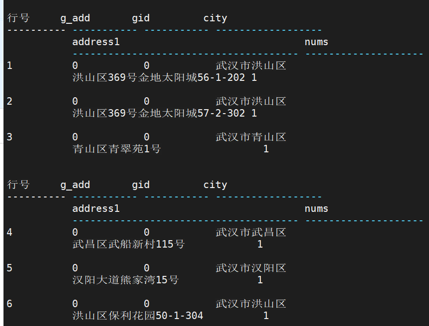

## GROUP BY子句

```sql
-- 语法
<GROUP BY 子句> ::= GROUP BY <group_by 项>{,<group_by 项>}
<group_by 项>::=<分组项> | <ROLLUP 项> | <CUBE 项> | <GROUPING SETS 项>
<分组项>::= <值表达式>
<ROLLUP 项>::=ROLLUP (<分组项>)
<CUBE 项>::=CUBE (<分组项>)
<GROUPING SETS 项>::=GROUPING SETS(<GROUP 项>{,<GROUP 项>})
<GROUP 项>::=<分组项>
	|(<分组项>{,<分组项>})
 	|()
```

GROUP BY 定义了分组表：行组的集合，其中每一个组由其中所有分组列的值都相等的行构成。

- 例：统计每个部门的员工数

```sql 
SELECT DEPARTMENTID,COUNT(*) FROM RESOURCES.EMPLOYEE_DEPARTMENT GROUP BY DEPARTMENTID;
```



- 例：求小说类别包含的子类别所对应的产品数量，并按子类别编号的升序排列

```sql 
SELECT A1.PRODUCT_SUBCATEGORYID AS 子分类编号, A3.NAME AS 子分类名, count(*) AS 数量
FROM PRODUCTION.PRODUCT A1,
PRODUCTION.PRODUCT_CATEGORY A2,
PRODUCTION.PRODUCT_SUBCATEGORY A3
WHERE A1.PRODUCT_SUBCATEGORYID=A3.PRODUCT_SUBCATEGORYID
AND A2.PRODUCT_CATEGORYID=A3.PRODUCT_CATEGORYID
AND A2.NAME='小说'
GROUP BY A1.PRODUCT_SUBCATEGORYID,A3.NAME
ORDER BY A1.PRODUCT_SUBCATEGORYID;
```



**注意：**

1. 在 GROUP BY 子句中的每一列必须明确地命名属于在 FROM 子句中命名的表的一列。 分组列的数据类型不能是多媒体数据类型；
2. 分组列不能为集函数表达式或者在 SELECT 子句中定义的别名；
3. 当分组列值包含空值时，则空值作为一个独立组；
4. 当分组列包含多个列名时，则按照 GROUP BY 子句中列出现的顺序进行分组；
5. GROUP BY 子句中至多可包含 255 个分组列； 
6. ROLLUP\CUBE\GROUPING SETS 组合不能超过 9 个。


###  ROLLUP 的使用

```sql
-- 语法
GROUP BY ROLLUP (<分组项>)
<分组项>::= <列名> | <值表达式>{,<列名> | <值表达式>} 
```

假如 ROLLUP 分组列为(A, B, C)，首先对(A,B,C)进行分组，然后对(A,B)进行分 组，接着对(A)进行分组，最后对全表进行查询，无分组列，其中查询项中出现在 ROLLUP 中的列设为 NULL。查询结果是把每种分组的结果集进行 UNION ALL 合并输出。如果分组 列为 n 列，则共有 n+1 种组合方式。

- 例：按小区住址和所属行政区域统计员工居住分布情况。 

  ```sql
  SELECT CITY, ADDRESS1, COUNT(*) as NUMS FROM PERSON.ADDRESS GROUP BY ROLLUP(CITY, ADDRESS1);
  ```

  等价于

  ```sql
  SELECT CITY , ADDRESS1, COUNT(*) AS NUMS FROM PERSON.ADDRESS GROUP BY
  CITY, ADDRESS1
  UNION ALL
  SELECT CITY , NULL, COUNT(*) AS NUMS FROM PERSON.ADDRESS GROUP BY CITY
  UNION ALL
  SELECT NULL , NULL, COUNT(*) AS NUMS FROM PERSON.ADDRESS GROUP BY 0;
  ```

  

**注意：** 

1．ROLLUP 项不能包含集函数； 

2．不支持包含 ROWNUM、WITH FUNCTION 的相关查询； 

3．不支持包含存在 ROLLUP 的嵌套相关子查询； 

4．ROLLUP 项最多支持 511 个； 

5．ROLLUP 项不能引用外层列。


### CUBE 的使用

CUBE 的使用场景与 ROLLUP 类似，常用于统计分析，对分组列以及分区列的所有子集 进行分组，输出所有分组结果。

```sql
-- 语法
GROUP BY CUBE (<分组项>)
<分组项>::= <列名> | <值表达式>{,<列名> | <值表达式>}
```

假如，CUBE 分组列为(A, B, C)，则首先对(A,B,C)进行分组，然后依次对(A,B)、 (A,C)、(A)、(B,C)、(B)、(C)六种情况进行分组，最后对全表进行查询，无分组列， 其中查询项存在于 CUBE列表的列设置为NULL。输出为每种分组的结果集进行 UNION ALL。 CUBE 分组共有 2n 种组合方式。CUBE 最多支持 9 列。

例：按小区住址、所属行政区域统计员工居住分布情况

```sql
SELECT CITY , ADDRESS1, COUNT(*) AS NUMS FROM PERSON.ADDRESS GROUP BY CUBE(CITY, ADDRESS1);

等价于

SELECT CITY , ADDRESS1, COUNT(*) AS NUMS FROM PERSON.ADDRESS GROUP BY
CITY, ADDRESS1
UNION ALL
SELECT CITY , NULL, COUNT(*) AS NUMS FROM PERSON.ADDRESS GROUP BY CITY
UNION ALL
SELECT NULL , ADDRESS1, COUNT(*) AS NUMS FROM PERSON.ADDRESS GROUP BY
ADDRESS1
UNION ALL
SELECT NULL , NULL, COUNT(*) AS NUMS FROM PERSON.ADDRESS;
```

**注意：**

1. CUBE 项不能包含集函数；
2. 不支持包含 WITH FUNCTION 的相关查询
3. 不支持包含存在 CUBE 的嵌套相关子查询
4. CUBE 项最多支持 9 个
5. CUBE 项不能引用外层列。


### GROUPING 的使用

GROUPING 可以视为集函数，一般用于含 GROUP BY 的语句中，标识某子结果集是否 是按指定分组项分组的结果，如果是，GROUPING 值为 0；否则为 1。

```sql
-- 语法
<GROUPING 项>::=GROUPING (<分组项>)
<分组项>::= <列名> | <值表达式>
```

**使用约束说明：** 

1. GROUPING 中只能包含一列

2. GROUPING 只能在 GROUP BY 查询中使用

3.  GROUPING 不能在 WHERE 或连接条件中使用

4. GROUPING 支持表达式运算，

   例如 GROUPING(c1) + GROUPING(c2)

例：按小区住址和所属行政区域统计员工居住分布情况

```sql
SELECT GROUPING(CITY) AS G_CITY,GROUPING(ADDRESS1) AS G_ADD, CITY, ADDRESS1, COUNT(*) AS NUMS FROM PERSON.ADDRESS GROUP BY ROLLUP(CITY, ADDRESS1);
```




### GROUPING SETS 的使用

GROUPING SETS 是对 GROUP BY 的扩展，可以指定不同的列进行分组，每个分组列集作为一个分组单元。使用 GROUPING SETS，用户可以灵活的指定分组方式，避免 ROLLUP/CUBE 过多的分组情况，满足实际应用需求。 

GROUPING SETS 的分组过程为依次按照每一个分组单元进行分组，最后把每个分组结 果进行 UNION ALL 输出最终结果。如果查询项不属于分组列，则用 NULL 代替。

```sql
-- 语法
GROUP BY GROUPING SETS (<分组项>)
<分组项> ::= <分组子项> {,<分组子项>}
<分组子项> ::= <表达式> | () |(<表达式>{,<表达式>})
<表达式> ::= <列名> | <值表达式>
```

例：按照邮编、住址和行政区域统计员工住址分布情况

```sql
SELECT CITY , ADDRESS1, POSTALCODE, COUNT(*) AS NUMS FROM PERSON.ADDRESS GROUP BY GROUPING SETS((CITY, ADDRESS1), POSTALCODE);

等价于

SELECT CITY , ADDRESS1, NULL , COUNT(*) AS NUMS FROM PERSON.ADDRESS GROUP
BY CITY, ADDRESS1
UNION ALL
SELECT NULL , NULL, POSTALCODE ,COUNT(*) AS NUMS FROM PERSON.ADDRESS
GROUP BY POSTALCODE;
```



**注意：**

1. GROUPING SETS 项不能包含集函数
2.  不支持包含 WITH FUNCTION 的相关查询
3. 不支持包含存在 GROUPING SETS 的嵌套相关子查询
4. GROUPING SETS 项最多支持 512 个
5. GROUPING SETS 项不能引用外层列。


### GROUPING_ID 的使用

GROUPING_ID 表示参数列是否为分组列。返回值的每一个二进制位表示对应的参数列是否为分组列，如果是分组列，该位值为 0；否则为 1。

```sql
<GROUPING_ID 项>::=GROUPING_ID (<分组项>{,<分组项>)
<分组项>::= <列名> | <值表达式>
```

使用约束说明： 

1. GROUPING_ID 中至少包含一列，最多包含 63 列
2. GROUPING_ID 只能与分组项一起使用
3. GROUPING_ID 支持表达式运算
4. GROUPING_ID 作为分组函数，不能出现在 where 或连接条件中

例：按小区住址和所属行政区域统计员工居住分布情况

```sql
SELECT GROUPING(CITY) AS G_CITY,GROUPING(ADDRESS1) AS G_ADD, GROUPING_ID(CITY, ADDRESS1) AS G_CA,CITY , ADDRESS1, COUNT(*) AS NUMS FROM PERSON.ADDRESS
GROUP BY ROLLUP(CITY, ADDRESS1);
```




### GROUP_ID 的使用

GROUP_ID 表示结果集来自于哪一个分组，用于区别相同分组的结果集。如果有 N 个 相同分组，则 GROUP_ID 取值从 0..N-1。每组的初始值为 0。 

当查询包含多个分组时，使用 GROUP_ID 可以方便的过滤相同分组的结果集。 

使用约束说明： 

1. GROUP_ID 不包含参数
2. GROUP_ID 只能与分组项一起使用
3. GROUP_ID 支持表达式运算
4.  GROUP_ID 作为分组函数，不能出现在 WHERE 或连接条件中。

例：按小区住址和所属行政区域统计员工居住分布情况

```sql
SELECT GROUPING(CITY) AS G_CITY,GROUPING(ADDRESS1) AS G_ADD, GROUP_ID() AS GID, CITY, ADDRESS1, COUNT(*) AS NUMS FROM PERSON.ADDRESS GROUP BY ROLLUP(CITY, ADDRESS1), CITY;
```




## HAVING 子句

```sql
-- 语法
<HAVING 子句> ::= HAVING <搜索条件>
<搜索条件>::= <表达式>
```

HAVING 子句定义了一个成组表，其中只含有搜索条件为 TRUE 的那些组，且通常跟随一个 GROUP BY 子句。HAVING 子句与组的关系正如 WHERE 子句与表中行的关系。WHERE 子句用于选择表中满足条件的行，而 HAVING 子句用于选择满足条件的组

- 例：统计出同一子类别的产品数量大于 1 的子类别名称，数量，并按数量从小到大的顺序排列

```sql
SELECT A2.NAME AS 子分类名, COUNT (*) AS 数量
FROM PRODUCTION.PRODUCT A1,
PRODUCTION.PRODUCT_SUBCATEGORY A2
WHERE A1.PRODUCT_SUBCATEGORYID=A2.PRODUCT_SUBCATEGORYID
GROUP BY A2.NAME
HAVING COUNT(*)>1
ORDER BY 2;
```


