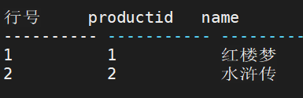
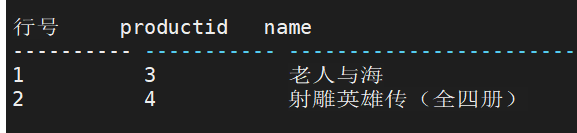
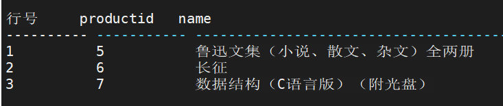
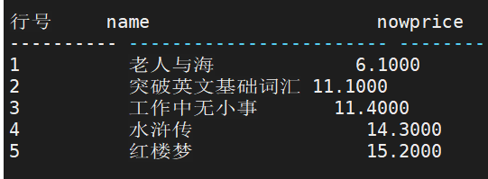
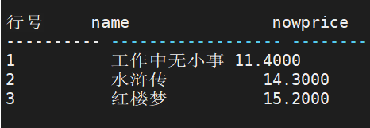
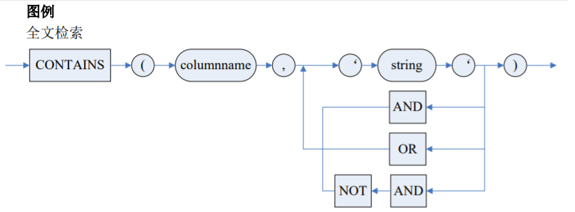
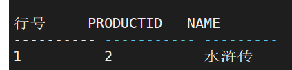
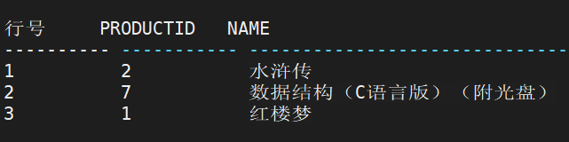

## LIMIT限制条件

### LIMIT子句

**支持四种方式：** 

1. LIMIT N：选择前 N 条记录 
2. LIMIT M,N：选择第 M 条记录之后的 N 条记录
3. LIMIT M OFFSET N：选择第 N 条记录之后的 M 条记录
4. OFFSET N LIMIT M：选择第 N 条记录之后的 M 条记录。 

**注意**：LIMIT 不能与 TOP 同时出现在查询语句中

- 查询前 2 条记录

`SELECT PRODUCTID, NAME FROM PRODUCTION.PRODUCT LIMIT 2;`



- 查询第 3，4 个登记的产品的编号和名称

`SELECT PRODUCTID, NAME FROM PRODUCTION.PRODUCT LIMIT 2 OFFSET 2;`



- 查询前第 5，6，7 个登记的姓名

`SELECT PERSONID,NAME FROM PERSON.PERSON LIMIT 4,3;`




### ROW_LIMIT 子句

ROW_LIMIT 子句用于指定查询结果中偏移位置的行数或者百分比行数，以便更为灵活 地获取查询结果。

```sql
-- 语法
< ROW_LIMIT 子句>::= [OFFSET <offset> <ROW | ROWS> ] [<FETCH 说明>]
<FETCH 说明>::= FETCH <FIRST | NEXT> <大小> [PERCENT] < ROW | ROWS ><ONLY| WITH
TIES>

-- 参数
1. <offset> 指定查询返回行的起始偏移。必须为数字。offset 为负数时视为 0；为 NULL 或大于等于所返回的行数时，返回 0 行；为小数时，小数部分截断；
2. <FIRST | NEXT> FIRST 为从偏移为 0 的位置开始。 NEXT 为从指定的偏移的下一行开始获取结果。 只做注释说明的作用，没有实际的限定作用；
3. <大小>[PERCENT] 指定返回行的行数（无 PERCENT）或者百分比（有PERCENT）。其中<大小>只能为数字。percent 指定为负数时，视为 0%；为 NULL 时返回 0 行，如果没有指定 percent，返回 1 行；
4. <ONLY | WITH TIES> 指定结果集是否返回额外的行。额外的行是指与最后一行以相同的排序键排序的所有行。ONLY 为只返回指定的行数。WITH TIES 必须与 ORDER BY 子句同时出现，如果没有 ORDER BY 子句，则忽略 WITH TIES。
```

**使用说明 ：**

1. ROW_LIMIT 子句不能与 FOR UPDATE 子句一起使用； 
2. 使用 ROW_LIMIT 子句时，查询列中不能包含有 CURRVAL 或者 NEXTVAL 伪列；
3. 视图的查询定义中包含有 ROW_LIMIT 子句时，这个视图不会增量刷新

- 查询价格最便宜的 50%的商品

`SELECT NAME, NOWPRICE FROM PRODUCTION.PRODUCT ORDER BY NOWPRICE FETCH FIRST 50 PERCENT ROWS ONLY;`



- 查询价格第 3 便宜开始的 3 条记录

`SELECT NAME, NOWPRICE FROM PRODUCTION.PRODUCT ORDER BY NOWPRICE OFFSET 2 ROWS FETCH FIRST 3 ROWS ONLY;`




## 全文检索

DM 数据库提供多文本数据检索服务，包括全文索引和全文检索。全文索引为在字符串 数据中进行复杂的词搜索提供了有效支持。全文索引存储关于词和词在特定列中的位置信息，全文检索利用这些信息，可以快速搜索包含某个词或某一组词的记录。 

执行全文检索涉及到以下这些任务： 

1. 对需要进行全文检索的表和列进行注册
2. 对注册了的列的数据建立全文索引
3. 对注册了的列查询填充后的全文索引。

执行全文检索步骤如下： 

1. 建立全文索引； 
2. 修改（填充）全文索引； 
3. 使用带 CONTAINS 谓词的查询语句进行全文检索； 
4. 当数据表的全文索引列数据发生变化，则需要进行增量或者完全填充全文索引，以 便可以查询到更新后的数据； 
5. 若不再需要全文索引，可以删除该索引； 
6. 在全文索引定义并填充后，才可进行全文检索。 全文检索通过在查询语句中使用 CONTAINS 子句进行。

```
-- 语法

CONTAINS ( <列名> , <检索条件> )
<检索条件>::= <布尔项> | <检索条件> <AND | OR | AND NOT> <布尔项>
<布尔项>::= '字符串'
```



**使用说明 :**

1. 使用 CONTAINS 子句查询时，<列名>必须是已经建立了全文索引并填充后的列， 否则系统会报错
2. 支持精确字、词、短语及一段文字的查询，CONTAINS 谓词内支持 AND | AND NOT | OR 的使用，AND 的优先级高于 OR 的优先级
3. 支持对每个精确词（单字节语言中没有空格或标点符号的一个或多个字符）或短语 （单字节语言中由空格和可选的标点符号分隔的一个或多个连续的词）的匹配。对词或短语 中字符的搜索不区分大小写
4.  对于短语或一段文字的查询，根据词库，单个查找串被分解为若干个关键词，忽略 词库中没有的词和标点符号，在索引上进行（关键词 AND 关键词）匹配查找。因而，不一定是精确查询
5. 英文查询不区分大小写和全角半角中英文字符
6. 不提供 Noise 文件，即不考虑忽略词或干扰词
7. 不支持通配符―*‖
8.  不提供对模糊词或变形词的查找
9. 不支持对结果集的相关度排名
10.  检索条件子句可以和其他子句共同组成 WHERE 的检索条件。


举例：

- 全文检索综合实例，以 PRODUCT 表为例。

  1. 在 DESCRIPTION 列上定义全文索引

     ```sql
     CREATE CONTEXT INDEX INDEX1 ON PRODUCTION.PRODUCT(DESCRIPTION) LEXER CHINESE_VGRAM_LEXER;
     ```

  2. 完全填充全文索引

     ```sql
     ALTER CONTEXT INDEX INDEX1 ON PRODUCTION.PRODUCT REBUILD
     ```

  3. 进行全文检索，查找描述里有“语言”字样的产品的编号和名称

     ```sql
     SELECT PRODUCTID, NAME FROM PRODUCTION.PRODUCT WHERE CONTAINS(DESCRIPTION,
     '语言');
     ```

     

  4. 进行全文检索，查找描述里有“语言”及“中国”字样的产品的编号和名称

     ```sql
     SELECT PRODUCTID, NAME FROM PRODUCTION.PRODUCT WHERE CONTAINS(DESCRIPTION,'
     语言' AND '中国');
     ```

     

  5. 进行全文检索，查找描述里有“语言”或“中国”字样的产品的编号和名称

     ```sql
     SELECT PRODUCTID, NAME FROM PRODUCTION.PRODUCT WHERE CONTAINS(DESCRIPTION,'
     语言' OR '中国');
     ```

     

  6. 进行全文检索，查找描述里无“中国”字样的雇员的产品的编号和名称。

     ```sql
     SELECT PRODUCTID, NAME FROM PRODUCTION.PRODUCT WHERE NOT CONTAINS(DESCRIPTION,
     '中国');
     ```

     

  7. 进行全文检索，查找描述里有“C 语言”字样的产品的编号和名称

     ```sql
     SELECT PRODUCTID, NAME FROM PRODUCTION.PRODUCT WHERE CONTAINS(DESCRIPTION,'C
     语言');
     ```

     

  8. 对不再需要的全文索引进行删除

     ```sql
     DROP CONTEXT INDEX INDEX1 ON PRODUCTION.PRODUCT;
     ```

     


