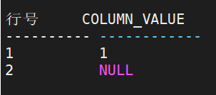
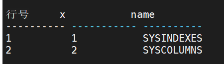
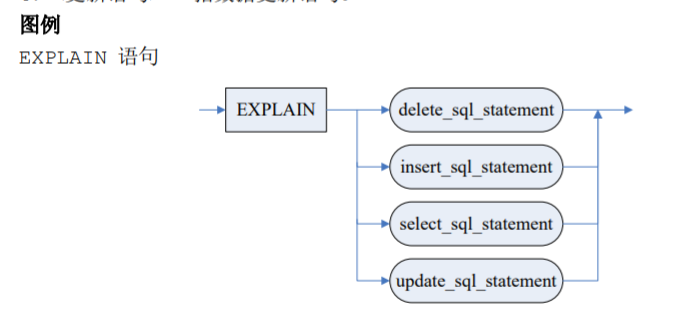
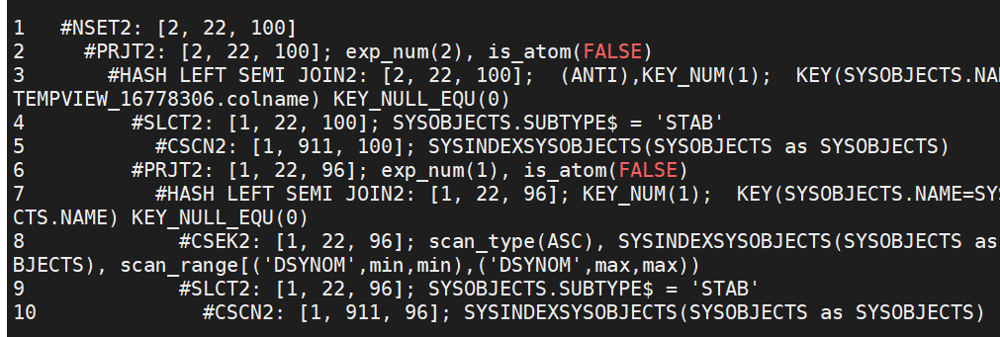
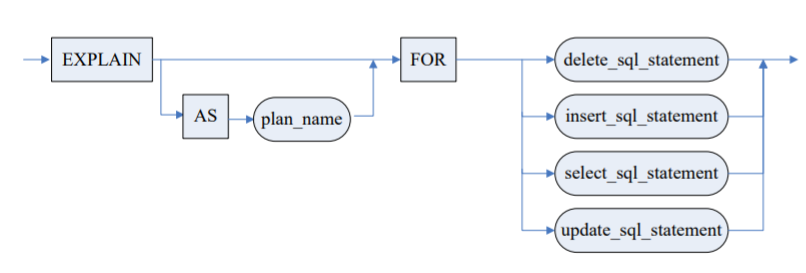

## ROWNUM

ROWNUM 是一个虚假的列，表示从表中查询的行号，或者连接查询的结果集行数。它将被分配为 1，2，3，4，...N，N 是行的数量。通过使用 ROWNUM 可以限制查询返回的行数。

例如，以下语句执行只会返回前 5 行数据。

```sql
 SELECT * FROM RESOURCES.EMPLOYEE WHERE ROWNUM<6;
```

 一个 ROWNUM 值不是被永久的分配给一行。表中的某一行并没有标号，不可以查询 ROWNUM 值为 5 的行。ROWNUM 值只有当被分配之后才会增长，并且初始值为 1。即只有满 足一行后，ROWNUM 值才会加 1，否则只会维持原值不变。因此，以下语句在任何时候都不 能返回数据。 

```sql
SELECT * FROM RESOURCES.EMPLOYEE WHERE ROWNUM >11; 
SELECT * FROM RESOURCES.EMPLOYEE WHERE ROWNUM = 5; 
```

ROWNUM 的一个重要作用是控制返回结果集的规模，可以避免查询在磁盘中排序。 

因为 ROWNUM 值的分配是在查询的谓词解析之后，任何排序和聚合之前进行的。因此， 在排序和聚合使用 ROWNUM 时需要注意，可能得到并非预期的结果。

例如：

```sql
SELECT * FROM RESOURCES.EMPLOYEE WHERE ROWNUM < 11 ORDER BY EMPLOYEEID; 
```

以上语句只会对 EMPLOYEE 表前 10 行数据按 EMPLOYEEID 排序输出，并不是表的所 有数据按 EMPLOYEEID 排序后输出前 10 行，要实现后者，需要使用如下语句： 

```sql
SELECT * FROM (SELECT * FROM RESOURCES.EMPLOYEE ORDER BY EMPLOYEEID) WHERE ROWNUM < 11; 
SELECT TOP 10 * FROM RESOURCES.EMPLOYEE ORDER BY EMPLOYEEID;
```

使用说明 ：

1．在查询中，ROWNUM 可与任何数字类型表达式进行比较及运算，但不能出现在含 OR 的布尔表达式中，否则报错处理； 

2．ROWNUM 可以在非相关子查询中使用；当参数 ENABLE_RQ_TO_INV 等于 1 时，部 分相关子查询支持使用； 

3．在非相关子查询中，ROWNUM只能实现与TOP相同的功能，因此子查询不能含ORDER BY 和 GROUP BY；

 4．ROWNUM 所处的子谓词只能为如下形式： ROWNUM op exp，exp 的类型只能是立 即数、参数和变量值，op ∈ {<， <=， >， >=， =， <>}。


## 数组查询

在 DM 中，可以通过查询语句查询数组信息。即中<普通表>使用数组。

语法如下： `FROM ARRAY <数组>` 

目前 DM 只支持一维数组的查询。 数组类型可以是记录类型和普通数据库类型。如果为记录类型的数组，则记录的成员都必须为标量（基本）数据类型。记录类型数组查询出来的列名为记录类型每一个属性的名字。 普通数据库类型查询出来的列名均为“COLUMN_VALUE”。

例 1 查看数组 

```sql
SELECT * FROM ARRAY NEW INT[2]{1};
```



例 2 数组与表的连接 

```sql
DECLARE 
	TYPE rrr IS RECORD (x INT, y INT);
	TYPE ccc IS ARRAY rrr[];
	c ccc;
BEGIN
	c = NEW rrr[2];
	FOR i IN 1..2 LOOP c[i].x = i;
		c[i].y = i*2;
	END LOOP;
	SELECT arr.x, o.name FROM ARRAY c arr, SYSOBJECTS o WHERE arr.x = o.id; 
END; 
```




## 查看执行计划与执行跟踪统计

### EXPLAIN 

EXPLAIN 语句可以查看 DML 语句的执行计划。 

```sql
-- 语法
EXPLAIN;
<SQL 语句> ::= <删除语句> | <插入语句> | <查询语句> | <更新语句> 

-- 参数 
1．<删除语句> 指数据删除语句； 
2．<插入语句> 指数据插入语句； 
3．<查询语句> 指查询语句； 
4．<更新语句> 指数据更新语句。

-- 语句功能
供用户查看执行计划。
```



例：显示如下语句的查询计划： 

```sql
EXPLAIN SELECT NAME,schid 
FROM SYSOBJECTS 
WHERE SUBTYPE$='STAB' AND NAME 
	NOT IN 
	( SELECT NAME FROM SYSOBJECTS WHERE NAME IN 	(SELECT NAME FROM SYSOBJECTS WHERE SUBTYPE$='STAB') AND TYPE$='DSYNOM');
```




### EXPLAIN FOR

EXPLAIN FOR 语句也用于查看 DML 语句的执行计划，不过执行计划以结果集的方式返回。

```sql
-- 语法
EXPLAIN [AS 计划名称] FOR <SQL 语句>;
<SQL 语句> ::= <删除语句> | <插入语句> | <查询语句> | <更新语句>

-- 参数
1．<删除语句> 指数据删除语句；
2．<插入语句> 指数据插入语句；
3．<查询语句> 指查询语句；
4．<更新语句> 指数据更新语句。

-- 语句功能
供用户以结果集的方式查看执行计划
```



例：以结果集的方式显示如下语句的查询计划

```sql
EXPLAIN FOR SELECT NAME, SCHID FROM SYS.SYSOBJECTS WHERE SUBTYPE$='STAB';
```


