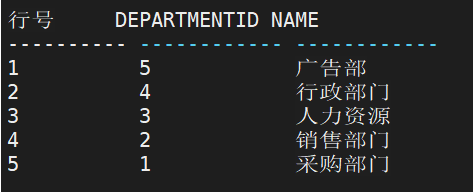
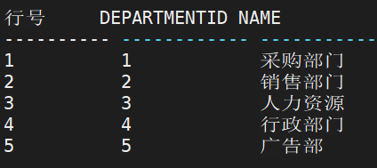
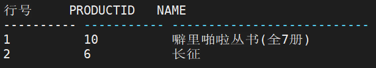
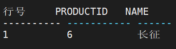
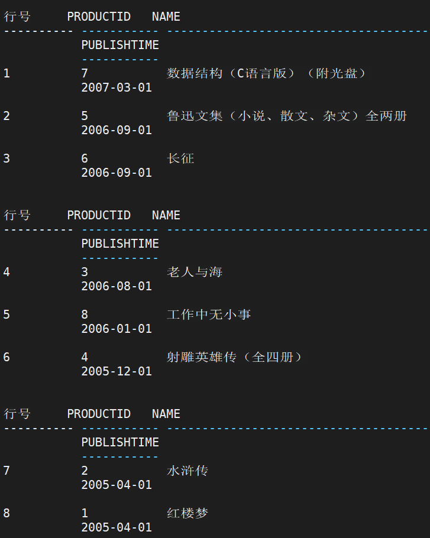

## ORDER BY 子句

ORDER BY 子句可以选择性地出现在<查询表达式>之后，它规定了当行由查询返回时 应具有的顺序。

```sql
-- 语法
<ORDER BY 子句> ::= ORDER [SIBLINGS] BY < order_by_list>
<order_by_list>::= < order_by_item >{,<order_by_item>}
<order_by_item>::= <exp> [ASC | DESC] [NULLS FIRST|LAST]
<exp >::=<无符号整数> | <列说明> | <值表达式>
```

****

**使用说明：**

1． ORDER BY 子句提供了要排序的项目清单和他们的排序顺序：递增顺序(ASC，默 认)或是递减顺序(DESC)。它必须跟随在<查询表达式>之后，因为它是在查询计算得出的 最终结果上进行操作的； 

2． 排序键可以是任何在查询清单中的列的名称，或者是对最终结果表的列计算的表达 式(即使这一列不在选择清单中)，也可以是子查询。对于 UNION 查询语句，排序键必须在第一个查询子句中出现；对于 GROUP BY 分组的排序，排序键可以使用集函数，但 GROUP BY 分组中必须包含查询列中所有列； 

3． <无符号整数> 对应 SELECT 后结果列的序号。当用<无符号整数>代替列名时，< 无符号整数>不应大于 SELECT 后结果列的个数。如下面例子中 ORDER BY 3，因查询结果列只有 2 列，无法进行排序，系统将会报错。若采用其他常量表达式(如：-1，3×6)作为排序列，将不影响最终结果表的行输出顺序； 

4． SIBLINGS 关键字必须与 CONNECT BY 一起配合使用，专门用于指定层次查询中 相同层次数据返回的顺序。

5． 无论采用何种方式标识想要排序的结果列，它们都不支持多媒体数据类型(如 IMAGE、TEXT、BLOB 和 CLOB)； 

6． 当排序列值包含 NULL 时，根据指定的―NULLS FIRST|LAST‖决定包含空值的行 是排在最前还是最后，缺省为 NULLS FIRST； 

7． 当排序列包含多个列名时，系统则按列名从左到右排列的顺序，先按左边列将查询 结果排序，当左边排序列值相等时，再按右边排序列排序……如此右推，逐个检查调整，最后得到排序结果； 

8． 由于 ORDER BY 只能在最终结果上操作，不能将其放在查询中； 

9． 如果 ORDER BY 后面使用集函数，则必须使用GROUP BY 分组，且 GROUP BY 分组中必须包含查询列中所有列； 

10． ORDER BY 子句中至多可包含 255 个排序列。

- 例：将 RESOURCES.DEPARTMENT 表中的资产总值按从大到小的顺序排列

```sql
SELECT * FROM RESOURCES.DEPARTMENT ORDER BY DEPARTMENTID DESC;

等价于：

SELECT * FROM RESOURCES.DEPARTMENT ORDER BY 1 DESC;
```




## FOR UPDATE子句

FOR UPDATE 子句可以选择性地出现在<查询表达式>之后。普通 SELECT 查询不会修 改行数据物理记录上的 TID 事务号，FOR UPDATE 会修改行数据物理记录上的 TID 事务号 并对该 TID 上锁，以保证该更新操作的待更新数据不被其他事务修改。

```sql
-- 语法
<FOR UPDATE 子句> ::= FOR READ ONLY
| <FOR UPDATE 选项>
<FOR UPDATE 选项> ::= FOR UPDATE [OF <选择列表>] [ NOWAIT
|WAIT N
|[N]SKIP LOCKED
]
<选择列表> ：：= [<模式名>.] <基表名>|<视图名> .] <列名> {,[<模式名>.] <基表名>|<
视图名> .] <列名>}

-- 参数
1. FOR READ ONLY 表示查询不可更新；
2. OF <选择列表>指定待更新表的列。指定某张表的列，即为锁定某张表。游标更新时，仅能更新指定的列；
3. NOWAIT，WAIT，SKIP LOCKED 等子句表示当试图上锁的行数据 TID 已经被其他事务上锁的处理方式：
	1) NOWAIT 表示不等待，直接报错返回；
	2) WAIT N 表示等待一段时间，其中的 N 值由用户指定，单位为秒。等待成功继续上锁，失败则报错返回。WAIT 的指定值必须大于 0，如果设置 0 自动转成NOWAIT 方式；
	3) [N] SKIP LOCKED 表示上锁时跳过已经被其他事务锁住的行，不返回这些行给客户端。N 是整数，为 DM 特有的语法，表示当取得了 N 条数据后，便不再取数据了，直接返回 N 条结果；
	4) 如果 FOR UPDATE 不设置以上三种子句，则会一直等待锁被其他事务释放；
	5) INI 参数 LOCK_TID_MODE 用来标记 SELECT FOR UPDATE 封锁方式。0 表示结果集小于 100 行时，直接封锁 TID，超过 100 行升级为表锁。1 表示不升级表锁，一律使用 TID 锁。默认为 1。
```

- 例： 查询 RESOURCES.DEPARTMENT 表中的资产

```sql
SELECT * FROM RESOURCES.DEPARTMENT FOR UPDATE; -- 只要 FOR UPDATE 语句不提交，其他会话就不能修改此结果集。
```



说明： 

1. 以下情况 SELECT FOR UPDATE 查询会报错： 

   1) 带 GROUP BY 的查询，如 SELECT C1, COUNT(C2) FROM TEST GROUP BY C1 FOR UPDATE； 

   2) 带聚集函数的查询，如 SELECT MAX(C1)FROM TEST FOR UPDATE； 

   3) 带分析函数的查询，如 SELECT MAX(C1) OVER(PARTITION BY C1) FROM TEST FOR UPDATE； 

   4) 对以下表类型的查询：外部表、物化视图、系统表和 HUGE 表； 

   5) WITH 子句，如 WITH TEST(C1) AS (SELECT C1 FROM T FOR UPDATE )SELECT * FROM TEST。

2.  涉及 DBLINK 的 SELECT FOR UPDATE 查询仅支持单表； 

3. 如果结果集中包含 LOB 对象，会再封锁 LOB 对象； 

4. 支持多表连接的情况，会封锁涉及到的所有表的行数据； 

5. 多表连接的时候，如果用 OF <选择列表>指定具体列，只会检测和封锁对应的表。


## TOP子句

 ```sql
 -- 语法
 <TOP 子句>::=TOP <n>
 | <<n>,<n>>
 | <n> PERCENT
 | <n> WITH TIES
 | <n> PERCENT WITH TIES
 <n>::=整数(>=0)
 
 -- 参数
 1. TOP <n> 选择结果的前 n 条记录；
 2. TOP <n1>,<n2> 选择第 n1 条记录之后的 n2 条记录；
 3. TOP <n> PERCENT 表示选择结果的前 n%条记录；
 4. TOP <n> PERCENT WITH TIES 表示选择结果的前 n%条记录，同时指定结果集可以返回额外的行。额外的行是指与最后一行以相同的排序键排序的所有行。WITH TIES必须与 ORDER BY 子句同时出现，如果没有 ORDER BY 子句，则忽略 WITH TIES。
 ```

- 查询现价最贵的两种产品的编号和名称

```sql
SELECT TOP 2 PRODUCTID,NAME FROM PRODUCTION.PRODUCT ORDER BY NOWPRICE DESC;
```



- 查询现价第二贵的产品的编号和名称

```sql
SELECT TOP 1,1 PRODUCTID,NAME FROM PRODUCTION.PRODUCT ORDER BY NOWPRICE DESC;
```



- 查询最新出版日期的70%的产品编号、名称和出版日期

```sql
SELECT TOP 70 PERCENT WITH TIES PRODUCTID,NAME,PUBLISHTIME FROM PRODUCTION.PRODUCT ORDER BY PUBLISHTIME DESC;
```



