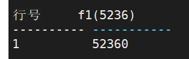
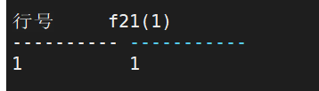
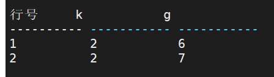
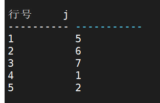
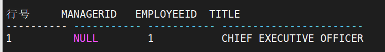
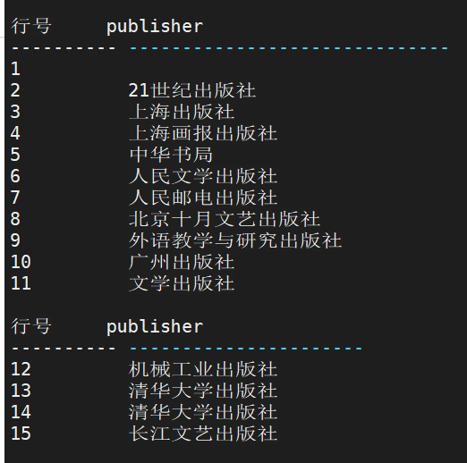
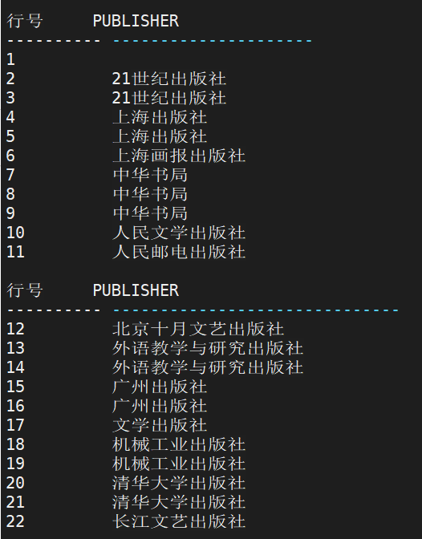

## WITH子句

语法：` <WITH 子句> ::= [<WITH FUNCTION 子句>] [<WITH CTE 子句>]`


### WITH FUNCTION 子句

WITH FUNCTION 子句用于在 SQL 语句中临时声明并定义存储函数，这些存储函数可以在其作用域内被引用。相比模式对象中的存储函数，通过 WITH FUNCTION 定义的存储函数在对象名解析时拥有更高的优先级。 和公用表表达式 CTE 类似，WITH FUNCTION 定义的存储函数对象也不会存储到系统 表中，且只在当前 SQL 语句内有效。 WITH FUNCTION 子句适用于偶尔需要使用存储过程的场景。和模式对象中的存储函数相比，它可以清楚地看到函数定义并避免了 DDL 操作带来的开销。 

语法： `WITH <函数> {<函数>}`

使用说明 ：

1. <WITH FUNCTION 子句>中定义的函数的作用域为所在的查询表达式内
2. 同一<WITH FUNCTION 子句>中函数名不得重复
3. <WITH FUNCTION 子句>中定义的函数不能是外部函数
4. 该语句的使用者并不需要 CREATE PROCEDURE 数据库权限

- 例：WITH FUNCTION 中定义的函数优先级高于模式对象的例子。 

  ```sql
  WITH FUNCTION f1(C INT) RETURN INT AS BEGIN RETURN C * 10; 
  END; 
  SELECT f1(5236) FROM DUAL; 
  /
  ```

  

- 例：WITH FUNCTION 和公用表表达式混合的例子。 

  ```sql
  WITH FUNCTION f21(C1 INT) RETURN INT AS BEGIN RETURN C1; 
  END;
  SELECT f21(1) FROM dual WHERE 100 IN
  (
   WITH FUNCTION f22(C1 INT) RETURN INT AS BEGIN RETURN C1 + 2; 
   END;
   FUNCTION f23(C1 INT) RETURN INT AS BEGIN RETURN C1 - 2; 
   END;
   v21(C) AS (SELECT 50 FROM dual)
   SELECT f22(C) +f23(C) FROM v21
  );
  /
  ```




### WITH CTE 子句

嵌套 SQL 语句如果层次过多，会使 SQL 语句难以阅读和维护。如果将子查询放在临时表中，会使 SQL 语句更容易维护，但同时也增加了额外的 I/O 开销，因此，临时表并不太 适合数据量大且频繁查询的情况。为此，在 DM 中引入了公用表表达式（CTE，COMMON TABLE EXPRESSION），使用 CTE 可以提高 SQL 语句的可维护性，同时 CTE 要比临时表的效率高很多。 

CTE 与派生表类似，具体表现在不存储为对象，并且只在查询期间有效。与派生表的不同之处在于，CTE 可自引用，还可在同一查询中引用多次。

WITH CTE 子句会定义一个公用表达式，该公用表达式会被整个 SQL 语句所用到。可以有效提高 SQL 语句的可读性，也可以用在 UNION ALL 中，作为提供数据的部分。

WITH CTE 子句根据 CTE 是否递归执行 CTE 自身，DM 将 WITH CTE 子句分为递归 WITH 和非递归 WITH 两种情况。

#### 1. 非递归WITH的使用

```sql 
-- 语法
WITH <非递归 with cte 子句>{,<非递归 with cte 子句>}<cte 查询语句>;
<非递归 with cte 子句>：：= <公用表表达式的名称> [<列名> ({,<列名>})] AS ( <公用表表达式子查询语句>)

-- 参数
1．<列名> 指明被创建的公用表表达式中列的名称
2．<公用表表达式子查询语句> 标识公用表表达式所基于的表的行和列，其语法遵照SELECT 语句的语法规则

-- 权限
该语句的使用者必须对< cte 查询语句>中的每个表均具有 SELECT 权限
```

- 例：创建一个表 TEST1 和表 TEST2，并利用公用表表达式对它们进行连接运算

  ```sql
  CREATE TABLE TEST1(I INT);
  INSERT INTO TEST1 VALUES(1);
  INSERT INTO TEST1 VALUES(2);
  CREATE TABLE TEST2(J INT);
  INSERT INTO TEST2 VALUES(5);
  INSERT INTO TEST2 VALUES(6);
  INSERT INTO TEST2 VALUES(7);
  WITH CTE1(K) AS(SELECT I FROM TEST1 WHERE I > 1),
  CTE2(G) AS(SELECT J FROM TEST2 WHERE J > 5)
  SELECT K, G FROM CTE1, CTE2;
  ```

  

- 例：利用公用表表达式将表 TEST1 中的记录插入到 TEST2 表中

  ```sql 
  INSERT INTO TEST2 WITH CTE1 AS(SELECT * FROM TEST1)
  SELECT * FROM CTE1;
  SELECT * FROM TEST2;
  ```

  

#### 2. 递归WITH的使用

```sql
-- 语法
WITH <递归 with cte 子句>{,<递归 with cte 子句>}<cte 查询语句>;
<递归 with cte 子句>::=<公用表表达式的名称> (<列名>{,<列名>}) AS (<定位点成员>
UNION ALL <递归成员>)

-- 参数
1．<列名> 指明被创建的递归 WITH 中列的名称；各列不能同名，列名和 AS 后的列名没有关系，类似建视图时为视图指定的列别名。
2．<定位点成员> 任何不包含<公用表表达式的名称>的 SELECT 查询语句，可以UNION ALL、 UNION、 INTERSECT 或 MINUS。定位点成员的查询结果集是递归成员迭代的基础。
3．<递归成员> 引用<公用表表达式的名称>的 SELECT 查询语句。递归成员通过引用自身<公用表表达式的名称>反复迭代执行，下一次迭代的数据基于上一次迭代的查询结果，当且仅当本次迭代结果为空集时才终止迭代。
4．<cte 查询语句> SELECT 查询语句。此处，语法上<cte 查询语句>支持任意SELECT语句，但是对于 CTE 而言，只有<cte 查询语句>中使用<公用表表达式的名称>，CTE 才有意义。

-- 使用说明
1． <公用表表达式的名称>在定位点成员中不能出现。<公用表表达式的名称>在递归成员中有且只能引用一次
2． 递归成员中不能包含下面元素：
 DISTINCT
 GROUP BY
 集函数，但支持分析函数
 <公用表表达式的名称>不能在<递归 with cte 子句>中使用
 <公用表表达式的名称>不能作为<递归成员>中外连接 OUTER JOIN 的右表
3． <递归成员>中列的数据类型必须与定位点成员中相应列的数据类型兼容
```

使用说明：

1． <公用表表达式的名称>在定位点成员中不能出现。<公用表表达式的名称>在递归成员中有且只能引用一次

2． 递归成员中==不能==包含下面元素：

** DISTINCT**

** GROUP BY**

** 集函数，但支持分析函数**

** <公用表表达式的名称>不能在<递归 with cte 子句>中使用**

** <公用表表达式的名称>不能作为<递归成员>中外连接 OUTER JOIN 的右表**

3． <递归成员>中列的数据类型必须与定位点成员中相应列的数据类型兼容


举例说明：

```sql 
-- 移除表 MYEMPLOYEES
DROP TABLE MYEMPLOYEES;
-- 创建表 MYEMPLOYEES
CREATE TABLE MYEMPLOYEES(
EMPLOYEEID SMALLINT,
FIRST_NAME VARCHAR2 (30) NOT NULL,
LAST_NAME VARCHAR2 (40) NOT NULL,
TITLE VARCHAR2 (50) NOT NULL,
DEPTID SMALLINT NOT NULL,
MANAGERID INT NULL);
-- 向表MYEMPLOYEES中插入数据
INSERT INTO MYEMPLOYEES VALUES (1, 'KEN', 'SANCHEZ', 'CHIEF EXECUTIVE OFFICER',
16, NULL);
INSERT INTO MYEMPLOYEES VALUES (273, 'BRIAN', 'WELCKER', 'VICE PRESIDENT OF SALES',
3, 1);
INSERT INTO MYEMPLOYEES VALUES (274, 'STEPHEN','JIANG', 'NORTH AMERICAN SALES
MANAGER',3, 273);
INSERT INTO MYEMPLOYEES VALUES (275, 'MICHAEL', 'BLYTHE', 'SALES REPRESENTATIVE',
3, 274);
INSERT INTO MYEMPLOYEES VALUES (276, 'LINDA', 'MITCHELL', 'SALES REPRESENTATIVE',
3, 274);
INSERT INTO MYEMPLOYEES VALUES (285, 'SYED', 'ABBAS', 'PACIFIC SALES MANAGER',
3, 273);
INSERT INTO MYEMPLOYEES VALUES (286, 'LYNN', 'TSOFLIAS', 'SALES REPRESENTATIVE',
3, 285);
INSERT INTO MYEMPLOYEES VALUES (16, 'DAVID', 'BRADLEY', 'MARKETING MANAGER', 4,
273);
INSERT INTO MYEMPLOYEES VALUES (23, 'MARY', 'GIBSON', 'MARKETING SPECIALIST',
4, 16);
commit;
-- 使用WITH子句
WITH DIRECTREPORTS(MANAGERID, EMPLOYEEID, TITLE, DEPTID) AS
(SELECT MANAGERID, EMPLOYEEID, TITLE, DEPTID
 FROM MYEMPLOYEES
 WHERE MANAGERID IS NULL -- 定位点成员
 UNION ALL
 SELECT E.MANAGERID, E.EMPLOYEEID, E.TITLE, E.DEPTID
 FROM MYEMPLOYEES E
INNER JOIN DIRECTREPORTS D
ON E.MANAGERID = D.EMPLOYEEID --递归成员
)
SELECT MANAGERID, EMPLOYEEID, TITLE FROM DIRECTREPORTS;
```




## 合并查询结果

```sql
-- 语法
<查询表达式>
UNION [ALL][DISTINCT]
[ ( ]<查询表达式> [ ) ];
   
-- 说明
1． 每个查询块的查询列数目必须相同；
2． 每个查询块对应的查询列的数据类型必须兼容；
3． 在 UNION 后的可选项关键字 ALL 的意思是保持所有重复，而没有 ALL 的情况下表示删除所有重复；
4． 在 UNION 后的可选项关键字 DISTINCT 的意思是删除所有重复。缺省值为DISTINCT
```

- 例：查询所有图书的出版商，查询所有图书供应商的名称，将两者连接，并去掉重复行

```sql 
SELECT PUBLISHER FROM PRODUCTION.PRODUCT
UNION
SELECT NAME FROM PURCHASING.VENDOR ORDER BY 1;
```



- UNION ALL

```sql
SELECT PUBLISHER FROM PRODUCTION.PRODUCT
UNION ALL
SELECT NAME FROM PURCHASING.VENDOR ORDER BY 1;
```



