## 子查询

### 标量子查询

标量子查询是一个普通 SELECT 查询，它只应该返回一行一列记录。如果返回结果多 于一行则会提示单行子查询返回多行，返回结果多于一列则会提示 SELECT 语句列数超长。

例：查询通常价格最小的供应商的名称和最小价格

```sql
SELECT NAME, (SELECT MIN(STANDARDPRICE) FROM PRODUCTION.PRODUCT_VENDOR T1 WHERE T1.VENDORID = T2.VENDORID) FROM PURCHASING.VENDOR T2;
```


### 表子查询

表子查询的查询结果可以是多行多列

表子查询类似标量子查询，单列构成了表子查询的选择清单，但它的查询 结果允许返回多行。可以从上下文中区分出表子查询：在其前面始终有一个只对表子查询的 算符：<比较算符>ALL、<比较算符>ANY(或是其同义词<比较算符> SOME)、IN 和 EXISTS。 第 4 章 数据查询语句 233 其中，在 IN/NOT IN 表子查询的情况下，DM 支持查询结果返回多列。

- 例：查询职务为销售代表的员工的编号、今年销售总额和去年销售总额。

```sql
SELECT EMPLOYEEID, SALESTHISYEAR, SALESLASTYEAR FROM SALES.SALESPERSON WHERE EMPLOYEEID IN ( SELECT EMPLOYEEID FROM RESOURCES.EMPLOYEE WHERE TITLE = '销售代表' );
```

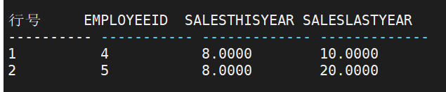

首先通过子查询―SELECT EMPLOYEEID FROM RESOURCES.EMPLOYEE WHERE TITLE = ' 销 售 代 表 '‖ 查 到 职 务 为 销 售 代 表 的 EMPLOYEEID 的集合，然后，在 SALESPERSON 表中找到与子查询结果集中的 EMPLOYEEID 所对应员工的 SALESTHISYEAR 和 SALESLASTYEAR。

上述例子也可以用连接查询的方式实现。 

```sql
SELECT T1.EMPLOYEEID, T1.SALESTHISYEAR, T1.SALESLASTYEAR FROM SALES.SALESPERSON T1 , RESOURCES.EMPLOYEE T2 WHERE T1.EMPLOYEEID = T2.EMPLOYEEID AND T2.TITLE = '销售代表';
```

- 例：询对目录名为小说的图书进行评论的人员名称和评论日期。

```sql
SELECT DISTINCT NAME, REVIEWDATE
FROM PRODUCTION.PRODUCT_REVIEW
WHERE PRODUCTID IN
( SELECT PRODUCTID
 FROM PRODUCTION.PRODUCT
 WHERE PRODUCT_SUBCATEGORYID IN
 ( SELECT PRODUCT_SUBCATEGORYID
 FROM PRODUCTION.PRODUCT_SUBCATEGORY
 WHERE PRODUCT_CATEGORYID IN
   ( SELECT PRODUCT_CATEGORYID
 FROM PRODUCTION.PRODUCT_CATEGORY
 WHERE NAME = '小说'
   )
 )
);
```

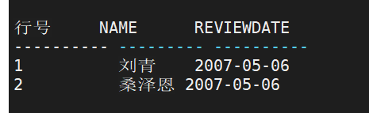

- 例：查询当前价格低于红楼梦的图书的名称、作者和当前价格。 

```sql
SELECT NAME, AUTHOR, NOWPRICE FROM PRODUCTION.PRODUCT WHERE NOWPRICE < ( SELECT NOWPRICE FROM PRODUCTION.PRODUCT WHERE NAME = '红楼梦');
```

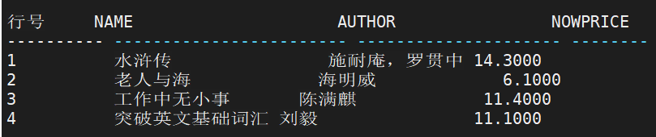

该语句也可以采用连接方式实现： 

```sql
SELECT T1.NAME, T1.AUTHOR, T1.NOWPRICE FROM PRODUCTION.PRODUCT T1 , PRODUCTION.PRODUCT T2 WHERE T2.NAME = '红楼梦' AND T1.NOWPRICE < T2.NOWPRICE;
```

- 例：查询图书的出版社和产品供应商名称相同的图书编号和名称。

```sql
SELECT T1.PRODUCTID, T1.NAME
FROM PRODUCTION.PRODUCT T1, PRODUCTION.PRODUCT_VENDOR T2
WHERE T1.PRODUCTID = T2.PRODUCTID AND T1.PUBLISHER = ANY
( SELECT NAME FROM PURCHASING.VENDOR T3
 WHERE T2.VENDORID = T3.VENDORID);
```


- 例：查询图书的出版社和产品供应商名称不相同的图书编号和名称。 

```sql
SELECT T1.PRODUCTID, T1.NAME FROM PRODUCTION.PRODUCT T1 WHERE T1.PUBLISHER <> ALL(SELECT NAME FROM PURCHASING.VENDOR );
```

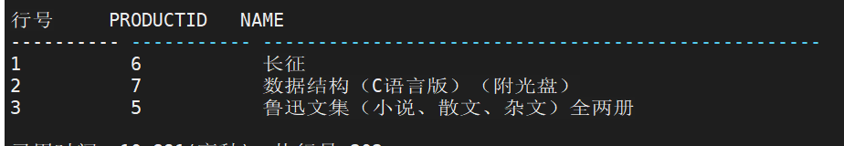


### 派生表子查询

派生表子查询是一种特殊的表子查询。所谓派生表是指 FROM 子句中的查询表达式， 可以以别名对其进行引用。在 SELCET 语句的 FROM 子句中可以包含一个或多个派生表。 派生表嵌套层次不能超过 60 层。 说明：在派生表中，如果有重复列名，DM 系统将自动修改其列名。

- 例：查询每个目录的编号、名称和对应的子目录的数量，并按数量递减排列。 

```sql
SELECT T1.PRODUCT_CATEGORYID, T1.NAME, T2.NUM FROM PRODUCTION.PRODUCT_CATEGORY T1, 
( SELECT PRODUCT_CATEGORYID, COUNT(PRODUCT_SUBCATEGORYID) 
FROM PRODUCTION.PRODUCT_SUBCATEGORY 
GROUP BY PRODUCT_CATEGORYID ) AS T2(PRODUCT_CATEGORYID,NUM) WHERE T1.PRODUCT_CATEGORYID = T2.PRODUCT_CATEGORYID ORDER BY T2.NUM
DESC;
```

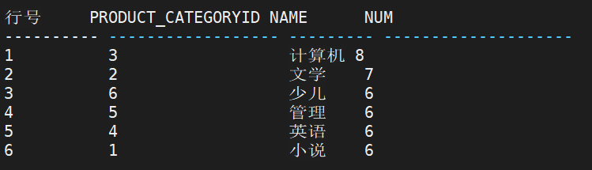


### 定量比较

量化符 ALL、SOME、ANY 可以用于将一个<数据类型>的值和一个由表子查询返回的值的集合进行比较。

1. **ALL**

   语法：`<标量表达式> <比较算符> ALL <表子查询>`

   1) <标量表达式>可以是对任意单值计算的表达式； 2) <比较算符>包括＝、＞、＜、＞＝、＜＝或＜＞

   若表子查询返回 0 行或比较算符对表子查询返回每一行都为 TRUE，则返回 TRUE。 若比较算符对于表子查询返回的至少一行是 FALSE，则 ALL 返回 FALSE

   - 例：查询没有分配部门的员工的编号、姓名和身份证号码

     ```sql
     SELECT T1.EMPLOYEEID, T2.NAME, T1.NATIONALNO FROM RESOURCES.EMPLOYEE T1 , PERSON.PERSON T2 WHERE T1.PERSONID = T2.PERSONID AND T1.EMPLOYEEID <> ALL ( SELECT EMPLOYEEID FROM RESOURCES.EMPLOYEE_DEPARTMENT);
     ```

     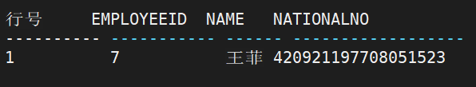

   - 例：查询比中华书局所供应的所有图书都贵的图书的编号、名称和现在销售价格

     ```sql 
     SELECT PRODUCTID, NAME, NOWPRICE
     FROM PRODUCTION.PRODUCT
     WHERE NOWPRICE > ALL
     ( SELECT T1.NOWPRICE
      FROM PRODUCTION.PRODUCT T1 , PRODUCTION.PRODUCT_VENDOR T2
      WHERE T1.PRODUCTID = T2.PRODUCTID AND T2.VENDORID =
      ( SELECT VENDORID FROM PURCHASING.VENDOR
      WHERE NAME = '中华书局'
      )
     )
     AND PRODUCTID <> ALL
     ( SELECT T1.PRODUCTID
      FROM PRODUCTION.PRODUCT_VENDOR T1 , PURCHASING.VENDOR T2
      WHERE T1.VENDORID = T2.VENDORID AND T2.NAME = '中华书局'
     );
     ```

     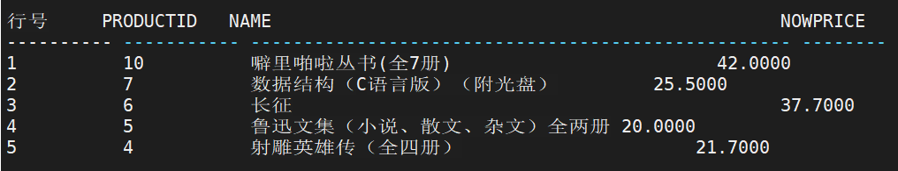

   

2. **ANY 或 SOME**

   语法：`<标量表达式> <比较算符> ANY | SOME <表子查询>`

   SOME 和 ANY 是同义词。如果它们对于表子查询返回的至少一行为 TRUE，则返回为 TRUE。若表子查询返回 0 行或比较算符对表子查询返回的每一行都为 FALSE，则返回 FALSE

   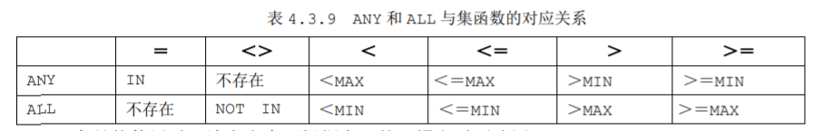


### 带 EXISTS 谓词的子查询

语法：` <EXISTS 谓词> ::= [NOT] EXISTS <表子查询>`

EXISTS 判断是对非空集合的测试并返回 TRUE 或 FALSE。若表子查询返回至少一行， 则 EXISTS 返回 TRUE，否则返回 FALSE。若表子查询返回 0 行，则 NOT EXISTS 返回 TRUE， 否则返回 FALSE

- 例：查询职务为销售代表的员工的编号和入职时间

  ```sql
  SELECT T1.EMPLOYEEID , T1.STARTDATE FROM RESOURCES.EMPLOYEE_DEPARTMENT T1 WHERE EXISTS ( SELECT * FROM RESOURCES.EMPLOYEE T2 WHERE T2.EMPLOYEEID = T1.EMPLOYEEID AND T2.TITLE = '销售代表');
  ```

  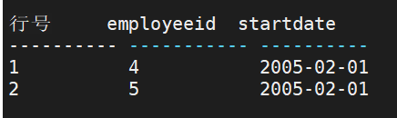

  ​	此例查询需要 EMPLOYEE_DEPARTMENT 表和 EMPLOYEE 表中的数据，其执行方式为： 

  首先在 EMPLOYEE_DEPARTMENT 表的第一行取 EMPLOYEEID 的值为 2，这样对内层子查 询则为： 

  ```sql
  (SELECT * FROM RESOURCES.EMPLOYEE T2 WHERE T2.EMPLOYEEID='2' AND T2.TITLE='销售代表'); 
  ```

  ​	在 EMPLOYEE 表中，不存在满足该条件的行，子查询返回值为假，说明不能取 EMPLOYEE_DEPARTMENT 表的第一行作为结果。系统接着取 EMPLOYEE_DEPARTMENT 表 的第二行，又得到 EMPLOYEEID 的值为 4，执行内层查询，此时子查询返回值为真，说明 可以取该行作为结果。重复以上步骤。

  ​	只有外层子查询 WHERE 子句结果为真时，方可将 EMPLOYEE_DEPARTMENT 表中的对应行送入结果表，如此继续，直到把 EMPLOYEE_DEPARTMENT 表的各行处理完。 

  ​	从以上分析得出，EXISTS 子查询的查询结果与外表相关，即连接条件中包含内表和外 表列，我们称这种类型的子查询为相关子查询；反之，子查询的连接条件不包含外表列，即 查询结果不受外表影响，我们称这种类型的子查询为非相关子查询。

### 多列表子查询

为了满足应用需求，DM 数据库扩展了子查询功能，目前支持多列 **IN / NOT IN** 子查询

**子查询可以是值列表或者查询块**

- 例：查询活动标志为 1 且信誉为 2 的供应商编号和名称。

  ```sql
  SELECT VENDORID, NAME FROM PURCHASING.VENDOR WHERE (ACTIVEFLAG, CREDIT) IN ((1, 2));
  ```

  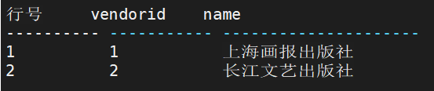

  

  **子查询为值列表时，需要注意以下三点：** 

  **1．值列表需要用括号**

  **2．值列表之间以逗号分割**

  **3．值列表的个数与查询列个数相同**


查询块

- 例：查询由采购代表下的供应商是清华大学出版社的订单的创建日期、状态和应付款总额。 

  ```sql
  SELECT ORDERDATE, STATUS, TOTAL FROM PURCHASING.PURCHASEORDER_HEADER WHERE (EMPLOYEEID, VENDORID) IN (SELECT T1.EMPLOYEEID, T2.VENDORID FROM RESOURCES.EMPLOYEE T1, PURCHASING.VENDOR T2 WHERE T1.TITLE = '采购代表' AND T2.NAME = '清华大学出版社');
  ```

  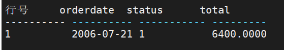

