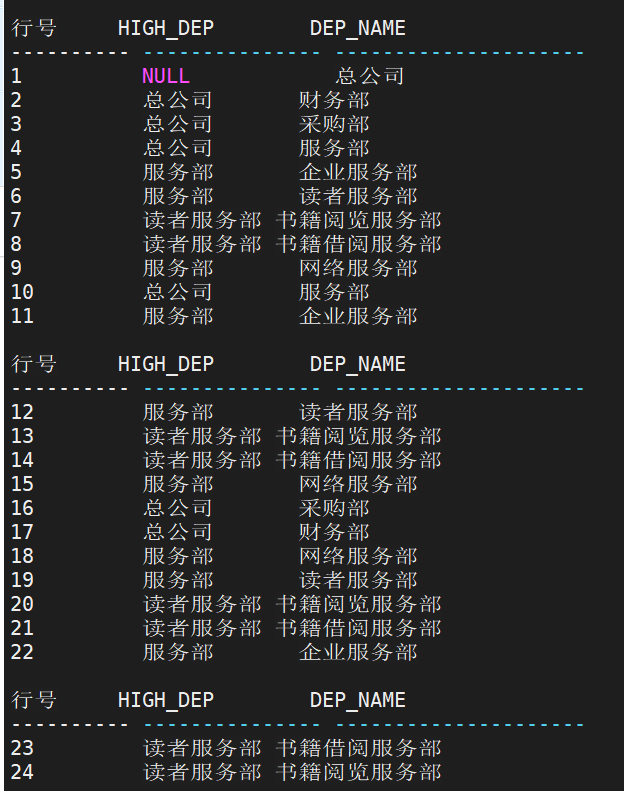
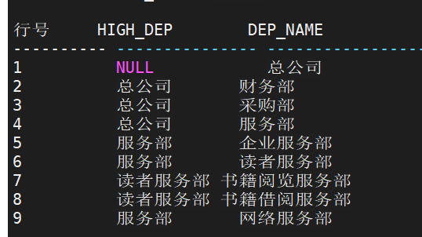
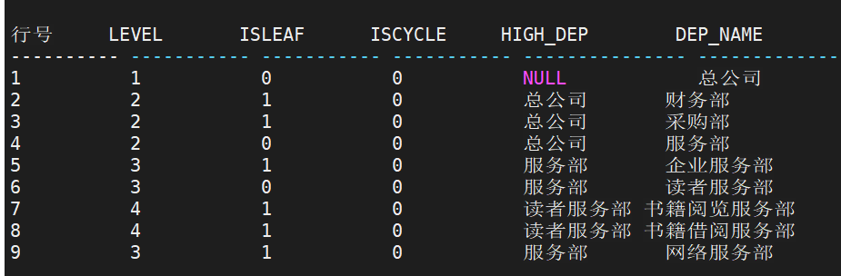
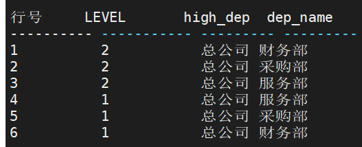
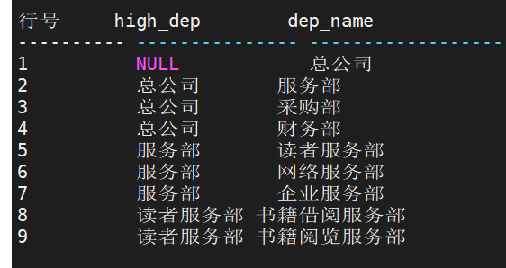
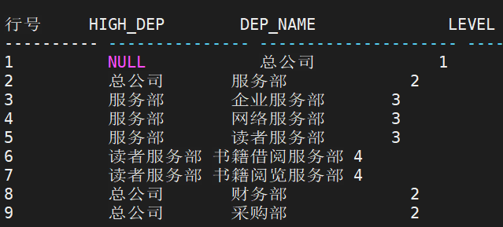
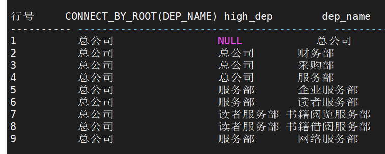
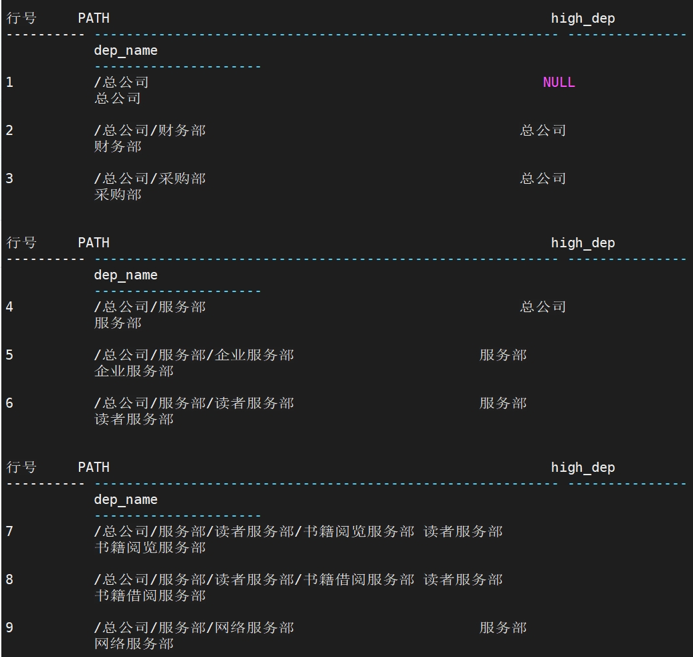

## 层次查询子句

```sql
-- 语法<层次查询子句> ::=
CONNECT BY [NOCYCLE] <连接条件> [ START WITH <起始条件> ] |
START WITH <起始条件> CONNECT BY [NOCYCLE] <连接条件>
<连接条件>::= <逻辑表达式>
<起始条件>::= <逻辑表达式>

-- 参数
1. <连接条件> 逻辑表达式，指明层次数据间的层次连接关系；
2. <起始条件> 逻辑表达式，指明选择层次数据根数据的条件；
3. NOCYCLE 关键字用于指定数据导致环的处理方式，如果在层次查询子句中指定NOCYCLE 关键字，会忽略导致环元组的儿子数据。否则，返回错误。
```


### 层次查询相关伪列

在使用层次查询子句时，可以通过相关的伪列来明确数据的层次信息。层次查询相关的伪列有： 

1．LEVEL 该伪列表示当前元组在层次数据形成的树结构中的层数。LEVEL 的初始值为 1，即层 次数据的根节点数据的 LEVEL 值为 1，之后其子孙节点的 LEVEL 依次递增。 

2．CONNECT_BY_ISLEAF 该伪列表示当前元组在层次数据形成的树结构中是否是叶节点(即该元组根据连接条 件不存在子结点)。是叶节点时为 1，否则为 0。

3．CONNECT_BY_ISCYCLE 该伪列表示当前元组是否会将层次数据形成环，该伪列只有在层次查询子句中表明 NOCYCLE 关键字时才有意义。如果元组的存在会导致层次数据形成环，该伪列值为 1，否 则为 0。


### 层次查询相关操作符

1．PRIOR PRIOR 操作符主要使用在层次查询子句中，指明 PRIOR 之后的参数为逻辑表达式中的 父节点。 PRIOR 操作符还可以出现在查询项、WHERE 条件、GROUP BY 子句、集函数参数中， 表示父层记录对应的值。 

例： 

```sql
SELECT HIGH_DEP, DEP_NAME FROM OTHER.DEPARTMENT CONNECT BY NOCYCLE PRIOR DEP_NAME = HIGH_DEP;
-- DEP_NAME 为父节点。下一条记录的 HIGH_DEP 等于前一条记录的 DEP_NAME 

或者 

SELECT HIGH_DEP, DEP_NAME FROM OTHER.DEPARTMENT CONNECT BY NOCYCLE DEP_NAME = PRIOR HIGH_DEP; 
-- HIGH_DEP 为父节点。下一条记录的 DEP_NAME 等于前一条记录的 HIGH_DEP 
```

2．CONNECT_BY_ROOT 该操作符作为查询项，查询在层次查询结果中根节点的某列的值。


### 层次查询相关函数

语法格式： `SYS_CONNECT_BY_PATH(col_name,char)` 

语句功能：层次查询。

使用说明：该函数得到从根节点到当前节点路径上所有节点名为 col_name 的某列的值，之间用 char 指明的字符分隔开。


### 层次查询层内排序

语法格式 ：`ORDER SIBLINGS BY`   

语句功能 ：层次查询

使用说明 ：ORDER SIBLINGS BY 用于指定层次查询中相同层次数据返回的顺序。在层次查询中 使用 ORDER SIBLINGS BY，必须与 CONNECT BY 一起配合使用。但是，ORDER SIBLINGS BY 不能和 GROUP BY 一起使用。


### 层次查询的限制

1. START WITH 子句中不能使用层次查询的所有伪列、层次查询函数、操作符
2. ORDER SIBLINGS BY 子句中不能使用层次查询的所有伪列、层次查询函数、操 作符、ROWNUM 以及子查询
3.  层次查询子句不能使用伪列 CONNECT_BY_ISLEAF、CONNECT_BY_ISCYCLE， SYS_CONNECT_BY_PATH 伪函数和 CONNECT_BY_ROOT 操作符
4. JOIN ON 子句中不允许出现层次查询的所有伪列、层次查询函数
5. PRIOR、CONNECT_BY_ROOT 操作符后以及 SYS_CONNECT_BY_PATH 第一个参 数不能使用层次查询的所有伪列、层次查询函数、操作符、ROWNUM 以及子查询。但 SYS_CONNECT_BY_PATH 的第一个参数允许出现 LEVEL 伪列且第二个参数必须是常量字 符串，CONNECT_BY_ROOT LEVEL 也被允许
6. 函数 SYS_CONNECT_BY_PATH 的最大返回长度为 8188，超长就会报错。函数 SYS_CONNECT_BY_PATH 在一个查询语句中最多使用个数为 64
7. INI 参数 CNNTB_MAX_LEVEL 表示支持层次查询的最大层次，默认为 20000。该 参数的有效取值为[1, 100000]


- 不带起始选择根节点起始条件的层次查询

```sql
SELECT HIGH_DEP, DEP_NAME FROM OTHER.DEPARTMENT CONNECT BY PRIOR DEP_NAME = HIGH_DEP;
```



- 带起始选择根节点起始条件的层次查询

```sql
SELECT HIGH_DEP, DEP_NAME FROM OTHER.DEPARTMENT CONNECT BY PRIOR DEP_NAME=HIGH_DEP START WITH DEP_NAME='总公司';
```



- 层次查询伪列的使用

```sql
SELECT LEVEL, CONNECT_BY_ISLEAF ISLEAF, CONNECT_BY_ISCYCLE ISCYCLE, HIGH_DEP, DEP_NAME FROM OTHER.DEPARTMENT CONNECT BY PRIOR DEP_NAME=HIGH_DEP START WITH DEP_NAME='总公司';
```



- 含有过滤条件的层次查询

```sql
SELECT LEVEL,* FROM OTHER.DEPARTMENT WHERE HIGH_DEP = '总公司' CONNECT BY PRIOR DEP_NAME=HIGH_DEP;
```



- 含有排序子句的层次查询

```sql
SELECT * FROM OTHER.DEPARTMENT CONNECT BY PRIOR DEP_NAME=HIGH_DEP START WITH DEP_NAME='总公司' ORDER BY HIGH_DEP;
```



- 含层内排序子句的层次查询

```sql
SELECT HIGH_DEP, DEP_NAME, LEVEL FROM OTHER.DEPARTMENT CONNECT BY PRIOR DEP_NAME=HIGH_DEP START WITH DEP_NAME='总公司' ORDER SIBLINGS BY DEP_NAME;
```



- CONNECT_BY_ROOT 操作符的使用

```sql
-- CONNECT_BY_ROOT 操作符之后跟某列的列名，
-- 例如： CONNECT_BY_ROOT DEP_NAME 进行如下查询： 
SELECT CONNECT_BY_ROOT DEP_NAME,* FROM OTHER.DEPARTMENT CONNECT BY PRIOR DEP_NAME=HIGH_DEP START WITH DEP_NAME='总公司';
```



- SYS_CONNECT_BY_PATH 函数的使用

```sql
-- SYS_CONNECT_BY_PATH(DEP_NAME, '/') 进行如下查询： 
SELECT SYS_CONNECT_BY_PATH(DEP_NAME, '/') PATH,* FROM OTHER.DEPARTMENT CONNECT BY PRIOR DEP_NAME=HIGH_DEP START WITH DEP_NAME='总公司' ;
```




## 并行查询

达梦支持并行查询技术。首先设置好如下三个 INI 参数，之后执行 SQL 语句，即可执行并行查询。

| 参数名              | 缺 省 值 | 说明                                                         |
| ------------------- | -------- | ------------------------------------------------------------ |
| MAX_PARALLEL_DEGREE | 1        | 用来设置最大并行任务个数。取值范围：1~128。缺省 值 1，表示无并行任务。全局有效。当 PARALLEL_POLICY 值为 1 时该参数值才有效。 |
| PARALLEL_POLICY     | 0        | 用来设置并行策略。取值范围：0、1 和 2，缺省为 0。 其中，0 表示不支持并行；1 表示自动配置并行工作线 程个数（与物理 CPU 核数相同）；2 表示手动设置并行 工作线程数。当 PARALLEL_POLICY 值为 2 时，需手 动指定当前并行任务个数。 |
| PARALLEL_THRD_NUM   | 10       | 用来设置并行工作线程个数。取值范围：1~1024。仅 当 PARALLEL_POLICY 值为 2 时才启用此参数。 |

**注：当处于 DMSQL 程序调试状态时，并行查询的相关设置均无效。**

其中，并行任务数也可以在 SQL 语句中使用“PARALLEL”关键字特别指定。如果单 条查询语句没有特别指定，则依然使用默认并行任务个数。“PARALLEL”关键字的用法为 在数据查询语句的 SELECT 关键字后增加 HINT 子句。

**语法格式：** `/*+ PARALLEL([<表名>] <并行任务个数>) */` 

**使用说明：**

对于无特殊要求的并行查询用户，可以使用默认并行任务数MAX_PARALLEL_DEGREE。 只需要在 INI 参数中设置好对应参数，然后执行 SQL 查询语句，就可以启用并行查询。

**举例说明：**

将 PARALLEL_POLICY 设置为 0，表示不支持并行查询。此时，另外两个参数不 起任何作用。 

`PARALLEL_POLICY 0` 

将 PARALLEL_POLICY 设置为 1，表示自动配置并行工作线程个数，因此，只要 设置下面 2 个参数就可以。 

```
MAX_PARALLEL_DEGREE	3 
PARALLEL_POLICY		1 
```

然后，执行 SQL 语句。 

```
SELECT * FROM SYSOBJECTS;
--- 本条语句使用默认并行任务数 3
```

当然，如果单条查询语句不想使用默认并行任务数 3，可以通过在 SQL 语句中增加 HINT，通过“PARALLEL”关键字特别指定。本条语句使用特别指定的并行任务数 4，例如： 

```
SELECT /*+ PARALLEL(4) */ * FROM SYSOBJECTS; 
```

将 PARALLEL_POLICY 设置为 2，表示手动配置并行工作线程个数，因此，指定 如下 2 个参数。 

```
PARALLEL_POLICY		2 
PARALLEL_THRD_NUM	4 
```

然后，在执行 SQL 语句时，需手动指定当前并行任务个数。若不指定，将不使用并行。 

```
SELECT /*+ PARALLEL(2) */ * FROM SYSOBJECTS; 
--- 本条语句使用并行任务数 2。
```

