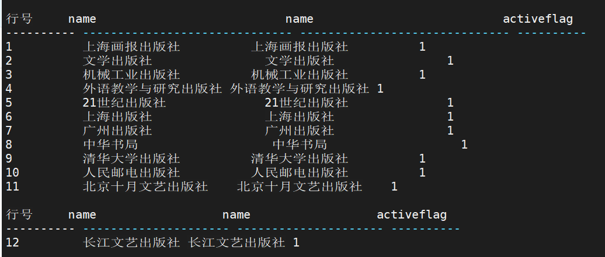
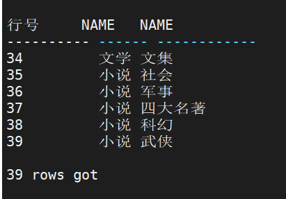
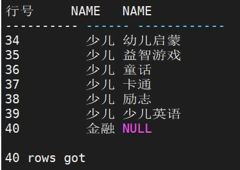
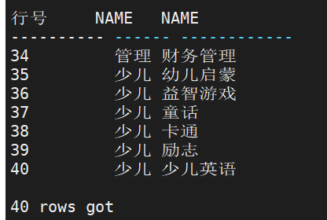
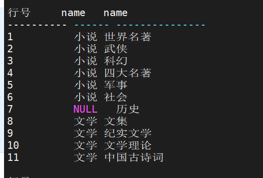

# 连接查询

### 交叉连接

1. 无过滤条件

   对连接的两张表记录做笛卡尔集，产生最终结果输出。

   - SALESPERSON 和 EMPLOYEE 通过交叉连接查询 HAIRDATE 和 SALESLASTYEAR

     ```sql
     SELECT T1.HAIRDATE, T2.SALESLASTYEAR FROM RESOURCES.EMPLOYEE T1 CROSS JOIN SALES.SALESPERSON T2;
     ```

     

2. 有过滤条件

   对连接的两张表记录做笛卡尔集，根据 WHERE 条件进行过滤，产生最终结果输出。 

   - 查询性别为男性的员工的姓名与职务

     ```sql
     SELECT T1.NAME, T2.TITLE FROM PERSON.PERSON T1, RESOURCES.EMPLOYEE T2 WHERE T1.PERSONID = T2.PERSONID AND T1.SEX = 'M';
     ```

     

### 自然连接

把两张连接表中的同名列作为连接条件，进行等值连接，我们称这样的连接为自然连接。 

自然连接具有以下特点： 

1. 连接表中存在同名列

2.  如果有多个同名列，则会产生多个等值连接条件

3. 如果连接表中的同名列类型不匹配，则报错处理

   

   例：查询销售人员的入职时间和去年销售总额。 

   ```sql
   SELECT T1.HAIRDATE, T2.SALESLASTYEAR FROM RESOURCES.EMPLOYEE T1 NATURAL JOIN SALES.SALESPERSON T2;
   ```


### JOIN … USING

这是自然连接的另一种写法，JOIN 关键字指定连接的两张表，USING 指明连接列。要求 USING 中的列存在于两张连接表中。

例：查询销售人员的入职时间和去年销售总额。 

```sql
SELECT HAIRDATE, SALESLASTYEAR FROM RESOURCES.EMPLOYEE JOIN SALES.SALESPERSON USING(EMPLOYEEID);
```


### JOIN...ON

这是一种连接查询的常用写法，说明是一个连接查询。JOIN 关键字指定连接的两张表， ON 子句指定连接条件表达式，其中不允许出现 ROWNUM。具体采用何种连接方式，由数据 库内部分析确定。

例：查询销售人员的入职时间和去年销售总额。

```sql
SELECT T1.HAIRDATE, T2.SALESLASTYEAR FROM RESOURCES.EMPLOYEE T1 JOIN SALES.SALESPERSON T2 ON T1.EMPLOYEEID=T2.EMPLOYEEID;
```


### 自连接

数据表与自身进行连接，我们称这种连接为自连接。 自连接查询至少要对一张表起别名，否则，服务器无法识别要处理的是哪张表。 

例：对 PURCHASING.VENDOR 表进行自连接查询 

```sql
SELECT T1.NAME, T2.NAME, T1.ACTIVEFLAG FROM PURCHASING.VENDOR T1, PURCHASING.VENDOR T2 WHERE T1.NAME = T2.NAME;
```




### 内连接(INNER JOIN)

根据连接条件，结果集仅包含满足全部连接条件的记录，我们称这样的连接为内连接。 

例：从 PRODUCT_CATEGORY、PRODUCT_SUBCATEGORY 中查询图书的目录名称和子目 录名称。

```sql
SELECT T1.NAME, T2.NAME
FROM PRODUCTION.PRODUCT_CATEGORY T1 INNER JOIN
PRODUCTION.PRODUCT_SUBCATEGORY T2
ON T1.PRODUCT_CATEGORYID = T2.PRODUCT_CATEGORYID;
```




### 外连接(OUTER JOIN)

外连接对结果集进行了扩展，会返回一张表的所有记录，对于另一张表无法匹配的字段 用 NULL 填充返回。DM 数据库支持三种方式的外连接：左外连接、右外连接、全外连接。

返回所有记录的表根据外连接的方式而定。 

1. 左外连接：返回左表所有记录
2. 右外连接：返回右表所有记录
3. 全外连接：返回两张表所有记录。处理过程为分别对两张表进行左外连接和右外连 接，然后合并结果集

在左外连接和右外连接中，如果需要对未能匹配的缺失数据进行填充，可以使用分区外 连接(PARTITION OUTER JOIN)，分区外连接通常用于处理稀疏数据以得到分析报表。

- 例：从 PRODUCT_CATEGORY、PRODUCT_SUBCATEGORY 中查询图书的所有目录名称和子目录名称，包括没有子目录的目录。 

```sql
SELECT T1.NAME, T2.NAME FROM PRODUCTION.PRODUCT_CATEGORY T1 LEFT OUTER JOIN PRODUCTION.PRODUCT_SUBCATEGORY T2 ON T1.PRODUCT_CATEGORYID = T2.PRODUCT_CATEGORYID;
```



- 例：从 PRODUCT_CATEGORY、PRODUCT_SUBCATEGORY 中查询图书的目录名称和所有 子目录名称，包括没有目录的子目录。 

```sql
SELECT T1.NAME, T2.NAME FROM PRODUCTION.PRODUCT_CATEGORY T1 RIGHT OUTER JOIN PRODUCTION.PRODUCT_SUBCATEGORY T2 ON T1.PRODUCT_CATEGORYID = T2.PRODUCT_CATEGORYID;
```



- 例：从 PRODUCT_CATEGORY、PRODUCT_SUBCATEGORY 中查询图书的所有目录名称和 所有子目录名称。

```sql
SELECT T1.NAME, T2.NAME
FROM PRODUCTION.PRODUCT_CATEGORY T1 FULL OUTER JOIN
PRODUCTION.PRODUCT_SUBCATEGORY T2
ON T1.PRODUCT_CATEGORYID = T2.PRODUCT_CATEGORYID;
```




