#### 1、用vagrant初始化一台linux虚拟机，添加hostonly网卡和public网卡

 完成linux系统的初始化设置，修改主机名，调整时区

```shell
#修改主机名
hostnamectl set-hostname xxx

#调整时区
timedatectl set-timezone Asia/Shanghai
```

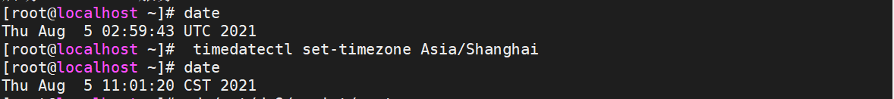

#### 2、安装DM8数据库

https://git.memadata.cn/zhujiayue/zhujiayue/-/blob/master/DM/DM.md

#### 3、初始化数据库DB1，解释各种初始化参数

| 数据库 | 端口号 |
| ------ | ------ |
| DB1    | 5236   |

```shell
cd /opt/dm8/bin
./dminit PAGE_SIZE=32 EXTENT_SIZE=32 CHARSET=1 CASE_SENSITIVE=0 LENGTH_IN_CHAR=0 BLANK_PAD_MODE=1 DB_NAME=DB1 PATH=/opt/dm8/data
```

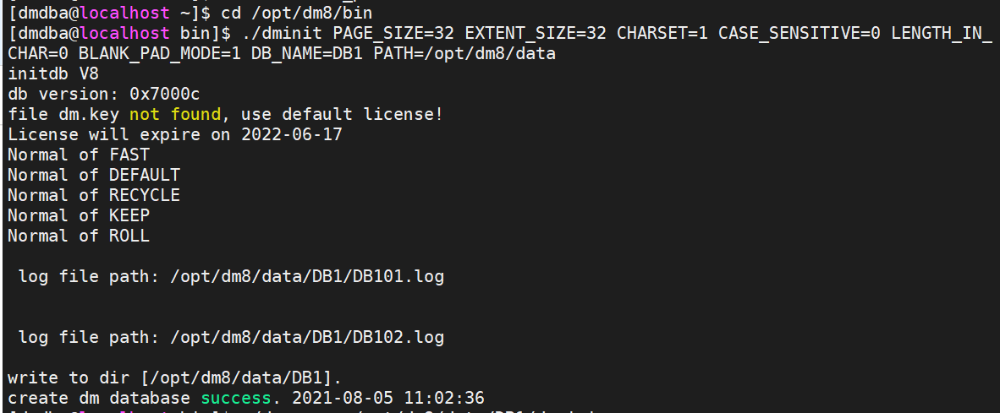

#### 4、注册数据库实例到Systemd，实现自动启停（root用户）

```shell
cd /opt/dm8/script/root

./dm_service_installer.sh -t dmserver -p DB1 -dm_ini /opt/dm8/data/DB1/dm.ini
```

#### 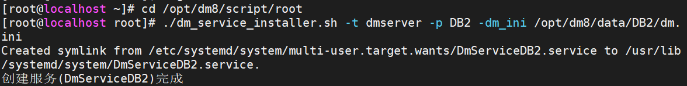 

#### 5、启动DB1 

`./dmserver /opt/dm8/data/DB1/dm.ini`

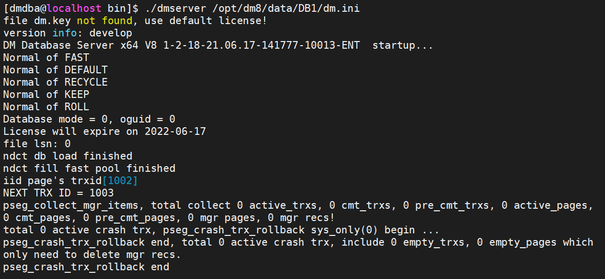

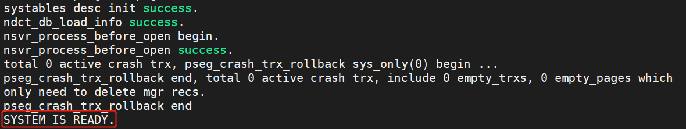

#### 6、创建测试用户，分配表空间

```sql
CREATE TABLESPACE TS_test
DATAFILE '/opt/dm8/data/DB1/user01.dbf' SIZE 128, '/opt/dm8/data/DB1/user02.dbf' SIZE 128;

CREATE USER test01
IDENTIFIED BY Mema_1234
DEFAULT TABLESPACE TS_test;

GRANT resource TO test01;
```

#### 7、为测试用户创建表tab1，添加100万条数据

```sql
connect test01/Mema_1234@localhost:5236

CREATE TABLE tab1 (
id int,
name varchar(20),
math int,
english int,
science int
);

insert into tab1 select rownum as id,
dbms_random.string('1',trunc(dbms_random.value(3,8))),
trunc(dbms_random.value(0,100)),
trunc(dbms_random.value(0,100)),
trunc(dbms_random.value(0,100))
from dual
connect by level <=1000000;

commit;
```

#### 8、windows上dm管理工具连接数据库	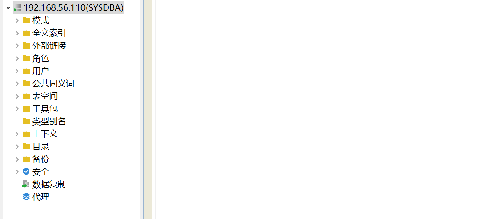

#### 9、创建各种表，普通表，堆表，列式存储表，各种分区表（四种），每个表插入10万条数据

```sql
CREATE OR REPLACE FUNCTION GET_CITY() RETURN VARCHAR 
AS
    TYPE   cityArray IS VARRAY(10) OF VARCHAR(100);
    citys  cityArray;
BEGIN
   citys:=cityArray();
   citys.extend();
   citys(1):='上海';
   citys.extend();
   citys(2):='北京';
   citys.extend();
   citys(3):='广州';
   citys.extend();
   citys(4):='重庆';
   citys.extend();
   citys(5):='深圳';
   citys.extend();
   citys(6):='青岛';
   citys.extend();
   citys(7):='成都';
   citys.extend();
   citys(8):='香港';
   citys.extend();
   citys(9):='合肥';
   citys.extend();
   citys(10):='武汉';
   RETURN citys(trunc(dbms_random.VALUE(1,11)));
END;
/

select get_city();

普通表
CREATE TABLE comm_student (
id bigint identity,
name varchar(20),
birthday date,
math int,
english int,
science int
);

insert into comm_student 
select
dbms_random.string('1',trunc(dbms_random.value(3,8))),
current_date()-365*20+dbms_random.value(-365,365),
trunc(dbms_random.value(40,100)),
trunc(dbms_random.value(40,100)),
trunc(dbms_random.value(40,100))
from dual
connect by level <=100000;

commit;

堆表
CREATE TABLE heap_student (
id bigint identity,
name varchar(20),
birthday date,
math int,
english int,
science int
)
STORAGE (BRANCH(4,2));

insert into heap_student 
select
dbms_random.string('1',trunc(dbms_random.value(3,8))),
current_date()-365*28+dbms_random.value(-366,366),
trunc(dbms_random.value(0,100)),
trunc(dbms_random.value(0,100)),
trunc(dbms_random.value(0,100))
from dual
connect by level <=100000;

commit;

列式存储表
CREATE HUGE TABLE huge_student (
id bigint,
name varchar(20),
birthday date,
math int,
english int,
science int
);

insert into huge_student 
select ROWNUM AS id,
dbms_random.string('1',trunc(dbms_random.value(3,8))),
current_date()-365*28+dbms_random.value(-366,366),
trunc(dbms_random.value(0,100)),
trunc(dbms_random.value(0,100)),
trunc(dbms_random.value(0,100))
from dual
connect by level <=100000;

commit;


各种分区表（四种）
1）范围分区
CREATE TABLE RANG_STUDENT(
id bigint,
name varchar(20),
city varchar(10),
birthday date,
tel varchar(20),
email varchar(50),
math int,
english int,
science int
)
PARTITION BY RANGE (math)(
PARTITION FALED VALUES LESS THAN ('45'),
PARTITION BAD VALUES LESS THAN ('60'),
PARTITION GOOD VALUES LESS THAN ('80'),
PARTITION EXCELLENT VALUES EQU OR LESS THAN (MAXVALUE)
);

insert into RANG_STUDENT 
select
  level,
  dbms_random.string('1',trunc(dbms_random.value(3,8))),
  get_city(),
  current_date()-365*20+dbms_random.value(-365*3,365*3),
  to_char(10000000000+floor(dbms_random.value(3111111111,3999999999))),
  dbms_random.string('L',8)||'@'||dbms_random.string('L',5)||'.com',
  trunc(dbms_random.value(40,100)),
  trunc(dbms_random.value(40,100)),
  trunc(dbms_random.value(40,100))
  from dual
connect by level <=100000;

commit;

2）列表分区
CREATE TABLE LIST_STUDENT(
id bigint,
name varchar(20),
city varchar(10),
birthday date,
tel varchar(20),
email varchar(50),
math int,
english int,
science int
)
PARTITION BY LIST(city)(                         
PARTITION p1 VALUES ('北京', '天津'),                        
PARTITION p2 VALUES ('上海', '合肥'),                        
PARTITION p3 VALUES ('武汉', '长沙'),                        
PARTITION p4 VALUES ('广州', '深圳'),
PARTITION P0 VALUES (DEFAULT)                        
);

insert into LIST_STUDENT 
select
  level,
  dbms_random.string('1',trunc(dbms_random.value(3,8))),
  get_city(),
  current_date()-365*20+dbms_random.value(-365*3,365*3),
  to_char(10000000000+floor(dbms_random.value(3111111111,3999999999))),
  dbms_random.string('L',8)||'@'||dbms_random.string('L',5)||'.com',
  trunc(dbms_random.value(40,100)),
  trunc(dbms_random.value(40,100)),
  trunc(dbms_random.value(40,100))
  from dual
connect by level <=100000;

commit;

3）哈希分区
CREATE TABLE HASH_STUDENT(
id bigint,
name varchar(20),
city varchar(10),
birthday date,
tel varchar(20),
email varchar(50),
math int,
english int,
science int
)
PARTITION BY HASH(name)(             
PARTITION p1,            
PARTITION p2,            
PARTITION p3,            
PARTITION p4            
); 

insert into HASH_STUDENT 
select
  level,
  dbms_random.string('1',trunc(dbms_random.value(3,8))),
  get_city(),
  current_date()-365*20+dbms_random.value(-365*3,365*3),
  to_char(10000000000+floor(dbms_random.value(3111111111,3999999999))),
  dbms_random.string('L',8)||'@'||dbms_random.string('L',5)||'.com',
  trunc(dbms_random.value(40,100)),
  trunc(dbms_random.value(40,100)),
  trunc(dbms_random.value(40,100))
  from dual
connect by level <=10000;

commit;

4）间隔分区
CREATE TABLE INTE_STUDENT(
id bigint,
name varchar(20),
city varchar(10),
birthday date,
tel varchar(20),
email varchar(50),
math int,
english int,
science int
)
PARTITION BY RANGE (birthday)  INTERVAL(NUMTOYMINTERVAL(1,'YEAR'))
(
PARTITION "PART_1" VALUES LESS THAN (TO_DATE('1900-01-01 00:00:0','YYYY-MM-DD HH24:MI:SS'))
);

insert into INTE_STUDENT 
select
  level,
  dbms_random.string('1',trunc(dbms_random.value(3,8))),
  get_city(),
  current_date()-365*20+dbms_random.value(-365*3,365*3),
  to_char(10000000000+floor(dbms_random.value(3111111111,3999999999))),
  dbms_random.string('L',8)||'@'||dbms_random.string('L',5)||'.com',
  trunc(dbms_random.value(40,100)),
  trunc(dbms_random.value(40,100)),
  trunc(dbms_random.value(40,100))
  from dual
connect by level <=100000;

commit;
```

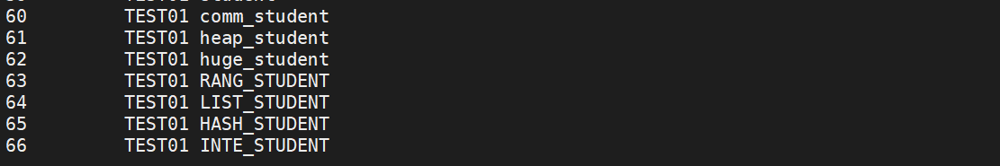

#### 10、导出数据

```shell
dexp sysdba/Mema_1234@localhost:5236 SCHEMAS=test01 DIRECTORY=/opt/dm8/data/DB1/bak FILE=TEST_2020.DMP LOG=TEST_2020.log
```

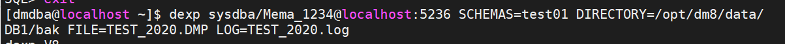

#### 11、初始化第二个实例，数据库名称DB2

| 数据库 | 端口号 |
| ------ | ------ |
| DB2    | 5002   |

```shell
cd /opt/dm8/bin
./dminit PAGE_SIZE=32 EXTENT_SIZE=32 CHARSET=1 CASE_SENSITIVE=0 LENGTH_IN_CHAR=0 BLANK_PAD_MODE=1 DB_NAME=DB2 PATH=/opt/dm8/data PORT_NUM=5002
```

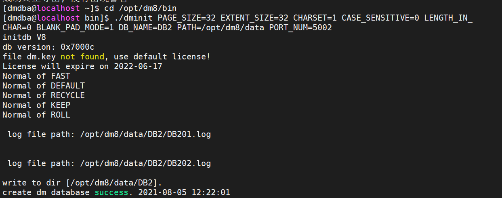

#### 12、注册数据库实例到Systemd，实现自动启停

```shell
cd /opt/dm8/script/root

./dm_service_installer.sh -t dmserver -p DB2 -dm_ini /opt/dm8/data/DB2/dm.ini
```

#### 13、启动DB2

```shell
systemctl start DmServiceDB2.service
```

#### 14、导入数据

```sql
CREATE USER test01
IDENTIFIED BY Mema_1234

dimp sysdba@localhost:5002 DIRECTORY=/opt/dm8/data/DB1/bak FILE=TEST_2020.DMP  LOG=TEST_2020.log 
```

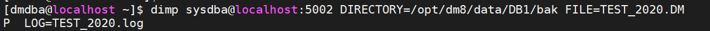

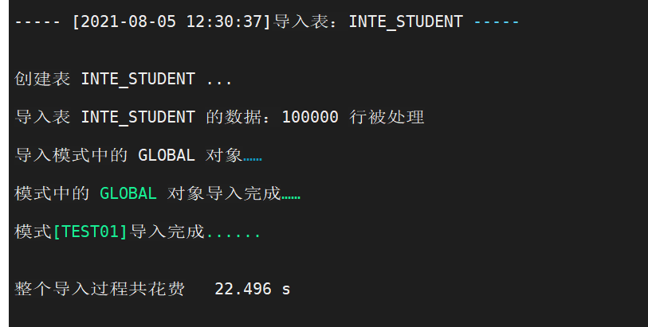

#### 15、脱机备份DB1

rman是物理备份，适用于损坏恢复，相同数据库

expdp是逻辑备份，粒度细，可以跨版本，但要创建相同的用户、表空间

```shell
#root用户
systemctl stop DmServiceDB1.service 
# 切换到dmdba用户
su - dmdba 

# 进入bin目录
cd /opt/dm8/bin 

# 进入脱机备份工具
./dmrman

RMAN> BACKUP DATABASE '/opt/dm8/data/DB1/dm.ini' FULL BACKUPSET '/opt/dm8/data/dm_back/DB1_full_bak_01';
```

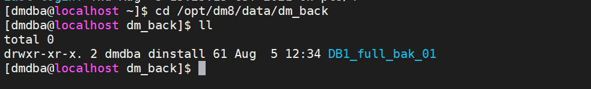

#### 16、初始化数据库DB3，用DB1脱机备份集恢复

| 目标库 | 端口号 | 备份库 | 端口号 |
| ------ | ------ | ------ | ------ |
| DB1    | 5236   | DB3    | 5003   |

```shell
cd /opt/dm8/bin

./dminit PAGE_SIZE=32 EXTENT_SIZE=32 CHARSET=1 CASE_SENSITIVE=0 LENGTH_IN_CHAR=0 BLANK_PAD_MODE=1 DB_NAME=DB3 PATH=/opt/dm8/data PORT_NUM=5003

./dmrman
RMAN> RESTORE DATABASE '/opt/dm8/data/DB3/dm.ini' FROM BACKUPSET '/opt/dm8/data/dm_back/DB1_full_bak_01';

RMAN> RECOVER DATABASE '/opt/dm8/data/DB3/dm.ini' FROM BACKUPSET '/opt/dm8/data/dm_back/DB1_full_bak_01';

RMAN> RECOVER DATABASE '/opt/dm8/data/DB3/dm.ini' UPDATE DB_MAGIC;


cd /opt/dm8/data/DB3

dmserver dm.ini -noconsole
```

#### 17、注册数据库实例到Systemd，实现自动启停

```shell
cd /opt/dm8/script/root

./dm_service_installer.sh -t dmserver -p DB3 -dm_ini /opt/dm8/data/DB3/dm.ini

systemctl start DmServiceDB3.service
```

#### 18、设置DB1数据库为归档方式

```sql
systemctl start DmServiceDB1.service
SQL> alter database mount;
SQL> alter database archivelog;
SQL> alter database add archivelog 'type=local,dest=/opt/dm8/data/DB1/arch,file_size=256,space_limit=0';
SQL> alter database open;
```

#### 19、在线备份数据库DB1

```sql
backup database;

repair archivelog database '/opt/dm8/data/DB1/dm.ini';
```

向DB1第一张测试表tab1添加1000万条数据，观察归档日志形成

```sql
insert into tab1 select rownum as id,
dbms_random.string('1',trunc(dbms_random.value(3,8))),
trunc(dbms_random.value(0,100)),
trunc(dbms_random.value(0,100)),
trunc(dbms_random.value(0,100))
from dual
connect by level <=10000000;

commit;
```

#### 20、记录时间值T1

date		Thu Aug  5 13:21:22 CST 2021

#### 21、删除DB1的第一张表tab1

```sql
drop table tab1;
```

#### 22、初始化数据库DB4，在DB4上用DB1的在线备份集和归档日志恢复数据库到T1时间

| 目标库 | 端口号 | 备份库 | 端口号 |
| ------ | ------ | ------ | ------ |
| DB1    | 5236   | DB4    | 5004   |

```shell
cd /opt/dm8/bin

./dminit PAGE_SIZE=32 EXTENT_SIZE=32 CHARSET=1 CASE_SENSITIVE=0 LENGTH_IN_CHAR=0 BLANK_PAD_MODE=1 DB_NAME=DB4 PATH=/opt/dm8/data PORT_NUM=5004

restore database '/opt/dm8/data/DB4/dm.ini' from backupset '/opt/dm8/data/DB1/bak/DB_DB1_FULL_20210805_131335_021783';

recover database '/opt/dm8/data/DB4/dm.ini' with archivedir '/opt/dm8/data/DB1/arch' until time '2021-08-05 13:21:22';

recover database '/opt/dm8/data/DB4/dm.ini' update db_magic;
```

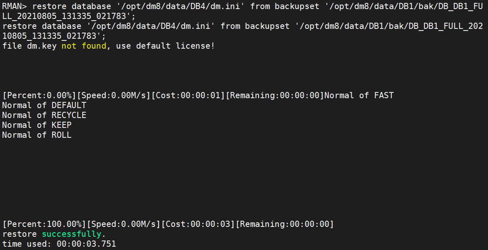

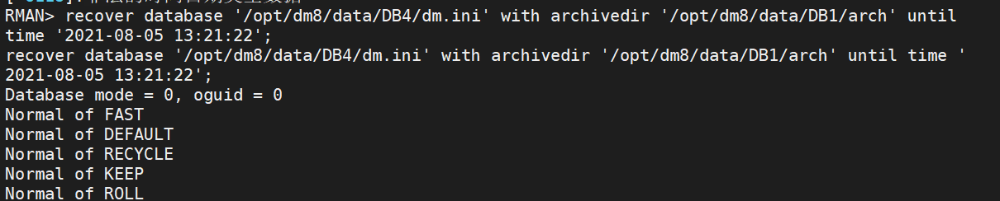

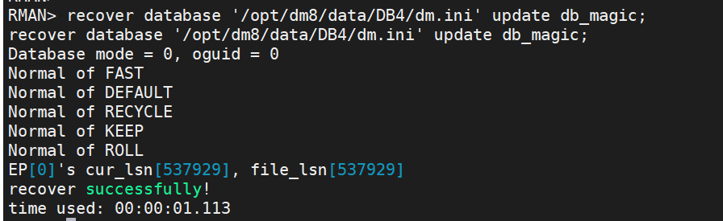

#### 23、注册数据库实例到Systemd，实现自动启停

```shell
cd /opt/dm8/script/root

./dm_service_installer.sh -t dmserver -p DB4 -dm_ini /opt/dm8/data/DB4/dm.ini

systemctl start DmServiceDB4.service
```

#### 24、启动DB4，确认tab1表已经恢复

```
disql test01/Mema_1234@localhost:5004

select count(*) from tab1;
```

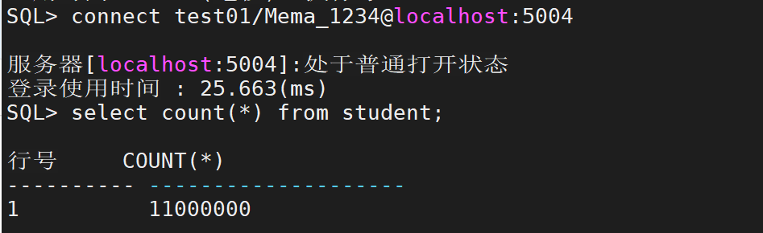

#### 25、将DB4的tab1表导出，然后导入回DB1

```shell
dexp sysdba/Mema_1234@localhost:5004 SCHEMAS=test01 DIRECTORY=/opt/dm8/data/DB4/bak FILE=TEST_2020_1.DMP LOG=TEST_2020_1.log

dimp sysdba/Mema_1234@localhost:5236 DIRECTORY=/opt/dm8/data/DB4/bak FILE=TEST_2020_1.DMP  LOG=TEST_2020_1.log 
```

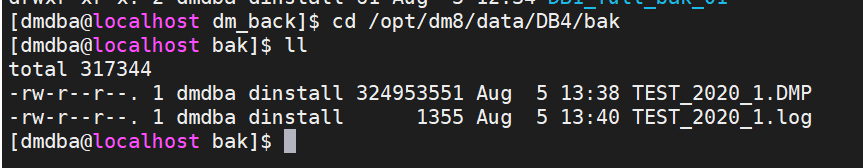

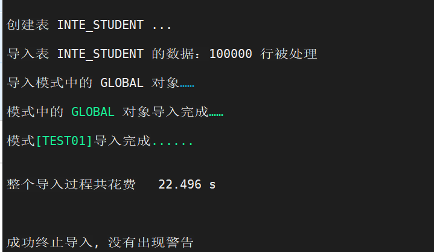

#### 26、设置DB4为归档方式

```sql
SQL> alter database mount;
SQL> alter database archivelog;
SQL> alter database add archivelog 'type=local,dest=/opt/dm8/data/DB4/arch,file_size=256,space_limit=0';
SQL> alter database open;
```

#### 27、通过作业系统定期备份DB4，每5分钟一次在线全备，每10分钟一次归档备份

（客户端方式）


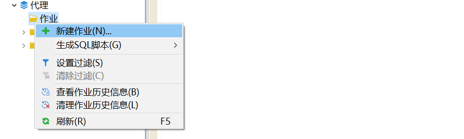


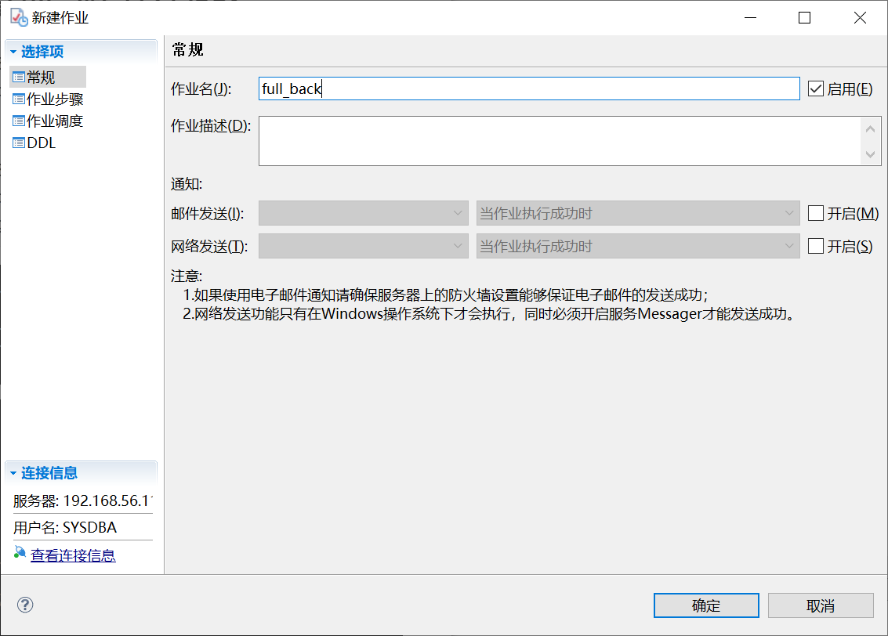

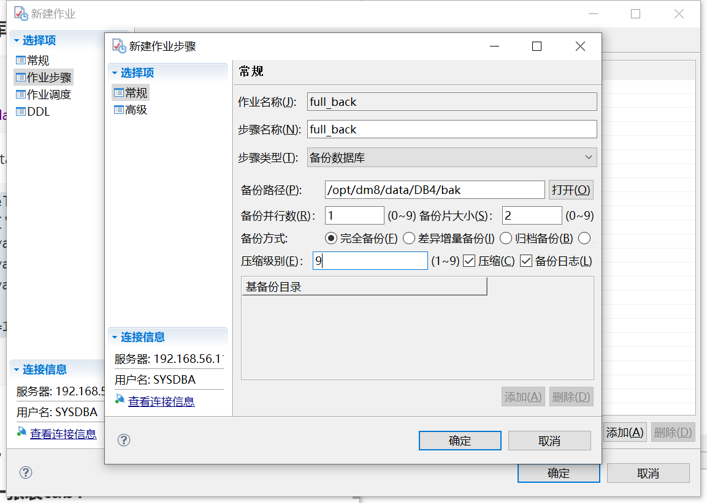


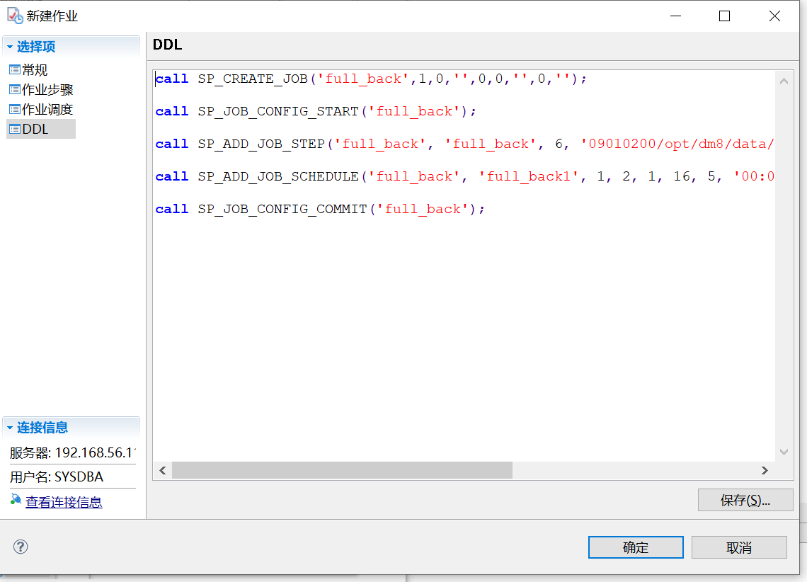

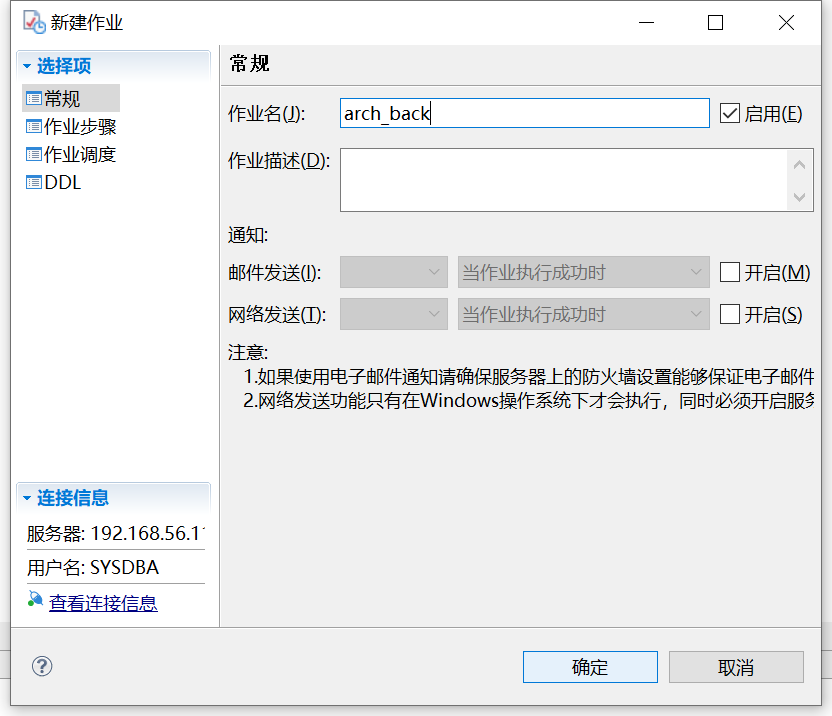

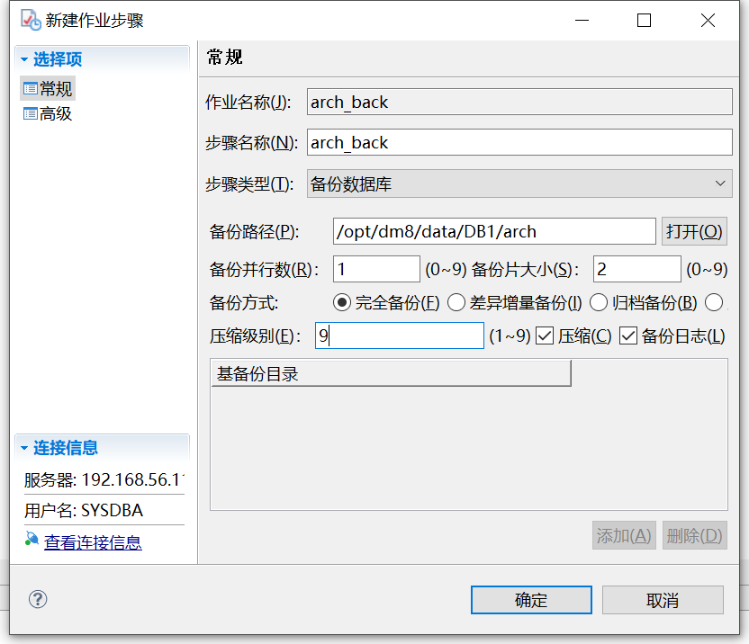

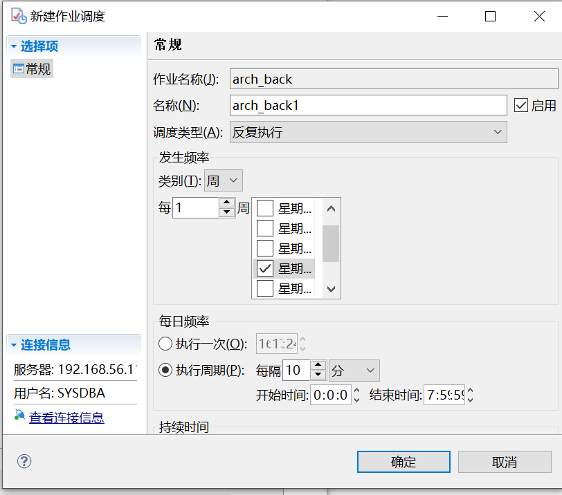

#### 28、确认定期备份执行成功。

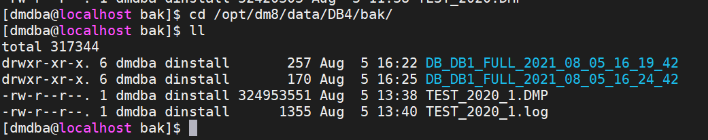

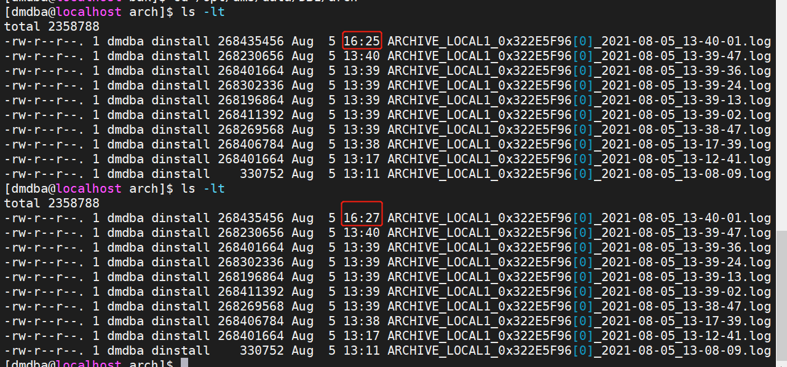

