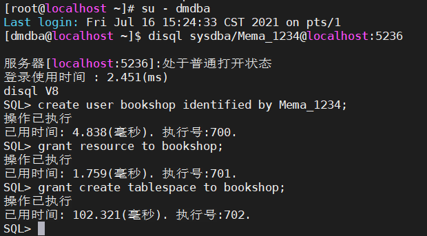
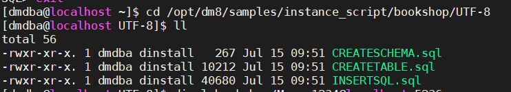
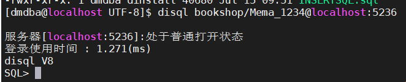

搭建环境导入BOOKSHOP数据

1.创建用户

sysdba用户进入数据库

创建用户

```sql
SQL> create user bookshop identified by Mema_1234;
SQL>grant resource to bookshop;
SQL>grant create tablespace to bookshop;
```



2.运行脚本数据

```shell
#退出SQL
#进入脚本位置
cd /opt/dm8/samples
cd instance_script
cd bookshop
cd UTF-8

# cd /opt/dm8/samples/instance_script/bookshop/UTF-8
```

| 文件名           | 作用             |
| ---------------- | ---------------- |
| CREATESCHEMA.sql | 创建表空间和模式 |
| CREATETABLE.sql  | 创建表           |
| INSERTSQL.sql    | 向表内插入数据   |



```shell
#在 /opt/dm8/samples/instance_script/bookshop/UTF-8 进入
disql bookshop/Mema_1234@localhost:5236
```



```sql
-- 创建表空间和模式
SQL>start CREATESCHEMA.sql
-- 创建表
SQL>start CREATETABLE.sql
-- 插入数据
SQL>start INSERTSQL.sql
```

检验安装是否成功

打开客服端进行查看
