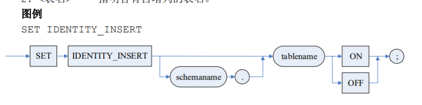
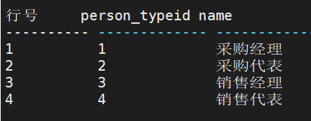
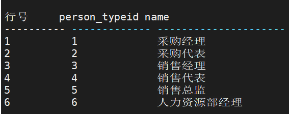
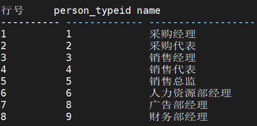
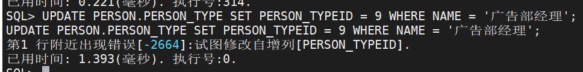
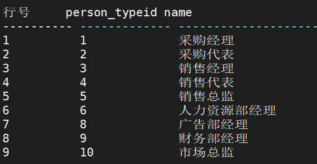

## 数据的插入、删除和修改

### 1、数据插入

数据插入语句用于向已定义好的表中插入单个或成批的数据。

INSERT 语句有两种形式。一种形式是值插入，即构造一行或者多行，并将它们插入到表中；另一种形式为查询插入，它通过<查询表达式>返回一个查询结果集以构造要插入表的一行或多行。

**使用说明：**

1. <基表名>或<视图名>后所跟的<列名>必须是该表中的列，且同一列名不允许出现两次，但排列顺序可以与定义时的顺序不一致
2. <ins_value>中插入值的个数、类型和顺序要与<列名>一一对应
3. 插入在指定值的时候，可以同时指定多行值，这种叫做多行插入或者批量插入。多行插入不支持列存储表
4. 如果某一<列名>未在 INTO 子句后面出现，则新插入的行在这些列上将取空值或缺省值，如该列在基表定义时说明为 NOT NULL 时将会出错
5. 如果<基表名>或<视图名>后没指定任何<列名>，则隐含指定该表或视图的所有列，这时新插入的行必须在每个列上均有<插入值>
6. 当使用<子查询表达式>作为 INSERT 的目标时，实际上是对查询表达式的基表进行操作，查询表达式的查询项必须都来源于同一个基表且不能是计算列，查询项所属的基表 即是查询表达式的基表，如果查询表达式是带有连接的查询，那么对于连接中视图基表以外的表，连接列上必须是主键或者带有 UNIQUE 约束。不支持 PIVOT/UNPIVOT，不支持 UNION/UNION ALL 查询
7. 如果两表之间存在引用和被引用关系时，应先插入被引用表的数据，再插入引用表的数据
8. <查询表达式>是指用查询语句得到的一个结果集插入到插入语句中<表名>指定的 表中，因此该格式的使用可供一次插入多个行，但插入时要求结果集的列与目标表要插入的 列是一一对应的，不然会报错
9. 多行插入时，对于存在行触发器的表，每一行都会触发相关的触发器；同样如果目标表具有约束，那么每一行都会进行相应的约束检查，只要有一行不满足约束，所有的值都 不能插入成功
10. 在嵌入方式下工作时，插入的值可以为主变量
11. 如果插入对象是视图，同时在这个视图上建立了 INSTEAD OF 触发器，则会将插入操作转换为触发器所定义的操作；如果没有触发器，则需要判断这个视图是否可更新，如果不可更新则报错，否则是可以插入成功的
12.  RETURN INTO 返回列支持返回 ROWID
13. RETURN INTO 语句中返回结果对象支持变量和数组。如果返回列为记录数组，则返回结果数只能为 1，且记录数组属性类型与个数须与返回列一致；如果为变量，则变量类 型与个数与返回列一致；如果返回普通数组，则数组个数和数组元素类型与返回列一致；返回结果不支持变量、普通数组和记录数组混和使用
14. 增删改语句当前修改表称为变异表（MUTATE TABLE），其调用函数中，不能对此变异表进行插入操作
15. BULK COLLECT 的作用是将检索结果批量地、一次性地赋给集合变量。与每次获取一条数据，并每次都要将结果赋值给变量相比，可以很大程度上的节省开销。使用 BULK COLLECT 时，INTO 后的变量必须是集合类型的。

**举例说明：**

- 在 VENDOR 表中插入一条供应商信息：账户号为 00，名称为华中科技大学出版社， 活动标志为 1，URL 为空，信誉为 2。

```sql
INSERT INTO PURCHASING.VENDOR(ACCOUNTNO, NAME, ACTIVEFLAG, WEBURL, CREDIT) VALUES ('00', '华中科技大学出版社', 1, '', 2);

-- 如果需要同时多行插入，则可以用如下的 SQL 语句实现：
INSERT INTO PURCHASING.VENDOR(ACCOUNTNO, NAME, ACTIVEFLAG, WEBURL, CREDIT) VALUES ('00', '华中科技大学出版社', 1, '', 2), ('00', '清华大学出版社', 1, '', 3);
```

- 将书名为长征的图书的出版社插入到 VENDOR 表中。

```sql
INSERT INTO PURCHASING.VENDOR(ACCOUNTNO, NAME, ACTIVEFLAG, WEBURL, CREDIT)
VALUES('00',
(SELECT PUBLISHER FROM PRODUCTION.PRODUCT WHERE NAME ='长征'),1, '', 1);
```

- 构造一个新的基表，表名为 PRODUCT_SELL，用来显示出售的商品名称和购买用户 名称，并将查询的数据插入此表中。

```sql
CREATE TABLE PRODUCTION.PRODUCT_SELL
( PRODUCTNAME VARCHAR(50) NOT NULL,
 CUSTOMERNAME VARCHAR(50) NOT NULL);
INSERT INTO PRODUCTION.PRODUCT_SELL
SELECT DISTINCT T1.NAME , T5.NAME
FROM PRODUCTION.PRODUCT T1, SALES.SALESORDER_DETAIL T2,
 SALES.SALESORDER_HEADER T3, SALES.CUSTOMER T4,
 PERSON.PERSON T5
WHERE T1.PRODUCTID = T2.PRODUCTID AND T2.SALESORDERID = T3.SALESORDERID
 AND T3.CUSTOMERID = T4.CUSTOMERID AND T4.PERSONID = T5.PERSONID;
```


### 2、数据修改

数据修改语句用于修改表中已存在的数据。

**使用说明：** 

1. SET 后的<列名>不能重复出现； 
2. WHERE 子句也可以包含子查询。如果省略了 WHERE 子句，则表示要修改所有的元组； 
3. 如果<列名>为被引用列，只有被引用列中未被引用列引用的数据才能被修改；如果 <列名>为引用列，引用列的数据被修改后也必须满足引用完整性。在 DM 系统中，以上引用完整性由系统自动检查； 
4. 执行基表的 UPDATE 语句触发任何与之相联系的 UPDATE 触发器； 
5. 对于未指定 ENABLE ROW MOVEMENT 属性水平分区表的更新，如果更新后的值将导致记录所属分区发生修改，则不能进行更新；更新包含大字段的水平分区表时不允许分区更改。 
6. 如果视图的定义查询中含有以下结构则不能更新视图： 
   1. 联结运算
   2. 集合运算符
   3. GROUP BY 子句
   4. 集函数
   5. INTO 子句
   6. 分析函数
   7. HAVING 字句
   8. 层次查询子句 
7. 如果更新对象是视图，同时在这个视图上建立了 INSTEAD OF 触发器，则会将更新操作转换为触发器所定义的操作；如果没有触发器，则需要判断这个视图是否可更新，如果不可更新则报错，否则可以继续更新，如果上面的条件都满足，则可以更新成功
8. RETURN INTO 不支持返回 ROWID 列
9. RETURN INTO 语句中返回列如果是更新列，则返回值为列的新值。返回结果对象 支持变量和数组。如果返回列为记录数组，则返回结果数只能为 1.且记录数组属性类型和个数须与返回列一致；如果为变量，则变量类型与个数与返回列一致；如果返回普通数组， 则数组个数与数组元素类型与返回列一致；返回结果不支持变量、普通数组和记录数组混和使用
10. UPDATE 语句支持一次进行多列修改，多列修改存在以下限制： 
    1.  集合操作情况（UNION 等）：只有当查询语句为非相关子查询才支持集合操作
    2. 多列修改不支持 EXPLAIN 操作
    3. 子查询的结果不能多于 1 行数据
11. 如果更新为子查询，则存在以下限制： 
    1. 更新子查询对应的最终更新对象目前仅仅必须为基表
    2. 更新的子查询的查询结果必须保证所更新基表的唯一性特性，类似于更新视图 是否可更新概念
    3.  更新子查询不支持多列更新
    4. 集合操作、DISTINCT 操作、集函数操作、带有 GROUP BY、CONNECT BY 等语句都不满足视图的更新性要求，报错
    5. 分区表暂不支持 
12. 增删改语句当前修改表称为变异表（MUTATE TABLE），其调用函数中，不能对此 变异表进行删除操作
13. 多表联合更新说明： 
    1. 更新列表中有多个表时，不支持使用多列修改子句
    2. 更新列表中有多个表时，不允许指定 FROM 项
    3. 若有多个 SET 项，则各个 SET 项的左表达式必须为同一个表对象（同一个表 的不同别名认为是不同对象）的列
    4. 要求用户对于更新列表的所有对象具有查询权限，对最终修改的目标对象具有 修改权限
    5.  多表联合更新最多支持 100 个表。

**举例说明：**

- 将出版社为中华书局的图书的现在销售价格增加 1 元。

```sql 
UPDATE PRODUCTION.PRODUCT SET NOWPRICE = NOWPRICE + 1.0000 WHERE PUBLISHER = '中华书局';
```

- 由于标量子查询允许用在标量值合法的地方，因此在数据修改语句的<值表达式>位 置也允许出现标量子查询。下例将折扣高于 7.0 且出版社不是中华书局的图书的折扣设成 出版社为中华书局的图书的平均折扣。

```sql
UPDATE PRODUCTION.PRODUCT SET DISCOUNT =
( SELECT AVG(DISCOUNT) FROM PRODUCTION.PRODUCT
WHERE PUBLISHER = '中华书局')
WHERE DISCOUNT > 7.0 AND PUBLISHER != '中华书局';
```

- 带 RETURN INTO 的更新语句。

```sql
CREATE TABLE T1(C1 INT,C2 INT,C3 INT);
DECLARE
 TYPE RRR IS RECORD(X INT, Y INT);
 TYPE CCC IS ARRAY RRR[];
 A INT;
 C CCC;
BEGIN
 C = NEW RRR[2];
 UPDATE T1 SET C2=4 WHERE C3 = 2 RETURN C1 INTO A;
 PRINT A;
 UPDATE T1 SET C2=5 WHERE C3 = 2 RETURN C1,C2 INTO C;
 SELECT * FROM ARRAY C;
END;
```

- 使用一次进行多列修改的更新语句。

```sql
UPDATE PURCHASING.PURCHASEORDER_HEADER SET(TAX,FREIGHT)=
(SELECT ORIGINALPRICE, NOWPRICE FROM PRODUCTION.PRODUCT WHERE NAME='长征');
```


### 3、数据删除

数据删除语句用于删除表中已存在的数据。

**使用说明 ：**

1. 如果不带 WHERE 子句，表示删除表中全部元组，但表的定义仍在字典中。因此， DELETE 语句删除的是表中的数据，并未删除表结构；
2. 由于 DELETE 语句一次只能对一个表进行删除，因此当两个表存在引用与被引用 关系时，要先删除引用表里的记录，只有引用表中无记录时，才能删被引用表中的记录，否则系统会报错；
3. 执行与表相关的 DELETE 语句将触发所有定义在表上的 DELETE 触发器；
4. 如果视图的定义查询中包含以下结构之一，就不能从视图中删除记录： 
   1. 联结运算
   2. 集合运算符
   3.  GROUP BY 子句
   4. 集函数
   5. INTO 语句
   6. 分析函数
   7. HAVING 语句
   8. CONNECT BY 语句。 
5.  当<子查询表达式>作为 DELETE 的目标时，实际上是对查询表达式的基表进行操作，查询表达式的查询项必须都来源于同一个基表且不能是计算列，查询项所属的基表即是 查询表达式的基表，如果查询表达式是带有连接的查询，那么对于连接中视图基表以外的表， 连接列上必须是主键或者带有 UNIQUE 约束。不支持 PIVOT/UNPIVOT，不支持 UNION/UNION ALL 查询；
6. RETURN INTO 不支持返回 ROWID 列；
7. RETURN INTO 返回结果对象支持变量和数组。如果返回列为记录数组，则返回结果数只能为 1. 且记录数组属性类型和个数须与返回列一致；如果为变量，则变量类型与个数与返回列一致；如果返回普通数组，则数组个数与数组元素类型与返回列一致；返回结果不支持变量、普通数组和记录数组混和使用；
8. 增删改语句当前修改表称为变异表（MUTATE TABLE），其调用函数中，不能对此变异表进行删除操作。

**举例说明：**

- 将没有分配部门的员工的住址信息删除

```sql
DELETE FROM RESOURCES.EMPLOYEE_ADDRESS
WHERE EMPLOYEEID IN
( SELECT EMPLOYEEID
FROM RESOURCES.EMPLOYEE
WHERE EMPLOYEEID NOT IN
( SELECT EMPLOYEEID FROM RESOURCES.EMPLOYEE_DEPARTMENT));
```

### 4、MERGE INTO

使用 MERGE INTO 语法可合并 UPDATE 和 INSERT 语句。通过 MERGE 语句，根据一 张表（或视图）的连接条件对另外一张表（或视图）进行查询，连接条件匹配上的进行 UPDATE （可能含有 DELETE），无法匹配的执行 INSERT。其中，数据表包括：普通表、分区表、 加密表、压缩表和堆表。

**举例说明：**

- 下面的例子把 T1 表中 C1 值为 2 的记录行中的 C2 列，更新为表 T2 中 C3 值为 2 的记录中 C4 列的值，同时把 T2 中 C3 列为 4 的记录行插入到 T1 中

```sql
DROP TABLE T1;
DROP TABLE T2;
CREATE TABLE T1 (C1 INT, C2 VARCHAR(20));
CREATE TABLE T2 (C3 INT, C4 VARCHAR(20));
INSERT INTO T1 VALUES(1,'T1_1');
INSERT INTO T1 VALUES(2,'T1_2');
INSERT INTO T1 VALUES(3,'T1_3');
INSERT INTO T2 VALUES(2,'T2_2');
INSERT INTO T2 VALUES(4,'T2_4');
COMMIT;
MERGE INTO T1 USING T2 ON (T1.C1=T2.C3)
WHEN MATCHED THEN UPDATE SET T1.C2=T2.C4
WHEN NOT MATCHED THEN INSERT (C1,C2) VALUES(T2.C3, T2.C4);下面的例子把 T1 表中 C1 值为 2，4 的记录行中的 C2 列更新为表 T2 中 C3 值为 2，4
的记录中 C4 列的值，同时把 T2 中 C3 列为 5 的记录行插入到了 T1 中。由于 UPDATE 带了
DELETE 子句，且 T1 中 C1 列值为 2 和 4 的记录行被更新过，而 C1 为 4 的行符合删除条
件，最终该行会被删除掉。

```

- 下面的例子把 T1 表中 C1 值为 2，4 的记录行中的 C2 列更新为表 T2 中 C3 值为 2，4 的记录中 C4 列的值，同时把 T2 中 C3 列为 5 的记录行插入到了 T1 中。由于UPDATE 带了 DELETE 子句，且 T1 中 C1 列值为 2 和 4 的记录行被更新过，而 C1 为 4 的行符合删除条件，最终该行会被删除掉。

```sql
DROP TABLE T1;
DROP TABLE T2;
CREATE TABLE T1 (C1 INT, C2 VARCHAR(20));
CREATE TABLE T2 (C3 INT, C4 VARCHAR(20));
INSERT INTO T1 VALUES(1,'T1_1');
INSERT INTO T1 VALUES(2,'T1_2');
INSERT INTO T1 VALUES(3,'T1_3');
INSERT INTO T1 VALUES(4,'T1_4');
INSERT INTO T2 VALUES(2,'T2_2');
INSERT INTO T2 VALUES(4,'T2_4');
INSERT INTO T2 VALUES(5,'T2_5');
COMMIT;
MERGE INTO T1 USING T2 ON (T1.C1=T2.C3)
WHEN MATCHED THEN UPDATE SET T1.C2=T2.C4 WHERE T1.C1 >= 2 DELETE WHERE T1.C1=4
WHEN NOT MATCHED THEN INSERT (C1,C2) VALUES(T2.C3, T2.C4);
```


### 5、伪列的使用

#### ROWID

DM 中行标识符 ROWID 用来标识数据库基表中每一条记录的唯一键值，标识了数据记录 的确切的存储位置。如果用户在选择数据的同时从基表中选取 ROWID，在后续的更新语句中，就可以使用 ROWID 来提高性能。如果在查询时加上 FOR UPDATE 语句，该数据行就会被锁住，以防其他用户修改数据，保证查询和更新之间的一致性。

例子：

```sql
SELECT ROWID, VENDORID, NAME, CREDIT
FROM PURCHASING.VENDOR
WHERE NAME = '广州出版社';
--假设查询的 ROWID=CF06000000
UPDATE PURCHASING.VENDOR SET CREDIT = 2
WHERE ROWID = 0XCF06000000;
```

#### UID 和 USER

伪列 USER 和 UID 分别用来表示当前用户的用户名和用户标识。

#### TRXID

伪列 TRXID 用来表示当前事务的事务标识。

#### SESSID

伪列 SESSID 用来表示当前会话的 ID 标识。

#### PHYROWID

伪列 PHYROWID 用来表示当前记录的物理存储信息。

PHYROWID 值由聚集 B 树或二级 B 树中物理记录的文件号、页号、页内槽号组成，能 体现聚集 B 树或二级 B 树的存储信息，聚集 B 树记录的最高位为 1。 

当查询语句中实际使用 CSCN、CSEK、BLKUP 操作符时，PHYROWID 内容是聚集 B 树 中记录的物理存储地址；当查询语句中实际仅使用 SSEK、SSCN 操作符时，PHYROWID 内容是二级 B 树中记录的物理存储地址。


### 6、DM自增列的使用

#### DM 自增列定义

##### 1．自增列功能定义

在表中创建一个自增列。该属性与 CREATE TABLE 语句一起使用，**一个表只能有一个自增列**。

```sql
-- 语法
IDENTITY [ (种子, 增量) ]

-- 参数
1．种子 装载到表中的第一个行所使用的值；
2．增量 增量值，该值被添加到前一个已装载的行的标识值上。增量值可以为 正数 或 负数，但不能为 0。
```

**使用说明 ：**

1．IDENTITY 适用于 INT(-2147483648～+2147483647)、BIGINT(-2 63～ +263-2)类型的列。每个表只能创建一个自增列； 

2．不能对自增列使用 DEFAULT 约束； 

3．必须同时指定种子和增量值，或者二者都不指定。如果二者都未指定，则取默认值 (1,1)。若种子或增量为小数类型，报错； 

4．最大值和最小值为该列的数据类型的边界； 

5．建表种子和增量大于最大值或者种子和增量小于最小值时报错；

 6．自增列一旦生成，无法更新，不允许用 UPDATE 语句进行修改； 

7. 临时表、列存储表、水平分区表不支持使用自增列。


##### 2．自增列查询函数

1) IDENT_SEED(函数) 

   ```sql
   -- 语法 
   IDENT_SEED ('tablename') 
   -- 功能
   返回种子值，该值是在带有自增列的表中创建自增列时指定的。 
   -- 参数
   tablename 是带有引号的字符串常量，也可以是变量、函数或列名。tablename 的数据类型为 CHAR 或 VARCHAR。其含义是表名，可带模式名前缀。 
   -- 返回类型
   返回数据类型为 INT/NULL 
   ```

2) IDENT_INCR(函数) 

   ```sql
   -- 语法 
   IDENT_INCR ('tablename') 
   -- 功能
   返回增量值，该值是在带有自增列的表中创建自增列时指定的。 
   -- 参数
   tablename 是带有引号的字符串常量，也可以是变量、函数或列名。tablename 的数据类型为 CHAR 或 VARCHAR。其含义是表名，可带模式名前缀。 
   -- 返回类型
   返回数据类型为 INT/NULL 
   ```

   例：用自增列查询函数获得表 PERSON_TYPE 的自增列的种子和增量信息。 

   ```sql
   SELECT IDENT_SEED('PERSON.PERSON_TYPE'); 
   # 查询结果为：1
   
   SELECT IDENT_INCR('PERSON.PERSON_TYPE'); 
   # 查询结果为：1
   ```

   

#### SET IDENTITY_INSERT 属性

设置是否允许将显式值插入表的自增列中。

```sql
-- 语法
SET IDENTITY_INSERT [<模式名>.]<表名> ON | OFF;

-- 参数
1．<模式名> 指明表所属的模式，缺省为当前模式；
2．<表名> 指明含有自增列的表名。
```



**使用说明 ：**

1．IDENTITY_INSERT 属性的默认值为 OFF。SET IDENTITY_INSERT 的设置是在 执行或运行时进行的。当一个连接结束，IDENTITY_INSERT 属性将被自动还原为 OFF； 

2．DM 要求一个会话连接中只有一个表的 IDENTITY_INSERT 属性可以设置为 ON， 当设置一个新的表 IDENTITY_INSERT 属性设置为 ON 时，之前已经设置为 ON 的表会自 动还原为 OFF。当一个表的 IDENTITY_INSERT 属性被设置为 ON 时，该表中的自动增量 列的值由用户指定。如果插入值大于表的当前标识值(自增列当前值)，则 DM 自动将新插入 值作为当前标识值使用，即改变该表的自增列当前值；否则，将不影响该自增列当前值； 

3．当设置一个表的 IDENTITY_INSERT 属性为 OFF 时，新插入行中自增列的当前值由系统自动生成，用户将无法指定； 

4．自增列一经插入，无法修改； 

5．手动插入自增列，除了将 IDENTITY_INSERT 设置为 ON，还要求在插入列表中明 确指定待插入的自增列列名。插入方式与非 IDENTITY 表是完全一样的。如果插入时，既 不指定自增列名也不给自增列赋值，则新插入行中自增列的当前值由系统自动生成。

**举例说明：**

- PERSON_TYPE表中的PERSON_TYPEID列是自增列。在该表中插入数据，自增列的值由系统自动生成。



```sql
INSERT INTO PERSON.PERSON_TYPE(NAME) VALUES('销售总监');
INSERT INTO PERSON.PERSON_TYPE(NAME) VALUES('人力资源部经理');
```



- 当插入数据并且要指定自增列的值时，必须要通过语句将 IDENTITY_INSERT 设 置为 ON 时，插入语句中必须指定 PERSON_TYPEID 中要插入的列。

```sql
SET IDENTITY_INSERT PERSON.PERSON_TYPE ON;
INSERT INTO PERSON.PERSON_TYPE(PERSON_TYPEID, NAME) VALUES( 8, '广告部经理');
INSERT INTO PERSON.PERSON_TYPE(PERSON_TYPEID, NAME) VALUES( 9, '财务部经理');
```



- 不允许用户修改自增列的值。 

  ```sql
  UPDATE PERSON.PERSON_TYPE SET PERSON_TYPEID = 9 WHERE NAME = '广告部经理'; 
  ```

  修改失败！对于自增列，不允许 UPDATE 操作。 

  

-  还原 IDENTITY_INSERT 属性。 

  ```sql
  SET IDENTITY_INSERT PERSON.PERSON_TYPE OFF;
  ```

-  插入后再次查询。注意观察自增列当前值的变化。 

  ```sql
  INSERT INTO PERSON.PERSON_TYPE(NAME) VALUES('市场总监');
  ```

  

