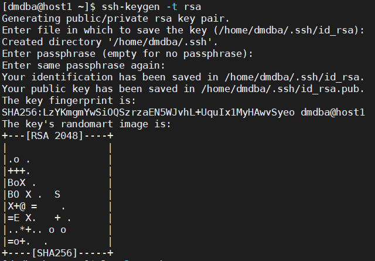
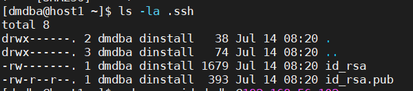
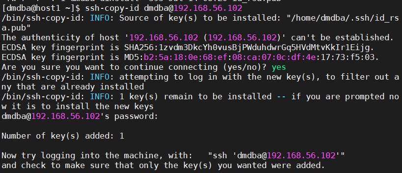
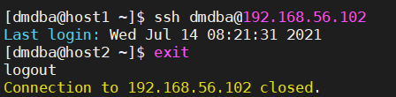
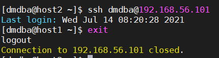

## ssh免密登录

#### 1.准备2台或以上的虚拟机

| **host1** | **192.168.56.101** |
| --------- | ------------------ |
| **host2** | **192.165.56.102** |

#### 2.开始ssh服务

```shell
#使用root用户
cd /etc/ssh
vi sshd_config
##将passwordauthentication no->yes

#重启sshd服务
systemctl restart sshd
#查看sshd服务状态
systemctl status sshd
```

#### 3.创建组和用户，修改密码

```shell
# host1，root用户
hostnamectl set-hostname host1
groupadd -g 12349 dinstall
useradd -u 12345 -g dinstall -m -d /home/dmdba -s /bin/bash dmdba
passwd dmdba 
# 密码设置为dmdba

# host2，root用户
hostnamectl set-hostname host2
groupadd -g 12349 dinstall
useradd -u 12345 -g dinstall -m -d /home/dmdba -s /bin/bash dmdba
passwd dmdba 
# 密码设置为dmdba
```

#### 4.生成密钥对

```shell
su - dmdba
ssh-keygen -t rsa
```



查看生成的密钥对

```shell
cd
ls -la .ssh
```



#### 5.传送公钥

将公钥上传到host2 主机，并以dmdba用户登录

`ssh-copy-id dmdba@192.168.56.102`



**注意：这个过程还需要提供host2主机dmdba的密码**

#### 6.测试ssh免密登入

在host1上，使用dmdba用户，登入host2

`ssh dmdba@192.168.56.102`



#### 7.配置另一台主机的ssh免密登入

方法一：将host1主机的dmdba私钥复制给host2的dmdbau用户

方法二：host2主机的dmdba用户生成密钥对，将公钥传送到host1用户的dmdba用户

#### 8.两台机器相互免密




