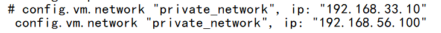
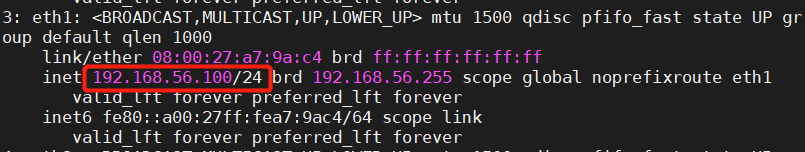
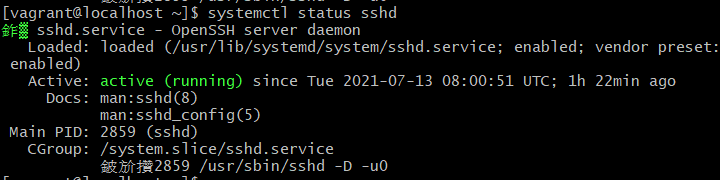

# vagrant 使用


## 1.创建目录

```shell
mkdir test0713
cd test0713
```

## 2.查看安装box

```shell
#查看box
vagrant box list

#选择box初始化
vagrant init xxx 
```

## 3.启动并连接虚拟机（VM）

```shell
#启动VM
vagrant up

#连接vm
vagrant ssh
```


## 4.切换到用户root

```shell
sudo -i
```

## 5.查看系统设置

```shell
#查看文件系统
df -Th

#查看交换分区
swapon -s

#查看磁盘
lsblk

#查看内存
free -h

#查看网络
ip a s
```

## 6.修改虚拟机配置

##### 添加一块网卡（hostonly）

先退出关闭虚拟机

` vagrant halt `

再修改vagrantfile文件

                                                             `

保存，再次启动VM

` vagrant up `

进入VM

` vagrant ssh `

查看网络	`ip addr`

检查网卡是否存在



## 7.开放ssh的密码验证

```shell
#root用户，进入/etc/ssh
cd /etc/ssh
vi sshd_config
#将passwordauthentication no->yes

#重启sshd服务
systemctl restart sshd
#查看sshd服务状态
systemctl status sshd
```



## 8.修改用户vagrant的密码

```shell
#修改vagrant密码（root）
passwd vagrant
```

## 9.使用桌面工具MobaXterm登录

进行ssh 连接创建，指明用户—vagrant


输入密码后，登入成功


