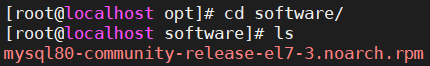
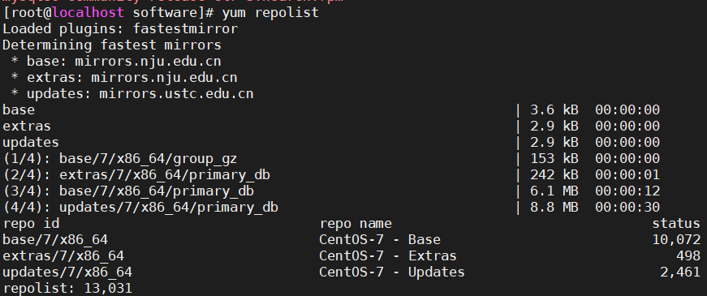
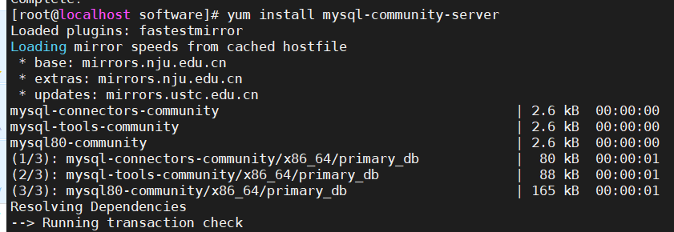
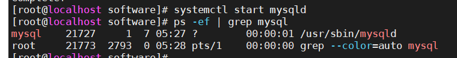
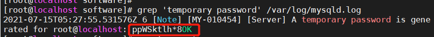
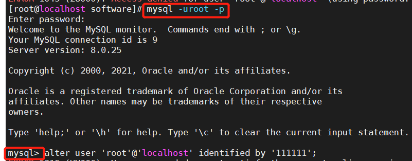
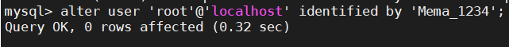
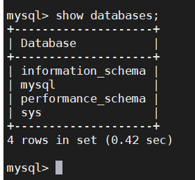
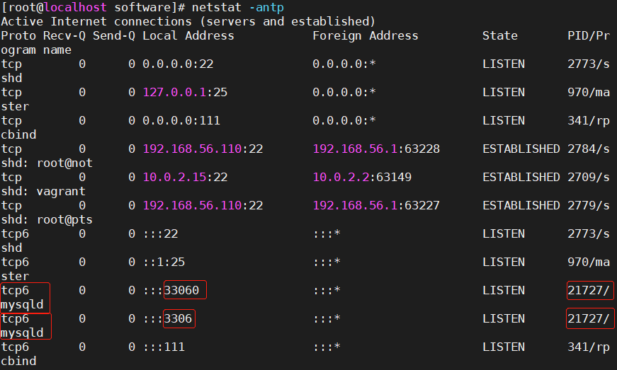
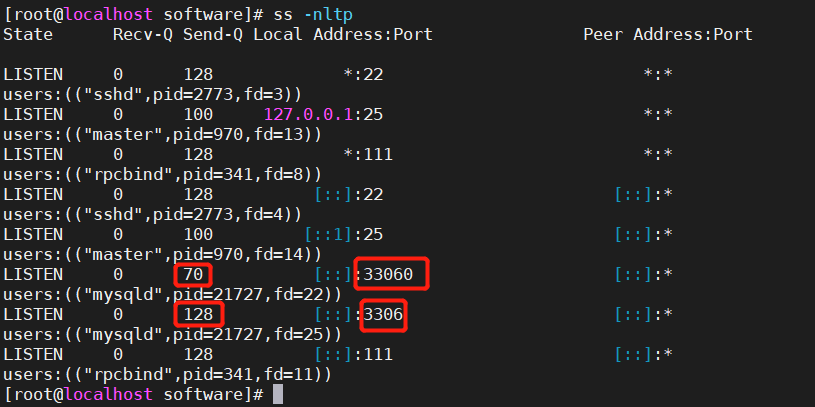

## MySQL数据库安装

#### 1. 所需工具

- Oracle VM VirtualBox
- Vagrant
- MobaXterm 
- Git Bash 

#### 2. 下载安装包

mysql80-community-release-el7-3.noarch.rpm

安装包存放目录：/opt/software



#### 3. 安装安装mysql8的yum源

root用户

```shell
yum install mysql80-community-release-el7-3.noarch.rpm 
```

#### 4. 查看yum源

```shell
yum repolist
```



#### 5.安装MySQL

```shell
yum install mysql-community-server
```



```shell
systemctl start mysqld
ps -ef|grep mysql
```



```shell
--修改数据库root用户密码
grep 'temporary password' /var/log/mysqld.log
#临时密码：ppWSktlh*8OK


```



```shell
#修改密码
mysql -uroot -p
输入找到的密码
mysql>ALTER USER 'root'@'localhost' IDENTIFIED BY 'Mema_1234';

#密码修改为Mema_1234
```





```shell
#查看数据库
mysql>show databases;
```



```shell
#查看端口
netstat -antp
ss -nltp
```



