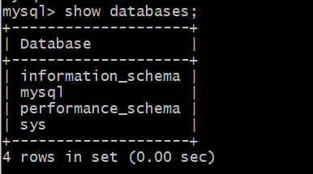
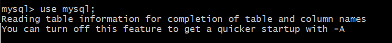
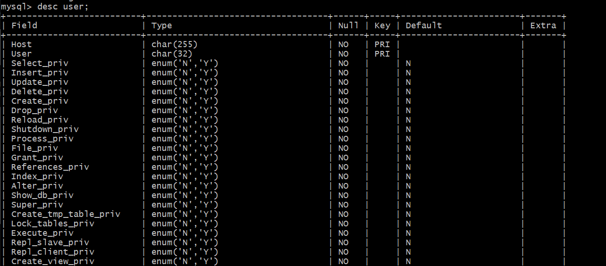

查看数据库

show database：



use mysql;



desc user;



select user,host from user;


赋予权限

GRANT SELECT,UPDATE,DELETE ON *.* TO 'username'@'%'

收回权限

REVOKE ALL ON *.* TO 'username'@'%' 

FLUSH PRIVILEGES

删除用户

DROP USER 'username'@'%'

或者

DELETE FROM mysql.user WHERE Host = '%' AND User = 'username'

修改密码

使用命令mysqladmin -u -username -p password "new_password"

或者改表

UPDATE user SET Password = PASSWORD('new_password') WHERE USER = 'username' and Host = '%'

FLUSH PRIVILEGES

或者修改当前用户密码

SET PASSWORD = PASSWORD("new_password");

修改其他用户密码

SET PASSWORD FOR 'username'@'%'=PASSWORD("new_password")


创建表空间名

create database 空间名 default character set utf8 collate utf8_bin;

创建用户
create user 用户名 identified with mysql_native_password by '密码';

给用户赋权（上面设置了用户密码，则赋权时不需要再设置密码）
grant all on 空间名.* to '用户名'@'%' identified with mysql_native_password by '密码';
grant select,insert,update,delete,create,drop on vtdc.employee to 用户名 identified with mysql_native_password by '密码';

切换用户

alter  user 用户名;


```
CREATE TABLE IF NOT EXISTS `runoob_tbl`(
   `runoob_id` INT UNSIGNED AUTO_INCREMENT,
   `runoob_title` VARCHAR(100) NOT NULL,
   `runoob_author` VARCHAR(40) NOT NULL,
   `submission_date` DATE,
   PRIMARY KEY ( `runoob_id` )
)ENGINE=InnoDB DEFAULT CHARSET=utf8;
```


创建数据库：

create database 数据库名字;

使用数据库：

use 数据库名字;

创建表：

create table 表名 (字段);

表中插入数据：

insert into 表名 () values (),(),()...,();

删除数据：

delete from 表名 ;

更新表中数据：

update test set id=5 where id=1;

查看数据库下的表：

show tables;

创建用户：

create user 'test01'@'localhost' identified by 'Mema_1234';

查看用户：

use mysql;

selecr user,host from user;

切换用户：

alter user test01;

赋予用户权限：

`grant all privileges on *.* to 'test01'@'localhost';`

开启远程连接：

update mysql.user set user.host='%' where user.user='test01';

flush privileges;

select user,host from user;

mysql -u 用户名 -h 主机名 -p 密码

查看当前用户权限：

show grants;

查看当前用户：

select user();

删除用户：

drop user '用户名'@'用户的host';

多表查询：

select * from 表名,表名;

备份（不关MySQL）：

mysqldump -u root -p test > /home/mysql/test.sql

恢复：

mysql -u root -p test < /home/mysql/test.sql


随机生成出生日期：

```
DROP FUNCTION GET_BIRTHDAY;

DELIMITER //  
CREATE FUNCTION GET_BIRTHDAY() RETURNS DATE
DETERMINISTIC
BEGIN
DECLARE bdate DATE;
SET bdate=adddate(current_date(),-1*round(rand()*365*100)+18);
return bdate;
END//

DELIMITER ;

SELECT GET_BIRTHDAY();
```


```
CREATE TABLE `t_user` (
  `id` int(11) NOT NULL AUTO_INCREMENT,
  `c_user_id` varchar(36) NOT NULL DEFAULT '',
  `c_name` varchar(22) NOT NULL DEFAULT '',
  `c_province_id` int(11) NOT NULL,
  `c_city_id` int(11) NOT NULL,
  `create_time` datetime NOT NULL,
  PRIMARY KEY (`id`),
  KEY `idx_user_id` (`c_user_id`)
) ENGINE=InnoDB DEFAULT CHARSET=utf8mb4;


# 创建随机字符串和随机时间的函数
mysql> delimiter $$
mysql> CREATE DEFINER=`root`@`%` FUNCTION `randStr`(n INT) RETURNS varchar(255) CHARSET utf8mb4
    ->     DETERMINISTIC
    -> BEGIN
    ->     DECLARE chars_str varchar(100) DEFAULT 'abcdefghijklmnopqrstuvwxyzABCDEFGHIJKLMNOPQRSTUVWXYZ0123456789';
    ->     DECLARE return_str varchar(255) DEFAULT '' ;
    ->     DECLARE i INT DEFAULT 0;
    ->     WHILE i < n DO
    ->         SET return_str = concat(return_str, substring(chars_str, FLOOR(1 + RAND() * 62), 1));
    ->         SET i = i + 1;
    ->     END WHILE;
    ->     RETURN return_str;
    -> END$$
Query OK, 0 rows affected (0.00 sec)

mysql> CREATE DEFINER=`root`@`%` FUNCTION `randDataTime`(sd DATETIME,ed DATETIME) RETURNS datetime
    ->     DETERMINISTIC
    -> BEGIN
    ->     DECLARE sub INT DEFAULT 0;
    ->     DECLARE ret DATETIME;
    ->     SET sub = ABS(UNIX_TIMESTAMP(ed)-UNIX_TIMESTAMP(sd));
    ->     SET ret = DATE_ADD(sd,INTERVAL FLOOR(1+RAND()*(sub-1)) SECOND);
    ->     RETURN ret;
    -> END $$

mysql> delimiter ;

# 创建插入数据存储过程
mysql> CREATE DEFINER=`root`@`localhost` PROCEDURE `add_t_user`(IN n int)
     BEGIN
         DECLARE i INT DEFAULT 1;
         WHILE (i <= n) DO
             INSERT INTO t_user(c_user_id, c_name, c_province_id,c_city_id, create_time) VALUES (uuid(), randStr(20), FLOOR(RAND() * 1000), FLOOR(RAND() * 100), NOW());
             SET i = i + 1;
         END WHILE;
     END
     $$
Query OK, 0 rows affected (0.01 sec)


CALL add_t_user_memory(1000000);

INSERT INTO t_user SELECT * FROM t_user_memory;


CREATE TABLE tmp_table (
    id INT,
    PRIMARY KEY (id)
);

python -c "for i in range(1, 1+1000000): print(i)" > base.txt

mysql> load data infile '/Users/LJTjintao/temp/base.txt' replace into table tmp_table;
```

