## 在Oracle Linux7上安装MySQL8

### 1、下载MySQL安装包

MySQL下载地址：https://dev.mysql.com/downloads/mysql/

安装包：==mysql-8.0.26-el7-x86_64.tar.gz==

### 2、初始化虚拟机

```shell
vagrant list box
vagrant init oraclelinux/7
vagrant up
```

==注：将MySQL的安装包放到虚拟机相对应的路径下==

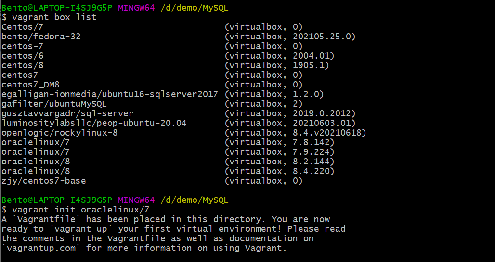

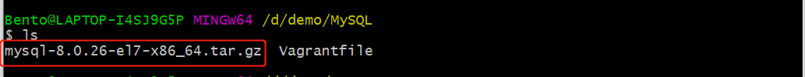


### 3、准备环境

进入虚拟机

```
vagrant ssh
$sudo -i
```

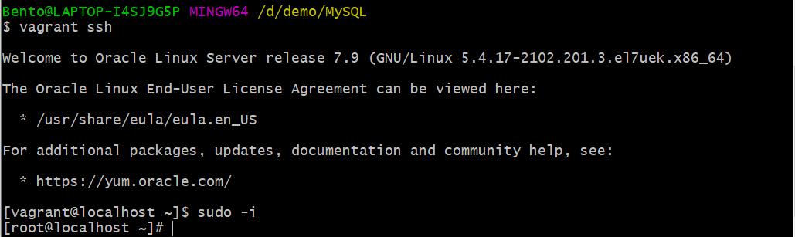

修改主机名称和时区

```
#修改主机名
hostnamectl set-hostname ol7mysql8
bash
#修改时区
timedatectl set-timezone Asia/Shanghai
```

添加mysql用户，并修改密码

```
useradd mysql
echo Mema_1234|passwd mysql
```


创建软件包存放目录和软件装目录：

```
mkdir /opt/software
cp /vagrant/mysql-8.0.26-el7-x86_64.tar.gz /opt/software
chown -R mysql.mysql /opt/software

mkdir /opt/mysql8
chown -R mysql.mysql /opt/mysql8

su - mysql
cd /opt/software
tar xvf mysql-8.0.26-el7-x86_64.tar.gz
mv mysql-8.0.26-el7-x86_64/* /opt/mysql8
```


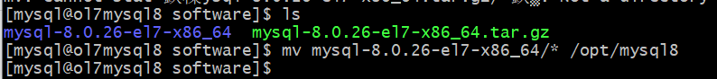

修改mysql环境变量

```
cd 
vi .bash_profile
```

后面两行添加/opt/mysql8/bin,修改为：

```
PATH=$PATH:$HOME/.local/bin:$HOME/bin:/opt/mysql8/bin
export PATH
```


### 4、初始化数据库目录

进入mysql操作系统用户。

```
mysqld --initialize --user=mysql --basedir=/opt/mysql8  --datadir=/opt/mysql8/data
```

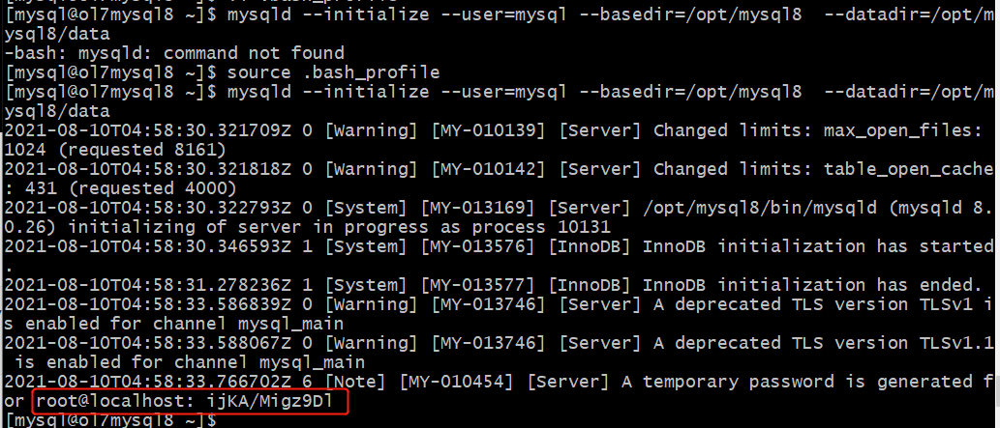

初始化后的root密码为： `ijKA/Migz9Dl`

初始化后，数据库目录结构为：

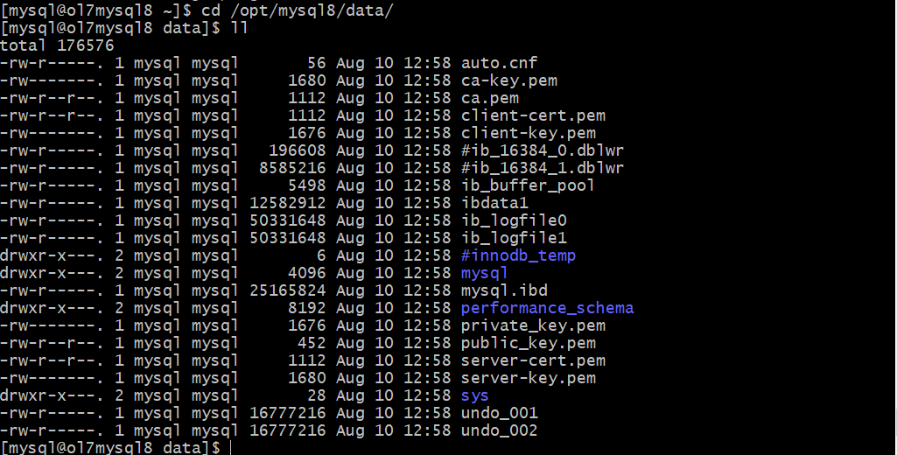

### 5、启动数据库

```
cd /opt/mysql8/data
mysqld_safe --user=mysql&
ps -ef|grep mysqld
```

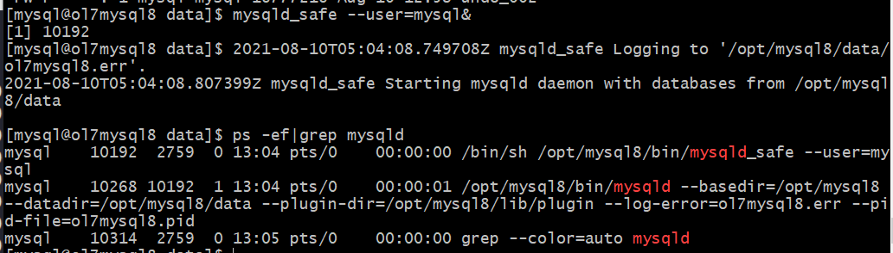

### 6、修改数据库初始密码

```
mysql -uroot -pijKA/Migz9Dl
mysql> alter user 'root'@'localhost' identified by 'Mema_1234';
```

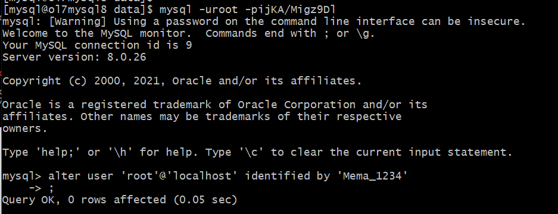

### 7、关闭数据库

```
mysqladmin -uroot -pMema_1234 shutdown
```

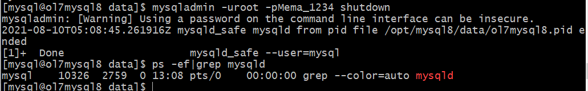

### 8、自动启停mysql

（root用户下）

编辑文件：`/etc/my.cnf` 内容如下

```
[mysqld]	#服务名
basedir=/opt/mysql8
datadir=/opt/mysql8/data
```

编辑文件：`/usr/lib/systemd/system/mysqld.service` 内容如下

```
#
# systemd service file for MySQL forking server
#
[Unit]
Description=MySQL Server
Documentation=man:mysqld(8)
Documentation=http://dev.mysql.com/doc/refman/en/using-systemd.html
After=network.target
After=syslog.target

[Install]
WantedBy=multi-user.target

[Service]
User=mysql
Group=mysql
ExecStart=/opt/mysql8/bin/mysqld --defaults-file=/etc/my.cnf
LimitNOFILE = 5000
#Restart=on-failure
#RestartPreventExitStatus=1
#PrivateTmp=false
```

设置自动启动，启动服务，查看状态。

```
systemctl enable mysqld
systemctl start mysqld
systemctl status mysqld
```

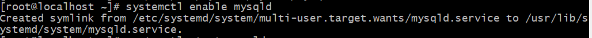

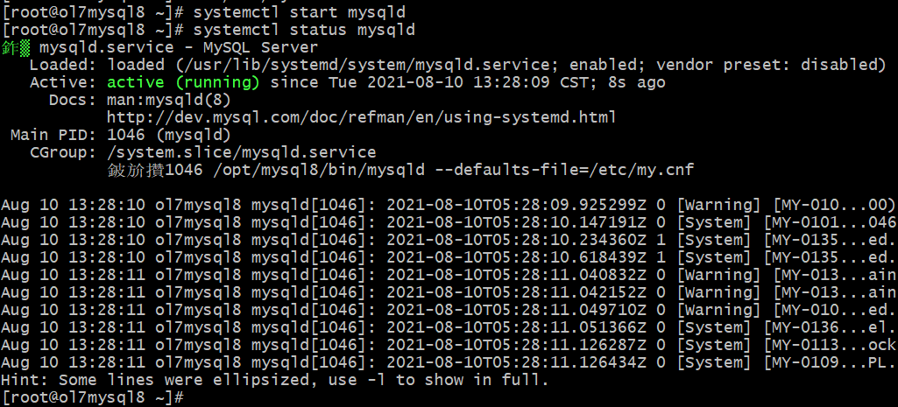

