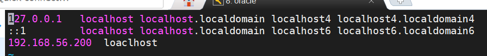
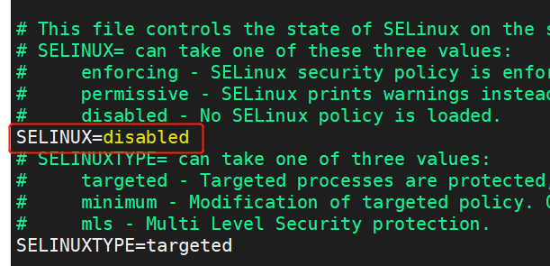
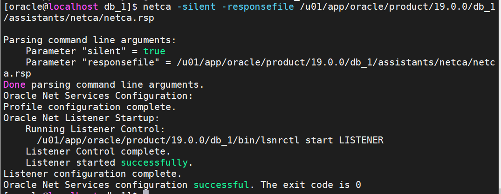
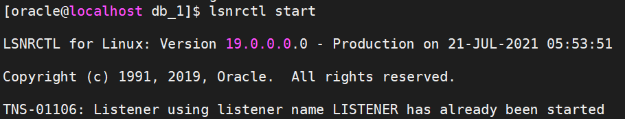

# Oracle 19c 静默安装

**操作系统：Centos7**

| 名称   | 安装路径                            | 介质路径      | 备注                                                         |
| :----- | ----------------------------------- | :------------ | ------------------------------------------------------------ |
| Oracle | /u01/app/oracle/product/19.0.0/db_1 | /u01/software | [Oracle 19c下载地址](https://www.oracle.com/database/technologies/oracle-database-software-downloads.html#19c) |

 

### 一、修改内核参数

**修改主机名**

```
[root@localhost ~]# vi /etc/hosts
```



#### 1.修改/etc/sysctl.conf增加以下参数

```shell
[root@localhost ~]# vi /etc/sysctl.conf
#添加以下内容
fs.file-max = 6815744
kernel.sem = 250 32000 100 128
kernel.shmmni = 4096
kernel.shmall = 1073741824
kernel.shmmax = 4398046511104
kernel.panic_on_oops = 1
net.core.rmem_default = 262144
net.core.rmem_max = 4194304
net.core.wmem_default = 262144
net.core.wmem_max = 1048576
net.ipv4.conf.all.rp_filter = 2
net.ipv4.conf.default.rp_filter = 2
fs.aio-max-nr = 1048576
net.ipv4.ip_local_port_range = 9000 65500
```

#### 2. 重新载入sysctl变量

```shell
[root@localhost ~]# /sbin/sysctl -p
```


### 二、修改oracle访问限制

#### 1.修改/etc/security/limits.conf文件增加以下内容

```shell
[root@localhost ~]# vi /etc/security/limits.conf

#添加以下内容
oracle soft nofile 10240
oracle hard nofile 65536
oracle soft nproc 16384
oracle hard nproc 16384
oracle soft stack 10240
oracle hard stack 32768
oracle hard memlock 134217728
oracle soft memlock 134217728
```

#### 2.修改文件/etc/pam.d/login加入以下内容

```shell
[root@localhost ~]# vi /etc/pam.d/login

#添加以下内容
session required pam_limits.so
```


### 三、修改firewall和selinux

#### 1.禁用firewall

```shell
systemctl stop firewalld
systemctl disable firewalld
```

#### 2.降低selinux，修改/etc/selinux/config修改selinux参数

```shell
vi /etc/selinux/config

#修改以下内容
SELINUX=disabled
```



**修改完成后需要重启生效**


### 四、安装oracle需要的rpm包

#### 1.挂载磁盘

```shell
mkdir /media/cdrom/
umount /dev/sr0
mount /dev/sr0 /media/cdrom/
```

#### 2.修改/etc/yum.repos.d/local.repo，加入以下配置

```shell 
[root@localhost ~]# vi /etc/yum.repos.d/local.repo

#添加以下配置
[base]
name=Red Hat Enterprise Linux 7 base
baseurl=file:///media/cdrom/
gpgcheck=0
enabled=1
```

#### 3.安装依赖包

```
yum install bc binutils \
compat-libcap1 \
compat-libstdc++-33 \
compat-libstdc++-33.i686 \
elfutils-libelf \
elfutils-libelf-devel \
fontconfig-devel \
gcc \
gcc-c++ \
glibc \
glibc.i686 \
glibc-devel \
glibc-devel.i686 \
ksh \
libgcc \
libgcc.i686 \
librdmacm-devel \
libstdc++ \
libstdc++.i686 \
libstdc++-devel \
libstdc++-devel.i686 \
libaio \
libaio.i686 \
libaio-devel \
libaio-devel.i686 \
libXext \
libXext.i686 \
libXrender \
libXrender-devel \
libXtst \
libXtst.i686 \
libX11 \
libX11.i686 \
libXau \
libXau.i686 \
libxcb \
libxcb.i686 \
libXi \
libXi.i686 \
make \
sysstat \
unixODBC \
unixODBC-devel \
compat-libcap1 \
compat-libstdc++-33 \
zlib-devel \
dtrace-utils \
libdtrace-ctf-devel \
net-tools \
nfs-utils \
python \
python-configshell \
python-rtslib \
python-six \
targetcli \
smartmontools

yum install kernel-devel

rpm -ivh http://public-yum.oracle.com/repo/OracleLinux/OL7/6/base/x86_64/getPackage/compat-libstdc++-33-3.2.3-72.el7.x86_64.rpm
```


### 五、创建oracle用户、组和安装目录

```shell
groupadd -g 50001 oinstall
groupadd -g 50002 dba
groupadd -g 50003 oper
groupadd -g 50004 backupdba
groupadd -g 50005 dgdba
groupadd -g 50006 kmdba
#groupadd -g 50007 asmdba
#groupadd -g 50008 asmoper
#groupadd -g 50009 asmadmin
groupadd -g 50010 racdba

useradd -u 50001 -g oinstall -G dba,oper,backupdba,dgdba,kmdba,racdba oracle

passwd oracle

mkdir -p /u01/app/oracle/product/19.0.0/db_1
mkdir -p /u02/oradata
chown -R oracle:oinstall /u01 /u02
chmod -R 775 /u01 /u02
```


### 六、编辑oracle用的profile

#### 1.编辑/home/oracle/.bash_profile文件增加以下变量

```
[root@VM_0_9_centos ~]$ vi /home/oracle/.bash_profile
# Oracle Settings
export TMP=/tmp
export TMPDIR=$TMP
export ORACLE_HOSTNAME=$(hostname)
export ORACLE_UNQNAME=ORCL
export ORACLE_BASE=/u01/app/oracle
export ORACLE_HOME=$ORACLE_BASE/product/19.0.0/db_1
export ORACLE_SID=ORCL
export ORA_INVENTORY=/u01/app/oraInventory
export DATA_DIR=/u02/oradata
export PATH=/usr/sbin:$PATH
export PATH=$ORACLE_HOME/bin:$PATH
export LD_LIBRARY_PATH=$ORACLE_HOME/lib:/lib:/usr/lib
export CLASSPATH=$ORACLE_HOME/jlib:$ORACLE_HOME/rdbms/jlib
```


### 七、安装软件

#### 1.解压安装包

```
[root@VM_0_9_centos ~]$ su - oracle
[oracle@VM_0_9_centos ~]$ cd $ORACLE_HOME
[oracle@VM_0_9_centos ~]$ unzip /u01/software/LINUX.X64_193000_db_home.zip -d $ORACLE_HOME
```

#### 2.安装

```
[oracle@VM_0_9_centos ~]$ ./runInstaller -ignorePrereq -waitforcompletion -silent \
-responseFile ${ORACLE_HOME}/install/response/db_install.rsp \
oracle.install.option=INSTALL_DB_SWONLY \
ORACLE_HOSTNAME=${ORACLE_HOSTNAME} \
UNIX_GROUP_NAME=oinstall \
INVENTORY_LOCATION=${ORA_INVENTORY} \
SELECTED_LANGUAGES=en,en_GB,zh,zh_CN \
ORACLE_HOME=${ORACLE_HOME} \
ORACLE_BASE=${ORACLE_BASE} \
oracle.install.db.InstallEdition=EE \
oracle.install.db.OSDBA_GROUP=dba \
oracle.install.db.OSBACKUPDBA_GROUP=backupdba \
oracle.install.db.OSDGDBA_GROUP=dgdba \
oracle.install.db.OSKMDBA_GROUP=kmdba \
oracle.install.db.OSRACDBA_GROUP=racdba \
SECURITY_UPDATES_VIA_MYORACLESUPPORT=false \
DECLINE_SECURITY_UPDATES=true
```

#### 3.切换到root用户，执行以下脚本

```
[root@VM_0_9_centos ~]# sh /u01/app/oraInventory/orainstRoot.sh
[root@VM_0_9_centos ~]# sh /u01/app/oracle/product/19.0.0/db_1/root.sh
```


### 八、创建监听和数据库

#### 1.创建监听

```
[oracle@VM_0_9_centos ~]$ netca -silent -responsefile /u01/app/oracle/product/19.0.0/db_1/assistants/netca/netca.rsp
```



#### 2.启动监听

```
[oracle@VM_0_9_centos ~]$ lsnrctl start
```



#### 3.创建数据库

```
[oracle@VM_0_9_centos ~]$ dbca -silent -createDatabase \
-templateName General_Purpose.dbc \
-gdbname ORCL -sid ORCL -responseFile NO_VALUE \
-characterSet AL32UTF8 \
-sysPassword oracle \
-systemPassword oracle \
-createAsContainerDatabase false \
-databaseType MULTIPURPOSE \
-automaticMemoryManagement false \
-totalMemory 2000 \
-storageType FS \
-datafileDestination "/u02/oradata/ORCL/" \
-redoLogFileSize 200 \
-emConfiguration NONE \
-ignorePreReqs
```

> 静默删除数据库
>
> dbca -silent -deleteDatabase -sourceDB ORCL


### 九、启动数据库

```
su - oracle
sqlplus / as sysdba

SQL> startup
SQL> select open_mode from v$database;
```

