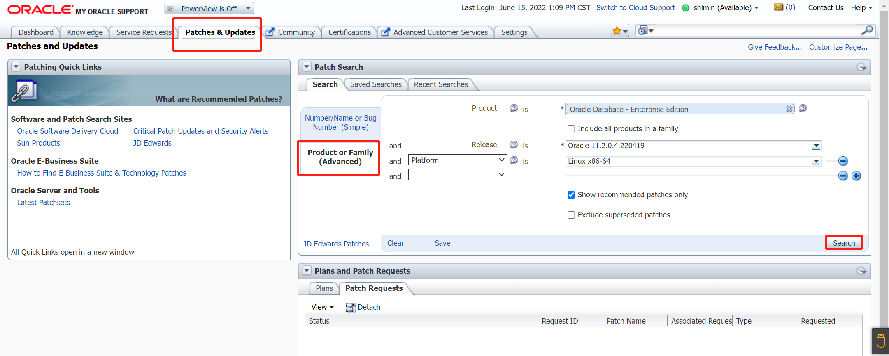
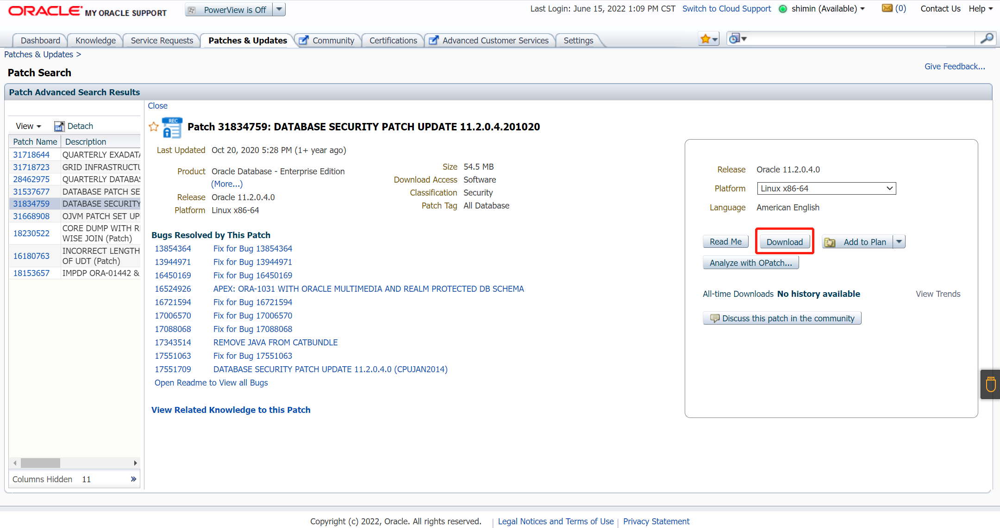
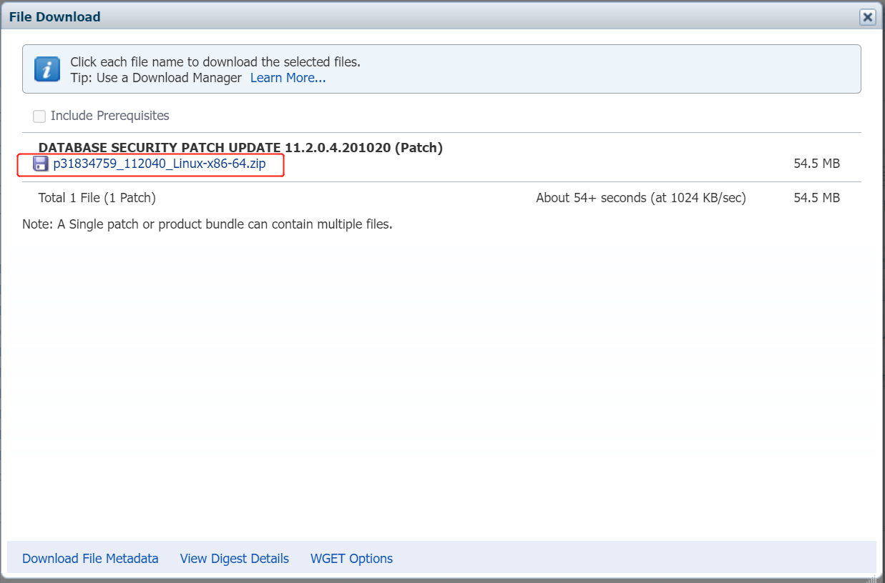
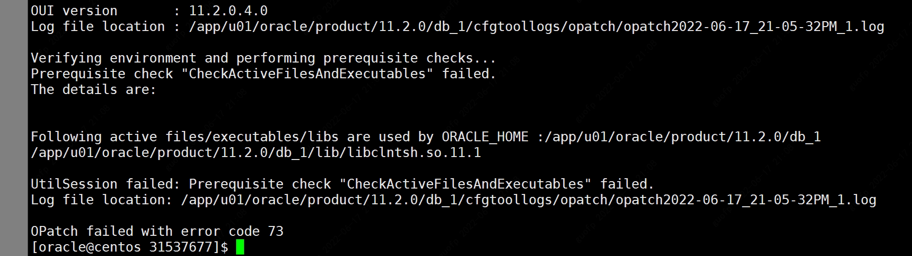

## Oracle 11g 补丁安装

### 下载补丁包

环境：Oracle 11g 11.2.0.4

登入 Oracle Support（https://support.oracle.com/）

【需要support账号】

点击**Patches&Updates**

选择 **Product or Family (Advanced)** 根据数据库版本来进行补丁查询

例子：Product is  * Oracle Database - Enterprise Edition

​			Release is  * Oracle 11.2.0.4.220419

​			Platform is * Linux x86-64

选择完毕后点击Search进行查找。



补丁查询结果：


注：根据需求进行补丁下载






### 方法一：安装Oracle软件，未创建数据库

| 补丁包                            | 描述         |
| --------------------------------- | ------------ |
| p6880880_112000_Linux-x86-64.zip  | opatch       |
| p31537677_112040_Linux-x86-64.zip | database psu |
| p31668908_112040_Linux-x86-64.zip | ojvm psu     |

#### 1.更新opatch

如果opatch不满足条件，需要更新opatch

```shell
su - oracle
cd $ORACLE_HOME
mv OPatch OPatch.old

[oracle@localhost OPatch.old]$ ./opatch version
OPatch Version: 11.2.0.3.4

OPatch succeeded.

unzip /tmp/software/p6880880_112000_Linux-x86-64.zip -d $ORACLE_HOME
```

#### 2.利用opatchauto安装GI和DB补丁

```
unzip /tmp/software/p31537677_112040_Linux-x86-64.zip -d $ORACLE_HOME

cd 31537677
/u01/app/oracle/product/11.0.0/dbhome_1/OPatch/opatch apply


unzip /tmp/software/p31668908_112040_Linux-x86-64.zip -d $ORACLE_HOME

cd 31668908
/u01/app/oracle/product/11.0.0/dbhome_1/OPatch/opatch apply
```

补丁确认：

```
[oracle@localhost dbhome_1]$ cd OPatch
[oracle@localhost OPatch]$ ./opatch lspatches
31668908;OJVM PATCH SET UPDATE 11.2.0.4.201020
31537677;Database Patch Set Update : 11.2.0.4.201020 (31537677)

OPatch succeeded.
```

补丁安装完毕后，进行监听和数据库的创建。


### 方法二：安装Oracle软件，创建数据库

| 补丁包                            | 描述         |
| --------------------------------- | ------------ |
| p6880880_112000_Linux-x86-64.zip  | opatch       |
| p31537677_112040_Linux-x86-64.zip | database psu |
| p31668908_112040_Linux-x86-64.zip | ojvm psu     |

#### 1.更新opatch

如果opatch不满足条件，需要更新opatch

```shell
su - oracle
cd $ORACLE_HOME
mv OPatch OPatch.old
./opatch version
unzip /tmp/software/p6880880_112000_Linux-x86-64.zip -d $ORACLE_HOME
```


#### 2.关闭数据库和所有Oracle进程

```
#关闭数据库
shutdown immediate

#关闭监听
lsnrctl stop
```


#### 3.检查冲突

```
cd /tmp/software
unzip /tmp/software/p31537677_112040_Linux-x86-64.zip -d $ORACLE_HOME

cd 31537677

/u01/app/oracle/product/11.0.0/dbhome_1/OPatch/opatch prereq CheckConflictAgainstOHWithDetail -ph ./
```


#### 4.安装 database psu

```
cd 31537677

/u01/app/oracle/product/11.0.0/dbhome_1/OPatch/opatch apply
```

忽略一下error

参考MOS文档`Doc ID 2265726.1`

#### 5.安装 ojvm psu

```

unzip /tmp/software/p31668908_112040_Linux-x86-64.zip -d $ORACLE_HOME

cd 31668908
/u01/app/oracle/product/11.0.0/dbhome_1/OPatch/opatch prereq CheckConflictAgainstOHWithDetail -ph ./

cd 31668908
/u01/app/oracle/product/11.0.0/dbhome_1/OPatch/opatch apply
```


#### 6.应用psu补丁到数据库

```
cd $ORACLE_HOME/rdbms/admin
sqlplus / as sysdba
startup
@catbundle.sql psu apply
@utlrp.sql
```

开启监听

```
lsnrctl start
```


#### 7.检查补丁安装情况

```
[oracle@rman1 admin]$ $ORACLE_HOME/OPatch/opatch lspatches
```

组件检查

```sql
col comp_name for a40;
col version for a15;


SQL> select comp_name,version,status from dba_registry;

COMP_NAME                                VERSION         STATUS
---------------------------------------- --------------- -----------
OWB                                      11.2.0.4.0      VALID
Oracle Application Express               3.2.1.00.12     VALID
Oracle Enterprise Manager                11.2.0.4.0      VALID
OLAP Catalog                             11.2.0.4.0      VALID
Spatial                                  11.2.0.4.0      VALID
Oracle Multimedia                        11.2.0.4.0      VALID
Oracle XML Database                      11.2.0.4.0      VALID
Oracle Text                              11.2.0.4.0      VALID
Oracle Expression Filter                 11.2.0.4.0      VALID
Oracle Rules Manager                     11.2.0.4.0      VALID
Oracle Workspace Manager                 11.2.0.4.0      VALID
Oracle Database Catalog Views            11.2.0.4.0      VALID
Oracle Database Packages and Types       11.2.0.4.0      VALID
JServer JAVA Virtual Machine             11.2.0.4.0      VALID
Oracle XDK                               11.2.0.4.0      VALID
Oracle Database Java Packages            11.2.0.4.0      VALID
OLAP Analytic Workspace                  11.2.0.4.0      VALID
Oracle OLAP API                          11.2.0.4.0      VALID

18 rows selected.

```


### 报错

```
Verifying environment and performing prerequisite checks...
Prerequisite check "CheckSystemCommandAvailable" failed.
The details are:
Missing command :fuser
Prerequisite check "CheckSystemCommandAvailable" failed.
```

解决方法：

```
yum install -y psmisc
```




```
https://blog.csdn.net/weixin_33953249/article/details/92504045


[oracle@centos ~]$ lsof /app/u01/oracle/product/11.2.0/db_1/lib/libclntsh.so.11.1
lsof: WARNING: can't stat() fuse.gvfsd-fuse file system /run/user/0/gvfs
      Output information may be incomplete.
COMMAND   PID   USER  FD   TYPE DEVICE SIZE/OFF     NODE NAME
emagent 11135 oracle mem    REG  253,5 53785384 19221971 /app/u01/oracle/product/11.2.0/db_1/lib/libclntsh.so.11.1
java    17174 oracle mem    REG  253,5 53785384 19221971 /app/u01/oracle/product/11.2.0/db_1/lib/libclntsh.so.11.1
[oracle@centos ~]$ kill -9 11135
[oracle@centos ~]$ kill -9 17174
-bash: kill: (17174) - No such process
[oracle@centos ~]$ lsof /app/u01/oracle/product/11.2.0/db_1/lib/libclntsh.so.11.1
lsof: WARNING: can't stat() fuse.gvfsd-fuse file system /run/user/0/gvfs
      Output information may be incomplete.
```


```

OPatch found the word "error" in the stderr of the make command.
Please look at this stderr. You can re-run this make command.
Stderr output:
chmod: changing permissions of ‘/u01/app/oracle/product/11.0.0/dbhome_1/bin/extjobO’: Operation not permitted
make: [iextjob] Error 1 (ignored)


Composite patch 31537677 successfully applied.
OPatch Session completed with warnings.
Log file location: /u01/app/oracle/product/11.0.0/dbhome_1/cfgtoollogs/opatch/opatch2022-06-20_03-39-11AM_1.log

```

