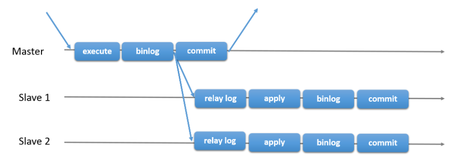
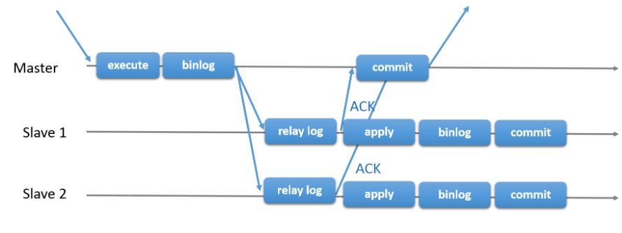
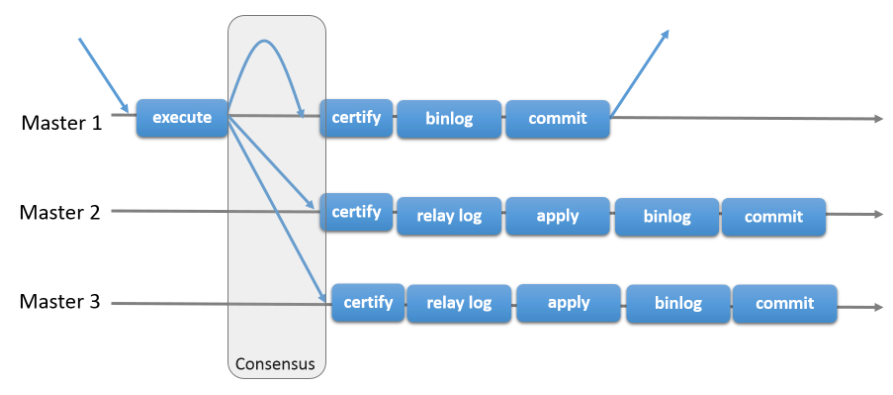

## 一.MySQL相关说明
### MySQL复制技术简介

#### 异步复制

master事务的提交不需要经过slave的确认，slave接收到master binlog后先写relay log，最后异步地去执行relay log中的sql应用到自身。由于master的提交不需要确保slave relay log是否被正确接受，当slave接受master binlog失败或者relay log应用失败，master无法感知。

缺点：

1.主库发生宕机，从库还未接收到主库binlog，此时从库提升为主库使用，就会出现数据不一致的情况。

2.若数据库并发量较大或数据库有大事务，主从同步会发生较大延迟。



#### 半同步复制

基于传统异步存在的缺陷，mysql在5.5版本推出半同步复制。可以说半同步复制是传统异步复制的改进，在master事务的commit之前，必须确保一个slave收到relay log并且响应给master以后，才能进行事务的commit。但是slave对于relay log的应用仍然是异步进行的。



#### 组复制

基于传统异步复制和半同步复制的缺陷，数据的一致性问题无法保证，MySQL官方在5.7.17版本正式推出组复制（MySQL Group Replication，简称MGR）。

由若干个节点共同组成一个复制组，一个事务的提交，必须经过组内大多数节点（N / 2 + 1）决议并通过，才能得以提交。如上图所示，由3个节点组成一个复制组，Consensus层为一致性协议层，在事务提交过程中，发生组间通讯，由2个节点决议(certify)通过这个事务，事务才能够最终得以提交并响应。

引入组复制，主要是为了解决传统异步复制和半同步复制可能产生数据不一致的问题。组复制依靠分布式一致性协议(Paxos协议的变体)，实现了分布式下数据的最终一致性。



### 二进制日志

二进制日志有 STATEMENT、ROW、MIXED三种格式，通过 binlog-format系统变量来设置：
1.STATEMENT格式，基于SQL语句的复制（Statement-Based Replication，SBR）。每一条会修改数据的SOL语句都会被记录到binlog中，这种格式的优点是不需要记录每行的数据变化，这样二进制日志会比较少，减少了磁盘IO，提高了性能。缺点是在某些情况下会导致主库与从库中的数据不一致，例如last insert_id()、now()等非确定性函数，以及用户自定义函数（User-Defined Function，UDF）等易出现问题。

2.ROW格式，基于行的复制（Row-Based Replication，RBR）。该格式不记录SQL语句的上下文信息，仅记录哪条数据被修改了，修改成了什么样子，能清楚地记录每一行数据的修改细节。这种格式的优点是不会出现某些特定情况下的存储过程函数或触发器的调用和触发无法被正确复制的问题。缺点是通常会产生大量的日志，尤其像大表上执行alter table操作时会让日志暴涨。

3.MIXED格式，混合复制（Mixed-Based Replication，MBR）。它是STATEMENT和ROW这两种格式的混合体，默认使用STATEMENT格式保存二进制日志，对STATEMENT格式无法正确复制的操作，会自动切换到基于ROW格式的复制操作，MySQL会根据执行的SQL语句选择日志保存方式。

### 复制步骤
总体来说，MySQL复制有五个步骤：
1.在主库上把数据更改事件记录到二进制日志中。
2.从库上的I/O线程向主库询问二进制日志中的事件。
3.主库上的二进制日志转储（Binlog dump）线程向I/O线程发送二进制事件。
4.从库上的I/O线程将二进制日志事件复制到自己的中继日志中。
5.从库上的SQL线程读取中继日志中的事件，并将其重放到从库上。

## MySQL主从环境搭建

##### 1.关闭防火墙

```
systemctl stop firewalld
systemctl disable firewalld
vim /etc/selinux/config 修改selinux参数为disabled
```

##### 2.查看系统是否安装mariadb，有则删除

```
rpm -qa|grep mariadb
mariadb-libs-5.5.64-1.el7.x86_64
rpm -e mariadb
```

##### 3.重命名默认参数文件

```
mv /etc/my.cnf /etc/my.cnf.default
```

##### 4.创建mysql用户和组

```
groupadd mysql
useradd mysql -g mysql
passwd mysql
```

##### 5.导入MySQL安装包

导入安装包到/home/mysql

##### 6.编辑参数文件（根据实际环境需修改参数配置）

```
vi /etc/my.cnf
```

    [client] 
    socket = /home/mysql/mysql-8.0.23/tmp/mysql.sock 
    
    [mysql]
    socket = /home/mysql/mysql-8.0.23/tmp/mysql.sock
    
    [mysqld]
    server-id = 1
    port = 3306 
    basedir = /home/mysql/mysql-8.0.23
    datadir = /home/mysql/mysql-8.0.23/data
    socket = /home/mysql/mysql-8.0.23/tmp/mysql.sock
    pid_file = /home/mysql/mysql-8.0.23/tmp/mysql.pid
    log_error = /home/mysql/mysql-8.0.23/logs/mysql.log
    skip-name-resolve
    
    default-storage-engine = INNODB
    innodb_buffer_pool_size=2G
    innodb_log_file_size = 128M
    innodb_log_files_in_group = 3
    log_timestamps = system
    lower_case_table_names=1
    max_connections = 1000
    
    log_bin = /home/mysql/mysql-8.0.23/logs/mysql-bin
    max_binlog_size = 1G
    expire_logs_days = 7
    binlog_format = ROW
    sync_binlog = 1

##### MySQL主从仅同步指定库

##### 方法一：在主库上指定主库二进制日志记录的库或忽略的库

```
vim  /etc/my.cnf

binlog-do-db=xxxx      二进制日志记录的数据库
binlog-ignore-db=xxxx  二进制日志中忽略数据库

如果多个库，则添加多行
```

##### 方法二：在从库上指定复制哪些库或者不复制哪些库

```
vim  /etc/my.cnf

replicate-do-db=xxxx             设定需要复制的数据库
replicate-ignore-db=xxxx         设定需要忽略的复制数据库
replicate-do-table=xxxx          设定需要复制的表
replicate-ignore-table=xxxx      设定需要忽略的复制表
replicate-wild-do-table=xxxx     同replication-do-table功能一样，但是可以通配符
replicate-wild-ignore-table=xxxx 同replication-ignore-table功能一样，但是可以加通配符

如果多个库，则添加多行
```

##### 7.赋权限

```
chown -R mysql:mysql /etc/my.cnf
chown -R mysql:mysql /home/mysql
```

##### 8.配置环境变量

```
su - mysql
vi ~/.bash_profile
加入如下：
export MYSQL_HOME=/home/mysql/mysql-8.0.23
export PATH=$MYSQL_HOME/bin:$PATH

source ~/.bash_profile
```

##### 9.安装MySQL

```
cd /home/mysql
tar xvf mysql-8.0.23-linux-glibc2.12-x86_64.tar.xz
mv mysql-8.0.23-linux-glibc2.12-x86_64 mysql-8.0.23
cd mysql-8.0.23
mkdir data logs tmp
```

##### 10.初始化数据库

```
cd /home/mysql/mysql-8.0.23/bin
./mysqld --initialize --user=mysql --basedir=/home/mysql/mysql-8.0.23 --datadir=/home/mysql/mysql-8.0.23/data
```

##### 11.查看初始化root密码

```
cat /home/mysql/mysql-8.0.23/logs/mysql.log | grep localhost:
2021-10-06T14:55:17.349404+08:00 6 [Note] [MY-010454] [Server] A temporary password is generated for root@localhost: ht9h+oXaY?Y%
```

##### 12.启动MySQL

```
mysqld_safe --user=mysql &

或

cd /home/mysql/mysql-8.0.23/support-files
./mysql.server start
```

##### 13.修改root密码

```
//ALTER USER 'root'@'localhost' IDENTIFIED WITH mysql_native_password BY '你的密码';
//ALTER USER 'root'@'localhost' IDENTIFIED WITH caching_sha2_password BY '你的密码';
mysql -uroot -pht9h+oXaY?Y%
alter user 'root'@'localhost' identified by 'P@ssw0rd';

//可创建一个管理员账户
//create user 'root'@'%' identified with mysql_native_password by 'P@ssw0rd';
//grant all privileges on *.* to 'root'@'%' with grant option;
//select host,user,plugin from mysql.user;
```

##### 14.关闭MySQL

```
mysqladmin -uroot -pP@ssw0rd shutdown

或

cd /home/mysql/mysql-8.0.23/support-files
./mysql.server stop
```

##### 15.配置MySQL启动和关闭(root用户下执行)

systemd 提供自动 MySQL 服务器启动和关闭。它还可以使用**systemctl**命令启用手动服务器管理 。如下：

```terminal
cd /home/mysql/mysql-8.0.23/support-files
cp mysql.server /etc/init.d/mysqld
chmod 755 /etc/init.d/mysqld

vim /usr/lib/systemd/system/mysqld.service

[Unit]
Description=MySQL Server
Documentation=man:mysqld
Documentation=http://dev.mysql.com/doc/refman/en/using-systemd.html
After=network.target
After=syslog.target

[Install]
WantedBy=multi-user.target

[Service]
User=mysql
Group=mysql
Type=forking
PermissionsStartOnly=true
ExecStart= /etc/init.d/mysqld start
ExecStop= /etc/init.d/mysqld stop
LimitNOFILE = 5000

systemctl {start|stop|restart|status} mysqld
```

或者，使用与 System V 系统兼容的**service**命令：

```terminal
cd /home/mysql/mysql-8.0.23/support-files
cp mysql.server /etc/init.d/mysqld
chmod 755 /etc/init.d/mysqld

service mysqld {start|stop|restart|status}
```

##### 16.MySQL开机自启(root用户下执行)

systemctl方式

```
systemctl enable mysqld
```

service方式

```
chkconfig --add mysqld
chkconfig --list
chkconfig --level 345 mysqld on
```

##### 17.赋予mysql使用sudo systemctl mysqld的权限

```
visudo
加入如下：
mysql ALL=(ALL) NOPASSWD:/usr/bin/systemctl start mysqld, /usr/bin/systemctl stop mysqld, /usr/bin/systemctl restart mysqld, /usr/bin/systemctl status mysqld
```

##### 18.从库安装

从库安装过程与主库一致
server-id 参数需要修改
binlog可关闭

## 配置异步复制

### 一.空库

##### 1.查看主库二进制日志信息

```
show master status;
+------------------+----------+--------------+------------------+-------------------+
| File             | Position | Binlog_Do_DB | Binlog_Ignore_DB | Executed_Gtid_Set |
+------------------+----------+--------------+------------------+-------------------+
| mysql-bin.000020 |      156 |              |                  |                   |
+------------------+----------+--------------+------------------+-------------------+
```

##### 2.在主库上建立复制专属用户

```
create  user 'repl'@'%' identified with mysql_native_password by '123456';
grant replication client,replication slave on *.* to 'repl'@'%';
```

##### 3.在从库创建主库信息

```
change master to 
master_host='192.168.101.51',
master_port=3306,
master_user='repl', 
master_password='123456', 
MASTER_LOG_FILE='mysql-bin.000020',
MASTER_LOG_POS=156;
```

##### 4.在从库启动复制并查看复制信息

```
start slave;
show slave status\G
select host,user from mysql.user where user='repl';
```

##### 说明：

在从库上执行 show slave status可以查看从库的状态，输出的信息非常多，其中除了那些描述I/O线程、SQL线程状态的行，还有几个log_file和pos相关的行。理解这几行的意义至关重要，所以这里完整地描述它们：

Master_Log_File：I/O线程正在读取的 master binlog。

Read_Master_Log_Pos：线程已经读取到master binlog的哪个位置。

Relay_Log_File：SQL线程正在读取和执行的 relay log。

Relay_Log_Pos：SQL线程已经读取和执行到 relay log的哪个位置。

Relay_Master_Log_File：SQL线程最近执行的操作对应的是哪个 master binlog。

Exec_Master_Log_Pos：SQL线程最近执行的操作对应的是 master binlog的哪个位置。

（Relay_Master_Log_File，Exec_Master_Log_Pos）构成一个坐标，这个坐标表示从库上已经将主库上的哪些数据重放到自己的实例中，它可以用于下一次执行 change master to语句时指定的二进制日志坐标。与这个坐标相对应的是从库上SQL线程的中继日志坐标（Relay_Log_File Relay_log_Pos）。这两个坐标位置不同，但它们对应的数据是一致的。

还有一个延迟参数 Seconds_Behind_Master需说明一下，它的含义是SQL线程比IO线程慢多少。如果主从之间的网络状况优良，那么从库的IO线程读速度二进制日志和主库写二进制日志的速度基本一致，所以这个参数也用来描述“SQL线程比主库慢多少”，也就是说从库比主库少多少数据，只不过衡量的单位是秒。需要注意的是，该参数的描述并不标准，只是在网速很好的时候做个大概的估计，很多情况下它的值都是0，即使SQL线程比IO线程慢了很多也是如此。

### 二.脱机

##### 1.在主库上建立复制专属用户

```
create  user 'repl'@'%' identified with mysql_native_password by '123456';
grant replication client,replication slave on *.* to 'repl'@'%';
```

##### 2.停掉复制涉及的实例（主从两个实例都要停掉）

```
mysqladmin -uroot -pP@ssw0rd shutdown
```

##### 3.将主库数据目录整体复制到从库

```
scp -r /home/mysql/mysql-8.0.23/data 192.168.101.52:/home/mysql/mysql-8.0.23
```

##### 4.保证所有参与复制的实例server-uuid和server_id都不同

删除从库数据文件目录下auto.cnf，并编辑my.cnf修改server_id，保证实例的配置互不相同。

##### 5.重启实例（主从两个实例都要启动）

```
mysqld_safe --user=mysql &
```

##### 6.查看主库二进制日志信息

```
show master status;
+------------------+----------+--------------+------------------+-------------------+
| File             | Position | Binlog_Do_DB | Binlog_Ignore_DB | Executed_Gtid_Set |
+------------------+----------+--------------+------------------+-------------------+
| mysql-bin.000021 |      156 |              |                  |                   |
+------------------+----------+--------------+------------------+-------------------+
```

##### 7.使用上一步的输出在从库创建主库信息

```
change master to 
master_host='192.168.101.51',
master_port=3306,
master_user='repl', 
master_password='123456', 
MASTER_LOG_FILE='mysql-bin.000021',
MASTER_LOG_POS=156;
```

##### 8.在从库启动复制并查看复制信息

```
start slave;
show slave status \G
```

##### 此时从库的err日志中可以看到复制正常的信息：

```
2021-10-07T10:01:12.808658+08:00 8 [System] [MY-010597] [Repl] 'CHANGE MASTER TO FOR CHANNEL '' executed'. Previous state master_host='', master_port= 3306, master_log_file='', master_log_pos= 4, master_bind=''. New state master_host='192.168.101.51', master_port= 3306, master_log_file='mysql-bin.000021', master_log_pos= 156, master_bind=''.
2021-10-07T10:01:25.613752+08:00 9 [Warning] [MY-010897] [Repl] Storing MySQL user name or password information in the master info repository is not secure and is therefore not recommended. Please consider using the USER and PASSWORD connection options for START SLAVE; see the 'START SLAVE Syntax' in the MySQL Manual for more information.
2021-10-07T10:01:25.626587+08:00 9 [System] [MY-010562] [Repl] Slave I/O thread for channel '': connected to master 'repl@192.168.101.51:3306',replication started in log 'mysql-bin.000021' at position 156
```

### 三.联机

##### 1.在主库上建立复制专属用户

```
create  user 'repl'@'%' identified with mysql_native_password by '123456';
grant replication client,replication slave on *.* to 'repl'@'%';
```

##### 2.在从库上创建主库信息

```
change master to 
master_host='192.168.101.51',
master_port=3306,
master_user='repl', 
master_password='123456';
```

##### 3.在从库用mysqldump建立复制

```
mysqldump --single-transaction --all-databases --master-data=1 --host=192.168.101.51 --default-character-set=utf8mb4 --user=dba --password=P@ssw0rd --apply-slave-statements | mysql -uroot -pP@ssw0rd -hlocalhost
```

##### 说明：

--single-transaction 参数可以对 InnoDB表执行非锁定导出。此选项将事务隔离模式设置为 REPEATABLE READ，并在转储数据之前向服务器发送 START TRANSACTION SQL语句它仅适用于 InnoDB等事务表，因为它会在发出 START TRANSACTION时转储数据库的一致状态，而不会阻塞任何应用程序。因此这里假定：①所有的应用数据表都使用 InnoDB引擎；②所有非 InnoDB表数据在备份过程中不会发生变化。

--master-data 参数会导致转储输出包含类似 CHANGE MASTER TO MASTER_LOG_FILE='binlog.000004'，MASTER LOG_POS=1480；的SQL语句，该语句指示主库的二进制日志坐标（文件名和偏移量）如果选项值为2，则 CHANGE MASTER TO语句将写为SQL注释，因此仅提供信息，不会执行。如果参数值为1，则该语句不会写为注释，并在重新加载转储文件时执行。如果未指定选项值，则默认值为1

--apply-slave-statements 参数会在 CHANGE MASTER TO语句之前添加 STOP SLAVE语句，并在输出结尾处添加 START SLAVE语句，用来自动开启复制。

--default-character-set 参数指定默认字符集 MySQL 8默认的字符集为utf8mb4。

通过管道操作符，导出和导入一步进行，不需要中间落盘生成文件。

##### 4.确认复制状态

```
show slave status \G
```

